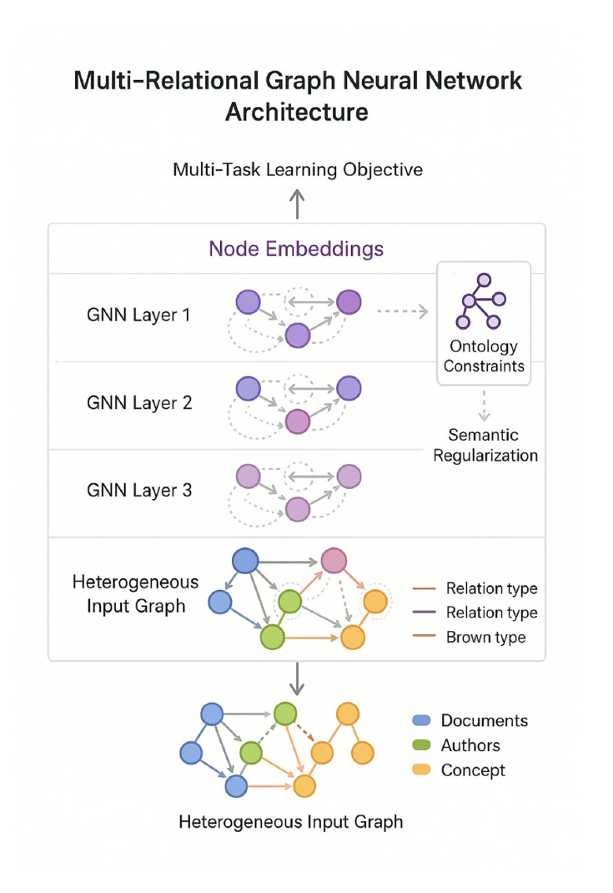
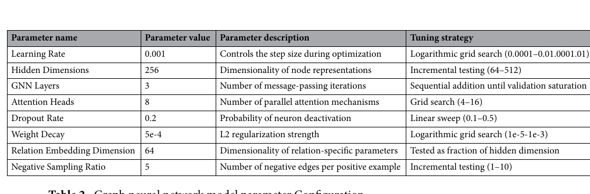

# Bài 04 — Multi-Relational GNN, Attention và Ontology Constraints

## 1. Heterogeneous graph formalization

Có thể mô hình hóa:

$$G=(V,E,R,T_V,T_E)$$

Mỗi node $v_i$ có type $\phi(v_i)$ và mỗi edge có type $\psi(e_{ij})$.

Feature ban đầu nên encode theo từng loại node:

$$x_i = Encode_{\phi(v_i)}(v_i)$$

- Document: text encoder + metadata.
- Agent: role, affiliation, expertise.
- Concept: ontology-aware encoder.

## 2. MR-GCN update

$$
h_i^{(l+1)}=\sigma\left(W_0^{(l)}h_i^{(l)}+\sum_{r\in R}\sum_{j\in N_r(i)}\frac{1}{|N_r(i)|}W_r^{(l)}h_j^{(l)}\right)
$$

Relation-specific $W_r$ giúp model giữ khác biệt giữa `cites`, `createdBy`, `hasConcept`.

## 3. Relation-aware attention

Trọng số attention cho relation $r$:

$$
\alpha_{ij}^{r}=\frac{\exp(LeakyReLU(a_r^T[W_rh_i\Vert W_rh_j]))}{\sum_{k\in N_r(i)}\exp(LeakyReLU(a_r^T[W_rh_i\Vert W_rh_k]))}
$$

Sau đó neighbor contribution được nhân với $\alpha_{ij}^r$. Mục tiêu là học “quan hệ nào/hàng xóm nào đáng nghe hơn”.

## 4. Ontology consistency regularization

Một term ràng buộc:

$$
L_{onto}=\sum_{(i,j,r)\in E_{onto}}\max(0,d(h_i,h_j,r)-\gamma_r)
$$

Nó phạt embedding khi một quan hệ ontology đáng ra gần/đúng cấu trúc nhưng representation lại vi phạm margin.

## 5. Multi-task objective

$$
L=\lambda_1L_{link}+\lambda_2L_{class}+\lambda_3L_{onto}+\lambda_4L_{align}+\lambda_5\|\Theta\|_2^2
$$

Ý nghĩa:

- $L_{link}$: dự đoán edge;
- $L_{class}$: phân loại node;
- $L_{onto}$: giữ semantic consistency;
- $L_{align}$: nối feature text với structure;
- weight decay: hạn chế overfit.

## 6. Hyperparameter tham chiếu

Thiết lập nguồn gồm learning rate 0.001, hidden dimension 256, 3 GNN layers, 8 attention heads, dropout 0.2, weight decay 5e-4, relation embedding 64 và negative sampling ratio 5.

Các giá trị này là **điểm khởi đầu tham chiếu**, không phải mặc định tối ưu cho mọi dataset.

## Debug checklist

- Loss giảm nhưng retrieval không tăng -> kiểm tra objective lệch khỏi retrieval task.
- Node embeddings collapse -> kiểm tra normalization, learning rate, oversmoothing.
- Ontology term quá mạnh -> model bám ontology nhưng bỏ qua evidence mới.
- Attention phân bố quá phẳng -> có thể relation signal chưa đủ hoặc regularization quá mạnh.
