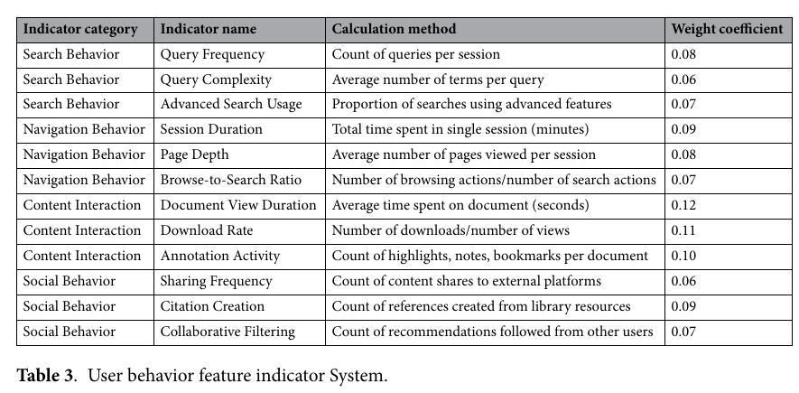

# Bài 05 — User Behavior Modeling và Privacy

## 1. Ba tầng thu thập hành vi

1. **Client-side:** scroll, focus, text selection, mouse interaction.
2. **Server-side:** query, document request, download, session metadata.
3. **Application-level semantic events:** research goal, task context, collection organization.

Raw event chưa dùng được ngay. Cần pipeline xử lý:

**noise filtering -> session reconstruction -> temporal alignment -> semantic enrichment -> graph integration**.

## 2. Bốn nhóm feature hành vi

- Search behavior: query frequency, complexity, advanced search usage.
- Navigation behavior: session duration, page depth, browse/search ratio.
- Content interaction: view duration, download rate, annotation activity.
- Social behavior: sharing, citation creation, collaborative filtering interactions.

Điểm quan trọng là không xem một metric riêng lẻ như “dwell time dài = luôn relevant”. Dwell time có thể dài vì tài liệu khó hiểu. Cần kết hợp nhiều signal.

## 3. Short-term vs long-term interest

User profile nên có hai thành phần:

- **Short-term:** ý định của phiên hiện tại, thay đổi nhanh.
- **Long-term:** chủ đề ổn định, có temporal decay để tín hiệu cũ giảm trọng số.

Nếu chỉ dùng long-term, hệ thống bị “kẹt” vào lịch sử. Nếu chỉ dùng short-term, personalization mất ổn định.

## 4. Đưa behavior vào graph

Một cách trực tiếp là tạo `User -> Entity` interaction edge với weight theo strength và recency. Ngoài ra có thể tạo **latent interest nodes** bằng clustering hành vi để nối các vùng graph vốn không có edge rõ ràng.

## 5. Privacy by design

Behavior data là dữ liệu nhạy cảm về hoạt động. Pipeline nên có:

- data minimization;
- anonymization/pseudonymization;
- purpose limitation;
- user control/consent;
- aggregation trước khi dùng để học;
- differential privacy cho statistic aggregate khi phù hợp;
- kiểm tra re-identification risk.

Paper mô tả thêm k-anonymization và tiered consent. Khi triển khai thật, lựa chọn kỹ thuật phải phù hợp pháp luật, loại dữ liệu và threat model cụ thể.

## Bài tập suy luận

Một user mở document 8 phút nhưng không download, không bookmark, sau đó quay lại search ngay. Hãy đề xuất ít nhất 3 cách diễn giải khác nhau và giải thích vì sao model không nên gán relevance chỉ từ dwell time.
