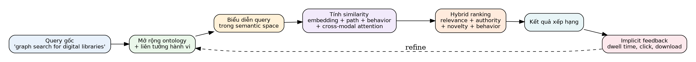
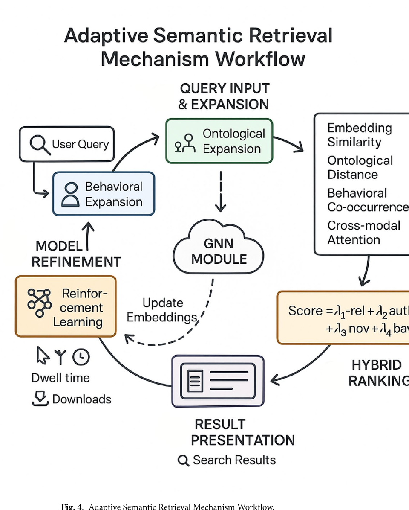
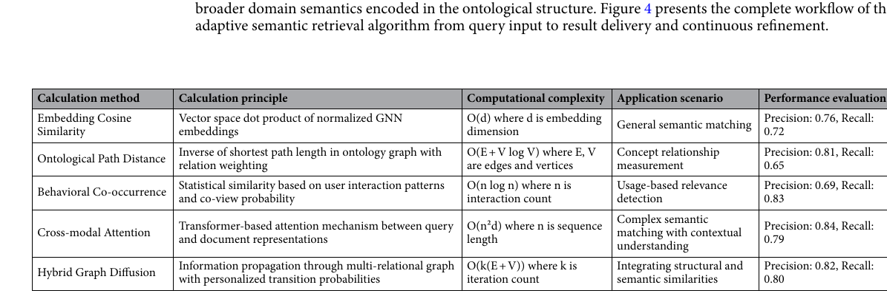

# Bài 06 — Adaptive Semantic Retrieval Algorithm

## 1. Toàn bộ hành trình của một query

Cơ chế retrieval gồm bốn khối chính: **query expansion, similarity, ranking, recommendation/feedback**.

## 2. Query expansion hai đường

### Ontology-guided expansion

$$
Q_{exp}=Q_{orig}\cup\{t\mid \exists q\in Q_{orig},\exists r\in R_{onto},(q,t,r)\in E_{onto},w(r)>\theta_r\}
$$

Ontology cung cấp synonym, hierarchical và associative relations có kiểm soát.

### Behavior-guided expansion

$$
B_{exp}=\{t\mid conf(q\rightarrow t)>\theta_b,\;supp(q\rightarrow t)>\sigma_b\}
$$

Behavior mining tìm term thường xuất hiện cùng nhau trong các session thực tế.

Hai đường bổ sung nhau: ontology bảo đảm semantic validity; behavior phản ánh cách người dùng thực sự tìm kiếm.

## 3. Multi-modal semantic similarity

Composite similarity:

$$
sim(q,d)=\sum_{i=1}^{n}\alpha_i\,sim_i(q,d)
$$

Nguồn sử dụng các kiểu signal như embedding cosine, ontology path distance, behavioral co-occurrence, cross-modal attention và graph diffusion.

## 4. Hybrid ranking

$$
score(d\mid q,u)=\lambda_1rel(q,d)+\lambda_2auth(d)+\lambda_3nov(d\mid u)+\lambda_4behav(d\mid u)
$$

- `rel`: phù hợp với query;
- `auth`: authority từ citation/usage;
- `nov`: tránh lặp lại thứ user đã xem quá nhiều;
- `behav`: khớp với pattern cá nhân.

Không nên hard-code $\lambda$ vĩnh viễn. Context khác nhau có thể cần profile khác: query fact-based nên ưu tiên relevance/authority; exploratory search có thể tăng novelty.

## 5. Recommendation bằng graph propagation

Một personalized PageRank-like recurrence truyền preference qua graph. Điểm mạnh là tìm được resource không trực tiếp nằm trong lịch sử user nhưng nối qua concept/author/citation hợp lý.

## 6. Feedback loop

Click, dwell time, download, annotation và bỏ qua kết quả đều có thể thành implicit feedback. Cơ chế reinforcement/update dùng feedback để tinh chỉnh ranking và representation theo thời gian.

## Sai lầm phổ biến

- Query expansion quá rộng -> recall tăng nhưng precision rơi.
- Behavior weight quá lớn -> filter bubble.
- Authority quá lớn -> tài liệu mới khó nổi lên.
- Feedback loop thiếu guardrail -> model học từ click bias và position bias.
