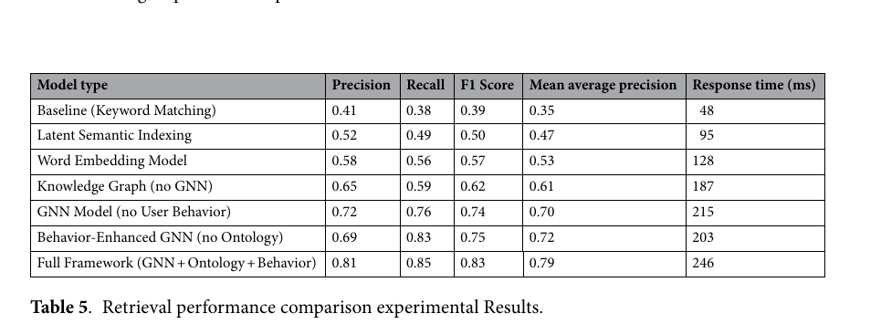
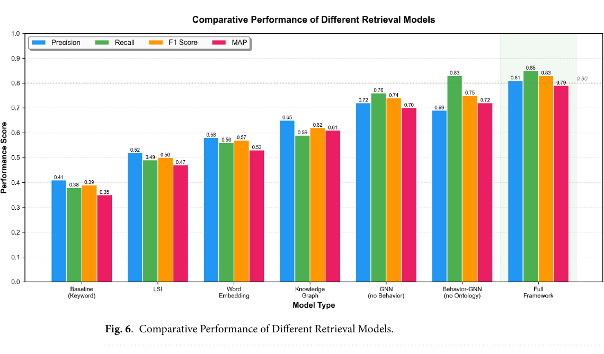
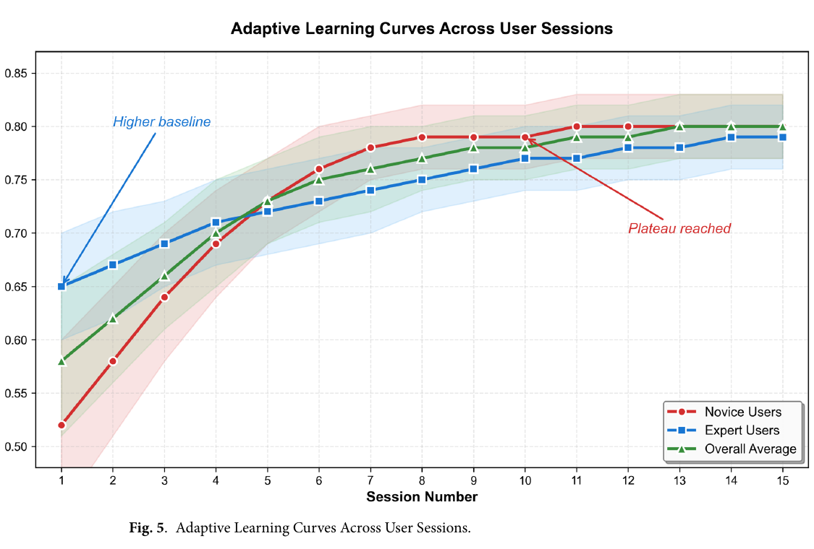

# Bài 08 — Đọc kết quả, Ablation và Scalability

## 1. So sánh model

| Model | Precision | Recall | F1 | MAP | Response time |
|---|---:|---:|---:|---:|---:|
| Keyword | 0.41 | 0.38 | 0.39 | 0.35 | 48 ms |
| LSI | 0.52 | 0.49 | 0.50 | 0.47 | 95 ms |
| Word embedding | 0.58 | 0.56 | 0.57 | 0.53 | 128 ms |
| KG, no GNN | 0.65 | 0.59 | 0.62 | 0.61 | 187 ms |
| GNN, no behavior | 0.72 | 0.76 | 0.74 | 0.70 | 215 ms |
| Behavior-GNN, no ontology | 0.69 | 0.83 | 0.75 | 0.72 | 203 ms |
| Full framework | 0.81 | 0.85 | 0.83 | 0.79 | 246 ms |

Điểm cần học không chỉ là “full framework cao nhất”, mà là **mỗi thành phần thay đổi precision/recall theo kiểu khác nhau**.

## 2. Ablation logic

Nguồn mô tả:

- bỏ ontology -> precision giảm đáng kể trong khi recall bị ảnh hưởng ít hơn;
- bỏ behavior -> performance giảm tương đối cân bằng, đặc biệt personalization/MAP bị ảnh hưởng mạnh.

Cách diễn giải: ontology đóng vai trò “rào semantic”, còn behavior cung cấp “tín hiệu nhu cầu thực tế”. Hai nguồn thông tin bổ sung nhau.

## 3. Adaptive learning curve

Nguồn mô tả improvement trung bình khoảng 15% sau 5 session và 22% sau 10 session. Novice users cải thiện nhanh hơn expert users. Điều này minh họa cold-start: hệ thống cần interaction history trước khi personalization đạt mức ổn định.

## 4. Scalability

Thiết lập nguồn dùng cluster 12 node, báo cáo average query response khoảng 246 ms khi scale vượt 5 triệu document và tới khoảng 500 active sessions; graph partitioning giảm cross-partition communication overhead 67% so với random partitioning.

Khi áp dụng vào hệ thống khác, không được copy con số này như SLA. Cần benchmark lại theo graph size, hardware, embedding dimension, batch strategy, ANN index và traffic thực tế.

## 5. Trade-off thực tế

Full framework có quality cao hơn nhưng response time cũng lớn hơn baseline. Đây là bài toán engineering quen thuộc:

> **relevance quality ↔ latency ↔ compute cost ↔ freshness**

Một hệ thống production có thể dùng two-stage retrieval: candidate generation nhanh trước, semantic re-ranking mạnh sau.

## Bài tập

Dùng file `../data/retrieval_results_table5.csv`, tính phần trăm cải thiện F1 của Full Framework so với Keyword, Word Embedding và GNN-no-behavior. Sau đó viết 3 câu kết luận không phóng đại kết quả.
