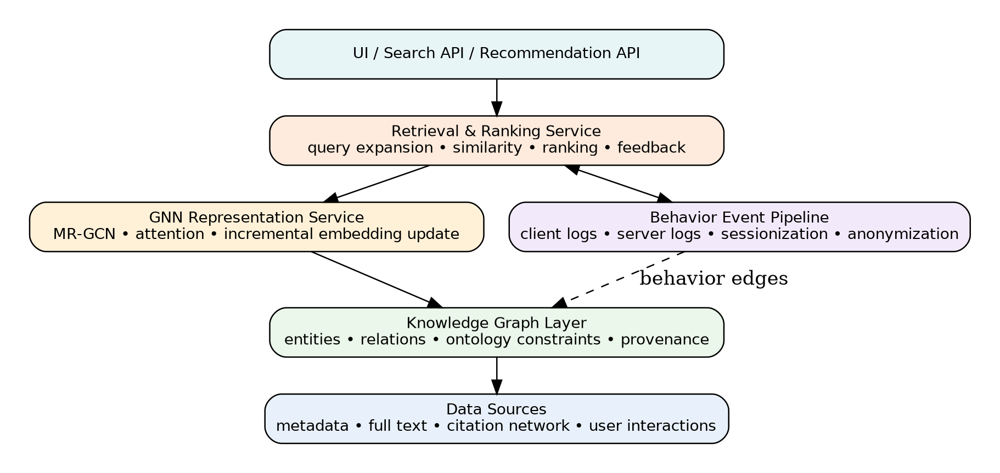

# Bài 09 — Blueprint triển khai hệ thống thực tế

## 1. Phân lớp kiến trúc

Một bản production có thể chia thành các service/layer:

1. **Ingestion layer:** metadata, full text, citation, catalog records.
2. **Knowledge graph layer:** entity resolution, relation store, provenance, ontology validation.
3. **Behavior event pipeline:** event schema, sessionization, consent, anonymization.
4. **Representation service:** text encoder + MR-GCN embedding + incremental update.
5. **Retrieval service:** query expansion, ANN candidate search, graph similarity, ranking.
6. **Feedback/learning service:** implicit feedback aggregation, model update, evaluation.
7. **API/UI:** search, recommendation, explanations.

## 2. Data model tối thiểu

Mỗi node cần: `id`, `type`, `attributes`, `embedding_version`.

Mỗi edge cần: `src`, `dst`, `relation_type`, `weight`, `provenance`, `timestamp`, `confidence`.

Mỗi event cần: `anonymous_user_id`, `session_id`, `event_type`, `entity_id`, `timestamp`, `context`, `consent_scope`.

## 3. Online vs offline

**Offline:** rebuild graph, train GNN, batch embedding, evaluate.

**Nearline:** cập nhật graph/embedding theo batch ngắn.

**Online:** query understanding, candidate retrieval, ranking, feedback logging.

Đừng đưa toàn bộ GNN training vào request path. Online path nên càng deterministic và nhanh càng tốt.

## 4. Candidate generation và re-ranking

Production nên dùng hai tầng:

- Tầng 1: ANN/vector/lexical hybrid lấy vài trăm candidate.
- Tầng 2: graph/ontology/behavior re-ranker chấm điểm sâu hơn.

Cách này giữ latency hợp lý mà vẫn tận dụng semantic reasoning.

## 5. Monitoring

Theo dõi ít nhất:

- P50/P95/P99 latency;
- empty-result rate;
- precision proxy/click satisfaction;
- query reformulation rate;
- embedding drift;
- ontology violation rate;
- cold-start segment metrics;
- privacy/consent event errors.

## 6. Explainability

Một kết quả nên có explanation đơn giản: “khớp concept X”, “được trích dẫn bởi Y”, “liên quan tài liệu bạn đã xem”, “được mở rộng từ thuật ngữ Z”. Không cần phơi ra toàn bộ attention weight, nhưng phải đủ để audit ranking.
