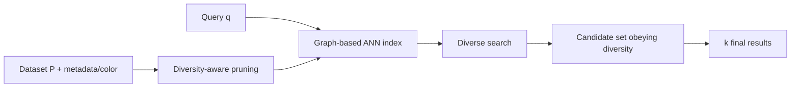

# Course Map

| Bài | Chủ đề | Kết quả chính cần nắm | Ảnh trọng tâm |
|---|---|---|---|
| 01 | Bài toán & động lực | Vì sao reranking hai giai đoạn có bottleneck; diverse retrieval giải gì | `figure_01`, `figure_02` |
| 02 | Nền tảng toán | colorful, k'-colorful, doubling dimension, Δ, recall | — |
| 03 | Colorful indexing | Pruning theo hình học + màu; bound bậc của graph | `algorithm_01` |
| 04 | Colorful search | Thay phần tử xa nhất; Lemma 3.3; hội tụ | `algorithm_02` |
| 05 | Tổng quát hóa | metric `ρ`, `(k', C)` diversity, primal/dual, Gonzalez | `algorithm_03`–`05` |
| 06 | Diverse DiskANN thực tế | priority queue, diverse search, diverse prune, diverse index | `algorithm_06`–`09` |
| 07 | Thực nghiệm | recall–latency, dataset, baseline, ablation `m` | `figure_03`–`07`, `table_01` |
| 08 | DiskANN recap & system design | RobustPruning, GreedySearch, fast/slow build; thiết kế RAG/search | `algorithm_10`–`13` |

## Quan hệ giữa các thành phần

Điểm cốt lõi của paper là **đưa diversity vào cả index construction và search**, thay vì chỉ lấy một tập ứng viên rất lớn rồi rerank ở cuối.
