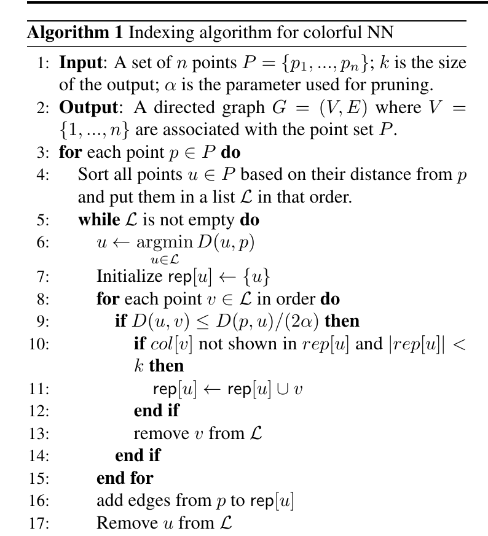

# Lesson 03 — Xây graph cho Colorful Nearest Neighbor

## Mục tiêu

Hiểu vì sao chỉ sửa search là chưa đủ, và cách Algorithm 1 giữ một lượng edge vừa đủ nhưng vẫn bảo toàn khả năng đi tới các color khác nhau.

## 1. Từ pruning của graph ANN đến pruning có diversity

Trong graph-based ANN, mỗi point là một vertex. Nếu `u` và `v` rất gần nhau so với khoảng cách từ `p` tới vùng đó, ta không cần edge `p→u` và `p→v` đồng thời: đi tới một representative rồi traversal tiếp có thể đủ.

Paper thêm hai trực giác diversity:

1. Nếu các điểm gần nhau có cùng color, giữ nhiều edge đến chúng ít giá trị cho một nghiệm colorful.
2. Nếu quanh một vùng đã có đủ `k` representative với color khác nhau, giữ thêm edge vào cùng vùng thường không cần thiết cho việc xây một nghiệm colorful kích thước `k`.

## 2. Algorithm 1



### Input

- `P={p1,...,pn}`;
- `k`: output size;
- `α`: pruning parameter.

### Output

Directed graph `G=(V,E)`.

### Diễn giải từng khối

#### Bước A — xử lý từng vertex `p`

Tất cả điểm được sort theo `D(u,p)`. Ta xét từ gần đến xa.

#### Bước B — tạo neighborhood bucket quanh một representative `u`

Khi chọn `u` là điểm gần nhất còn lại, ta khởi tạo:

```text
rep[u] = {u}
```

Sau đó, mọi `v` thỏa:

\[
D(u,v)\le \frac{D(p,u)}{2\alpha}
\]

được coi là nằm trong vùng mà `u` có thể đại diện về mặt geometry.

#### Bước C — giữ diversity trong representative set

Một `v` chỉ được thêm vào `rep[u]` nếu:

- color của `v` chưa có trong `rep[u]`;
- `|rep[u]|<k`.

Tức là một local region giữ tối đa `k` màu khác nhau.

#### Bước D — nối edge

Sau khi xử lý vùng quanh `u`, thêm edge:

```text
p -> every point in rep[u]
```

Rồi tiếp tục với vùng xa hơn.

## 3. Vì sao constraint “same color” có ý nghĩa?

Giả sử quanh một vùng có 100 vector của seller A và 2 vector seller B/C. Standard geometric pruning có thể giữ representative chủ yếu theo geometry mà không quan tâm màu. Diverse pruning buộc adjacency list có khả năng “mở đường” đến nhiều color.

Điều này rất quan trọng vì greedy search chỉ có thể khám phá những gì graph nối tới.

## 4. Bound bậc graph

Paper chia các điểm xung quanh `p` thành ring theo khoảng cách:

\[
\operatorname{Ring}(p,D_{max}/2^i,D_{max}/2^{i-1}).
\]

Mỗi ring có thể cover bởi `O((8α)^d)` ball nhỏ. Do pruning, trong mỗi small ball chỉ cần một “anchor region”, nhưng mỗi region có thể giữ tối đa `k` representative màu khác nhau.

Suy ra degree bound:

\[
O\big(k(8\alpha)^d\log\Delta\big).
\]

### Trực giác về từng factor

- `k`: số màu/representative tối đa một region cần giữ;
- `(8α)^d`: số local region cần cover theo doubling-dimension argument;
- `log Δ`: số scale/ring.

## 5. Điều Algorithm 1 **không** cố làm

Algorithm 1 không xây graph tối ưu theo một objective toàn cục. Nó giữ đủ cấu trúc cục bộ để greedy search có thể liên tục thay thế phần tử tệ nhất bằng một phần tử tốt hơn mà vẫn giữ colorful constraint.

Tính chất quan trọng là **progress under constraint**, không phải edge-minimality tuyệt đối.

## 6. Pseudocode rút gọn để nhớ

```text
for each p:
    sort all candidates by distance to p
    while candidates remain:
        u = nearest remaining
        rep = [u]
        for v in local ball around u:
            if color(v) is new and len(rep) < k:
                rep.add(v)
            remove v from candidates
        connect p -> rep
```

## 7. Sai lầm triển khai dễ gặp

- Dùng `k` màu global thay vì `k` màu trong từng `rep[u]`.
- Quên rằng condition geometric phụ thuộc `D(p,u)`, không phải một fixed radius.
- Prune trước khi thu đủ representative color cần thiết.
- Chỉ đổi search mà giữ graph standard; phần thực nghiệm cho thấy trường hợp này đôi khi còn tệ hơn post-processing.

## Câu hỏi tự kiểm tra

1. `rep[u]` đóng vai trò gì?
2. Vì sao mỗi local region không cần hơn `k` color representative trong case colorful NN?
3. Nếu bỏ kiểm tra color trong Algorithm 1, ta quay gần về loại pruning nào?
4. Từ đâu xuất hiện factor `k` trong degree bound?
