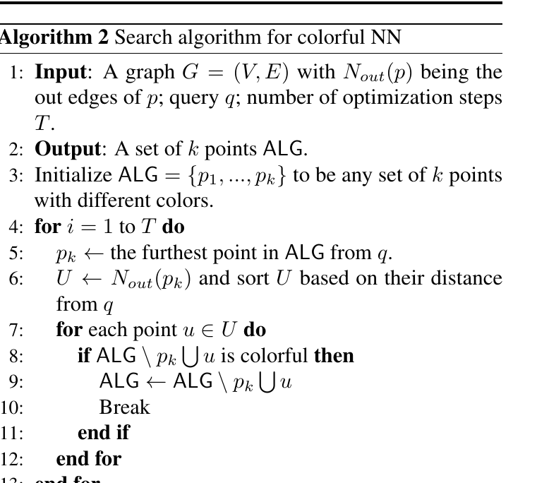

# Lesson 04 — Greedy search cho Colorful NN và ý tưởng chứng minh

## Mục tiêu

Hiểu Algorithm 2, Proposition 3.2, Lemma 3.3 và recurrence dẫn đến approximation guarantee.

## 1. Search invariant

Search luôn duy trì `ALG` gồm đúng `k` điểm có màu khác nhau.



Mỗi iteration:

1. tìm `p_k`, phần tử **xa query nhất** trong `ALG`;
2. lấy các out-neighbor của `p_k`;
3. sort neighbor theo khoảng cách tới query;
4. chọn neighbor gần nhất có thể thay `p_k` mà vẫn làm tập colorful.

Tức là thuật toán liên tục sửa **worst member**.

## 2. Proposition 3.2 — luôn tồn tại màu để thay

Gọi `OPT` là nghiệm colorful tối ưu kích thước `k`. Nếu `p_k ∉ OPT`, thì `ALG \ {p_k}` có `k-1` màu khác nhau, còn `OPT` có `k` màu.

Theo nguyên lý pigeonhole, phải có ít nhất một `p* ∈ OPT \ ALG` có color chưa xuất hiện trong `ALG \ {p_k}`.

Do đó:

```text
ALG - p_k + p*
```

vẫn colorful.

Đây là bước combinatorial đơn giản nhưng rất quan trọng: luôn tồn tại một “target replacement” hợp lệ trong nghiệm tối ưu.

## 3. Lemma 3.3 — graph phải cung cấp một replacement đủ tốt

Vấn đề: search không có quyền nhảy thẳng tới `p*`; nó chỉ thấy out-neighbor của `p_k`.

Lemma 3.3 cho thấy vẫn tồn tại một out-neighbor `p'` sao cho:

1. thay `p_k` bằng `p'` vẫn colorful;
2. khoảng cách tới query thỏa:

\[
D(p',q) \le \frac{D(p_k,q)}{\alpha}
+ \left(1+\frac{1}{\alpha}\right)OPT_k.
\]

### Hai trường hợp trong proof

- Nếu graph có edge trực tiếp `p_k→p*`, chọn `p'=p*`.
- Nếu `p*` đã bị prune, nguyên nhân pruning bảo đảm trong representative set có một điểm thay thế phù hợp về color và đủ gần về geometry.

Chính thiết kế Algorithm 1 tạo ra tính chất này.

## 4. Recurrence hội tụ

Khi một phần tử được update:

\[
D_t \le \frac{D_{t-1}}{\alpha}
+ \left(1+\frac{1}{\alpha}\right)OPT_k.
\]

Sau `t` lần update cùng slot:

\[
D_t \le \frac{D_0}{\alpha^t}
+ \frac{\alpha+1}{\alpha-1}OPT_k.
\]

Hai phần có ý nghĩa rõ:

- `D_0/α^t`: lỗi do initialization giảm theo cấp số nhân;
- `((α+1)/(α-1)) OPT_k`: “sàn” approximation do pruning/search geometry.

## 5. Vì sao cần khoảng `T/k` update mỗi slot?

Thuật toán luôn update phần tử xa nhất. Qua `T` bước, counting argument cho thấy phần tử quyết định `ALG_k` không thể bị update quá ít so với các slot khác; từ đó paper đưa `α^{T/k}` vào bound.

Kết quả cần số bước cỡ:

\[
O\left(k\log_\alpha\frac{\Delta}{\varepsilon}\right).
\]

để đạt:

\[
ALG_k \le \left(\frac{\alpha+1}{\alpha-1}+\varepsilon\right)OPT_k.
\]

## 6. Ba case trong proof cuối

Paper chia theo scale của initialization và `OPT_k` so với `Dmax`, `Dmin`.

### Case 1 — initialization rất xa

Nếu `D(p_i^0,q)>2Dmax`, dùng triangle inequality để liên hệ khoảng cách initial với `OPT_k`, sau đó phần `1/α^{T/k}` suy giảm đủ nhanh.

### Case 2 — initialization nằm trong scale dataset và OPT không quá nhỏ

Dùng lower bound theo `Dmin` để chuyển điều kiện lỗi tuyệt đối thành số bước phụ thuộc `Δ=Dmax/Dmin`.

### Case 3 — OPT cực nhỏ

Paper chỉ ra nếu `k>1` sẽ mâu thuẫn với định nghĩa `Dmin`; vì vậy case này rút về `k=1`, tức nearest neighbor thông thường.

## 7. Ý nghĩa kỹ thuật của theorem

Bảo đảm của diverse search gần tương tự graph ANN không diversity, nhưng phải trả overhead liên quan `k` vì algorithm duy trì nhiều representative và một set nghiệm kích thước `k`.

Một chi tiết hữu ích: graph xây cho một upper bound `k1` có thể dùng search với `k2≤k1`. Vì vậy hệ thống không nhất thiết build một graph riêng cho mọi `k`.

## Câu hỏi tự kiểm tra

1. Vì sao Algorithm 2 thay phần tử xa nhất thay vì phần tử gần nhất?
2. Proposition 3.2 dùng điều gì từ việc cả `ALG` và `OPT` đều colorful?
3. Giải thích hai thành phần trong recurrence sau nhiều update.
4. Nếu graph construction không giữ representative màu khác nhau, Lemma 3.3 dễ hỏng ở đâu?
