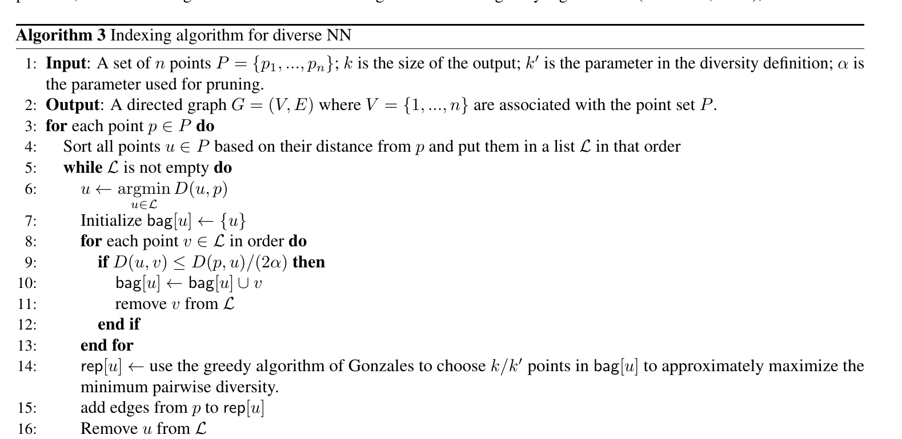
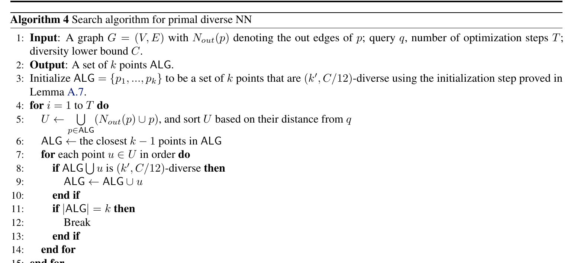
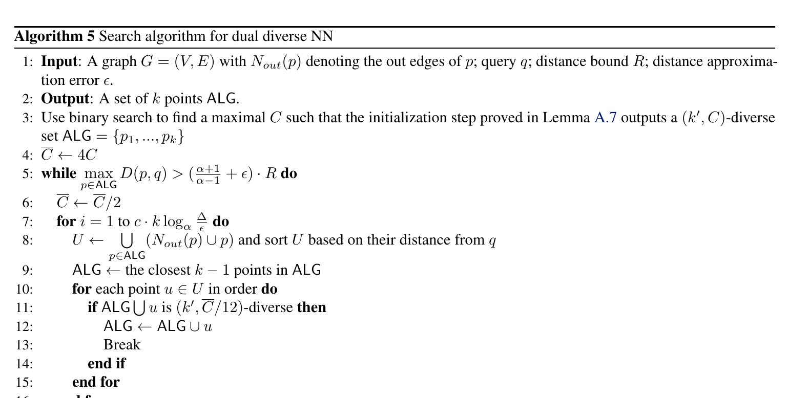

# Lesson 05 — Tổng quát hóa: metric diversity, k' và primal/dual

## Mục tiêu

Rời khỏi color rời rạc để hiểu framework tổng quát dùng metric `ρ` và constraint `(k',C)`.

## 1. Hai metric khác nhiệm vụ

Paper dùng:

- `D`: relevance / closeness tới query;
- `ρ`: diversity / dissimilarity giữa các kết quả.

Hai metric có thể hoàn toàn khác nhau.

Ví dụ RAG:

- `D`: cosine distance giữa embedding query và chunk;
- `ρ`: khoảng cách giữa embedding document-level hoặc feature thể hiện perspective/topic.

## 2. C-diverse

Một set `S` là `C`-diverse nếu:

\[
\rho(p_1,p_2)\ge C
\]

cho mọi cặp khác nhau trong `S`.

Đây là minimum-pairwise-distance diversity.

## 3. (k', C)-diverse

Paper tổng quát thành:

\[
|B_\rho(p,C)\cap S|\le k'
\]

với mọi `p∈S`.

Nghĩa là quanh mỗi nghiệm, trong neighborhood “quá giống” theo `ρ`, tổng số nghiệm được phép xuất hiện chỉ tối đa `k'`.

- `k'=1` → `C`-diverse;
- `k'>1` → cho phép cụm nhỏ các kết quả tương tự.

## 4. Color là trường hợp đặc biệt của ρ

Ta có thể định nghĩa pseudo-metric:

```text
ρ(pi,pj)=0 nếu cùng color
ρ(pi,pj)=1 nếu khác color
```

Khi đó colorful tương ứng với `C=1`, `k'=1`.

Do đó phần general case thật sự bao phủ bài toán seller/brand.

## 5. Primal Diverse NN

Input có `C` cố định. Mục tiêu:

> tìm `k` điểm gần query nhất nhưng phải đủ đa dạng.

Approximate output cho phép hai loại xấp xỉ:

- distance xấp xỉ theo factor `c`;
- diversity relax từ `C` xuống `C/a`.

Đây là bài toán phù hợp khi product yêu cầu một mức diversity tối thiểu đã biết.

## 6. Dual Diverse NN

Input có radius relevance `R` cố định. Mục tiêu:

> trong các điểm đủ gần query, tìm tập có diversity lớn nhất.

Dual phù hợp khi hệ thống có quality radius/threshold rõ ràng và muốn tối đa hóa variety bên trong vùng đó.

## 7. General indexing — Algorithm 3



Khác với colorful case, local bag không chọn representative theo color nữa. Thay vào đó:

1. Gom `bag[u]` bằng geometric pruning condition.
2. Chạy **Gonzalez greedy** để chọn khoảng `k/k'` điểm có minimum pairwise diversity lớn.
3. Nối `p` tới các representative này.

### Gonzalez greedy

- chọn điểm đầu tùy ý;
- mỗi bước tiếp theo, chọn điểm có khoảng cách nhỏ nhất tới set đã chọn là **lớn nhất**.

Đây là greedy farthest-first cho `k`-center/min-pairwise-diversity style objective và cho một tính chất “anti-cover” quan trọng trong proof.

## 8. Primal search — Algorithm 4



Khác Algorithm 2, mỗi vòng không chỉ nhìn neighbor của phần tử xa nhất. Nó lấy union neighbor của **toàn bộ** `ALG`, rồi rebuild set:

1. giữ `k-1` điểm gần nhất hiện có;
2. scan candidate theo distance tới query;
3. thêm điểm đầu tiên giúp tập vẫn `(k',C/12)`-diverse;
4. lặp qua `T` vòng.

## 9. Initialization cho general diversity

Paper dùng procedure dựa trên các ball `B_ρ(p,C/4)`:

- nếu một ball có nhiều hơn `k'` điểm, chọn `k'` điểm vào solution;
- xóa vùng `B_ρ(p,C/2)` khỏi candidate pool;
- cuối cùng thêm các điểm còn lại;
- nếu đủ ít nhất `k` điểm, chọn `k` điểm.

Lemma A.7 đảm bảo: nếu tồn tại `(k',C)` solution kích thước `k`, initialization tìm được `(k',C/4)` solution kích thước `k`.

## 10. Dual search — Algorithm 5



Dual algorithm thêm một lớp binary search/halving trên `C`:

- tìm mức diversity khởi đầu lớn;
- nếu chưa đạt distance target `R`, giảm `C`;
- với mỗi mức `C`, chạy primal-style updates.

Kết quả cuối cùng đạt diversity xấp xỉ với factor `24` trong theorem.

## 11. Main theorem cho general case

### Primal

Algorithm trả về `(k',C/12)`-diverse solution với distance approximation:

\[
\frac{\alpha+1}{\alpha-1}+\varepsilon.
\]

Degree/space overhead giảm từ `k` xuống gần `k/k'` trong graph:

\[
O\left((k/k')(8\alpha)^d\log\Delta\right).
\]

Điều này hợp lý: cho phép mỗi local similarity group có `k'` phần tử thì cần ít representative group hơn.

### Dual

Algorithm trả về `(k',C/24)`-diverse solution và distance bounded theo `R` với cùng loại approximation factor.

## 12. Điều quan trọng khi đọc constant 12 và 24

Các constant này đến từ chuỗi triangle-inequality và relaxation trong proof, không nên hiểu như “hệ thống thực tế phải đặt diversity threshold chia đúng 12/24”. Heuristic thực nghiệm của paper tập trung vào `k'`-colorful case và dùng `m` để điều khiển diversity khi build graph.

## Câu hỏi tự kiểm tra

1. Vì sao cần tách `D` và `ρ`?
2. `(k',C)`-diverse mạnh/yếu thế nào khi tăng `k'`?
3. Vì sao số representative trong Algorithm 3 có tỷ lệ `k/k'`?
4. Primal và dual khác nhau ở biến nào được cố định và biến nào được tối ưu?
