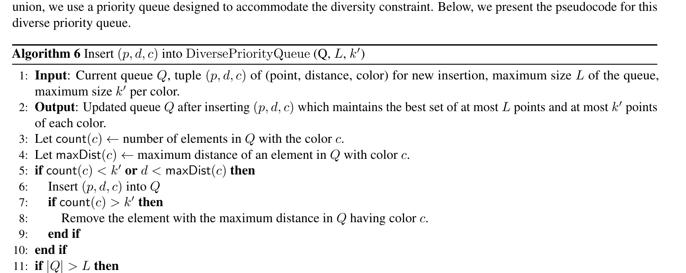
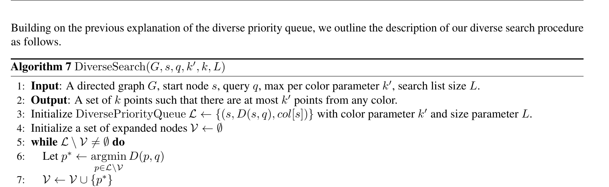
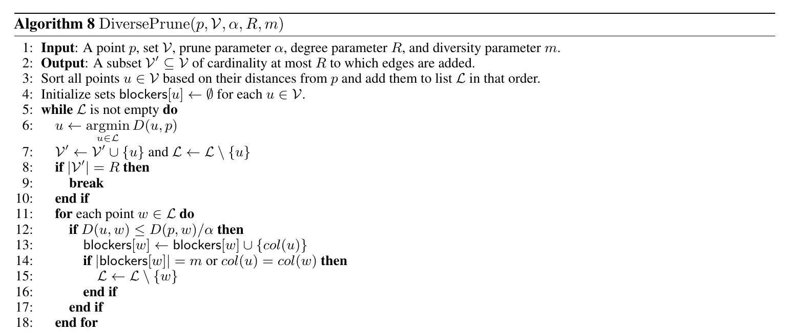
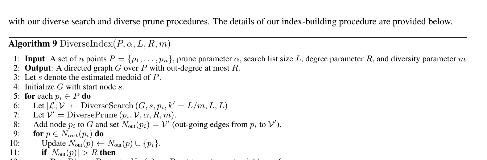

# Lesson 06 — Từ thuật toán có chứng minh đến Diverse DiskANN thực tế

## Mục tiêu

Hiểu 4 thành phần triển khai thực nghiệm: DiversePriorityQueue, DiverseSearch, DiversePrune và DiverseIndex.

## 1. Vì sao cần heuristic?

Indexing algorithm lý thuyết có thể phải xét rất nhiều cặp điểm và mang chi phí quadratic ở quy mô dữ liệu lớn. DiskANN nguyên bản cũng có sự tách biệt tương tự:

- slow preprocessing: dễ phân tích lý thuyết nhưng đắt;
- fast preprocessing: heuristic thực tế.

Paper giữ tinh thần đó và xây một phiên bản fast diversity-aware.

## 2. DiversePriorityQueue — Algorithm 6



Queue lưu tối đa `L` phần tử và tối đa `k'` phần tử trên mỗi color.

Khi insert `(p,d,c)`:

1. nếu color `c` chưa đủ `k'` phần tử → có thể insert;
2. nếu đã đủ nhưng `p` gần query hơn phần tử tệ nhất cùng color → thay thế;
3. nếu tổng queue vượt `L` → xóa phần tử xa nhất toàn queue.

### Invariant

Queue luôn cố giữ candidate **gần** và **không bị một color chiếm quá `k'` slot**.

## 3. DiverseSearch — Algorithm 7



Greedy graph traversal:

1. bắt đầu từ seed `s`;
2. chọn phần tử gần query nhất chưa expand;
3. đưa out-neighbor vào DiversePriorityQueue;
4. tiếp tục tới khi mọi phần tử còn trong queue đã được expand;
5. trả top-`k` từ queue.

Khác standard greedy search ở chỗ candidate set itself đã diversity-aware.

## 4. DiversePrune — Algorithm 8



Standard DiskANN có thể prune edge `(p,w)` nếu một edge qua `u` đủ để “cover” về geometry.

Paper thêm `blockers[w]`: tập các color đã có khả năng block `w`.

Một candidate `w` chỉ bị xóa khi:

- đủ `m` color khác nhau đã block nó; **hoặc**
- có blocker cùng color với `w`.

### Ý nghĩa của `m`

`m` càng lớn, hệ thống càng khó prune một edge chỉ vì geometry; graph sẽ giữ nhiều đường đến các color khác nhau hơn.

Đổi lại:

- build có thể nặng hơn;
- graph có thể nhiều edge hữu ích cho diversity hơn;
- search recall ở diversity-constrained task có thể tăng.

## 5. DiverseIndex — Algorithm 9



Build theo phong cách DiskANN fast preprocessing:

1. chọn medoid làm seed;
2. lần lượt thêm point `p_i` vào graph;
3. dùng DiverseSearch để tạo candidate neighbor set;
4. dùng DiversePrune để chọn out-neighbor;
5. thêm reverse edges;
6. nếu degree của neighbor vượt `R`, prune lại.

Một chi tiết trong pseudocode: search khi build dùng `k'=L/m`, liên kết giữa capacity per color và diversity parameter của graph construction.

## 6. Ba system variants trong experiment

### A. Standard Build + Post-Processing

- build DiskANN thường;
- search thường lấy `r >> k`;
- greedily filter theo `k'`.

Đây là baseline hai giai đoạn.

### B. Standard Build + Diverse Search

- graph vẫn standard;
- search dùng DiverseSearch.

Variant này kiểm tra xem chỉ sửa query-time có đủ không.

### C. Diverse Build + Diverse Search

- graph build bằng diverse pruning;
- query dùng diverse search.

Đây là full method.

## 7. Vì sao chỉ DiverseSearch có thể tệ?

Nếu graph standard đã prune mất nhiều edge dẫn tới color hiếm, DiverseSearch không thể “phát minh” ra đường đi mới. Nó còn bị diversity constraint thu hẹp queue, nên đôi khi cần traversal khác nhưng graph không hỗ trợ.

Paper quan sát hiện tượng này trên arXiv/SIFT ở một số vùng recall: `standard build + diverse search` có thể chậm hơn baseline post-processing, còn `diverse build + diverse search` lại tốt nhất.

## 8. Pseudocode triển khai tối giản

```python
class DiverseQueue:
    # conceptual skeleton
    def insert(self, point, distance, color):
        # 1) enforce per-color cap k_prime
        # 2) keep only best L overall
        pass
```

```python
def diverse_search(graph, seed, q, L, k_prime):
    queue = DiverseQueue(L, k_prime)
    visited = set()
    queue.insert(seed, dist(seed, q), color(seed))

    while queue.has_unexpanded(visited):
        p = queue.closest_unexpanded(visited)
        visited.add(p)
        for u in graph[p]:
            queue.insert(u, dist(u, q), color(u))

    return queue.top_k()
```

Skeleton trên để học tư duy; khi benchmark thật cần cấu trúc heap/index theo color hiệu quả hơn.

## 9. Những invariant nên test

- Queue không bao giờ có quá `k'` phần tử/color.
- Queue không vượt `L`.
- Graph out-degree không vượt `R` sau prune.
- Khi `m=1`, pruning diversity yếu hơn `m` lớn.
- Khi `k'=k`, diverse queue gần với standard queue.

## Câu hỏi tự kiểm tra

1. `m` nằm ở build-time hay query-time?
2. Vì sao blocker phải được đếm theo **color khác nhau**?
3. Nếu queue đã có `k'` điểm màu `c`, khi nào một điểm màu `c` mới vẫn được insert?
4. Vì sao diverse build và diverse search có tính bổ trợ nhau?
