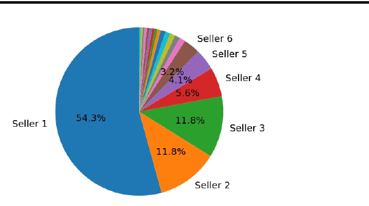
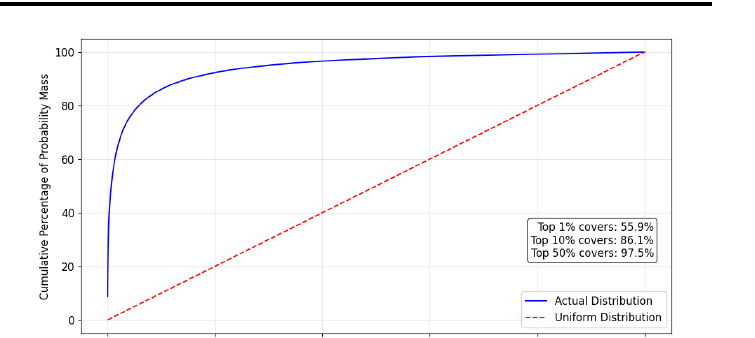
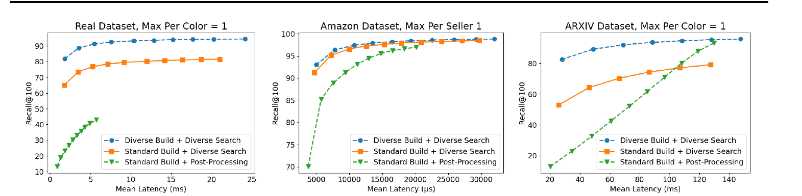
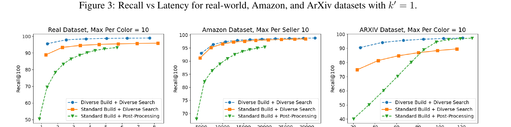
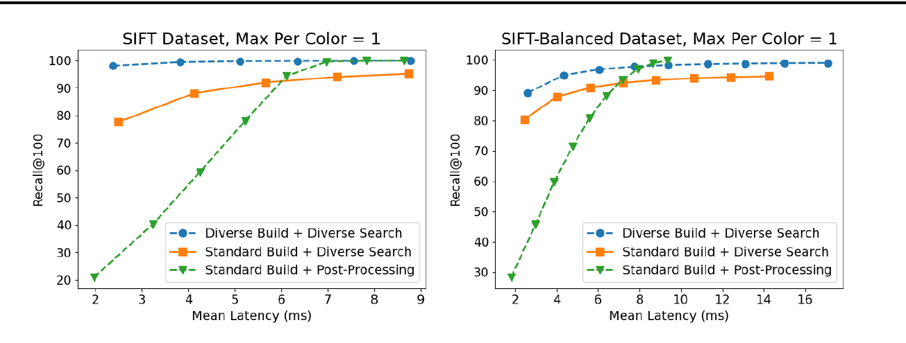
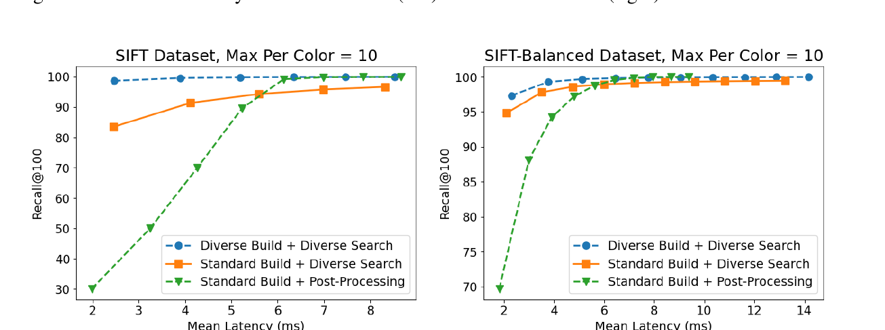
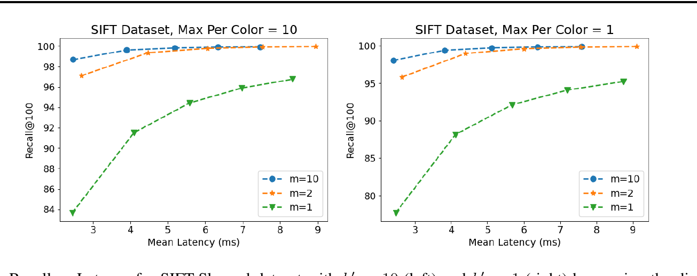
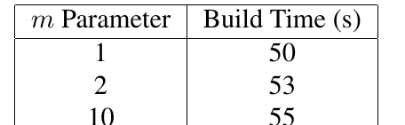

# Lesson 07 — Đọc phần thực nghiệm: Recall, latency và ablation

## Mục tiêu

Biết dataset nào được dùng, task nào được đo, ba baseline/variant khác nhau ra sao và cách đọc đúng từng plot.

## 1. Môi trường thí nghiệm

Paper báo cáo chạy trên máy Linux với AMD Ryzen Threadripper 3960X, 24-core, 48 vCPU và 250 GB RAM. Latency/throughput được báo cáo với 48 threads.

Điều này cần ghi nhớ khi so trực tiếp con số ms với máy cá nhân hoặc deployment khác.

## 2. Datasets

### Real-world Seller Dataset

- 20 triệu base vectors;
- 64 dimensions;
- khoảng 2,500 sellers;
- 5,000 query vectors;
- phân bố rất skew: khoảng 7 seller chiếm >90% dữ liệu.

### Amazon Automotive

- khoảng 2 triệu base vectors;
- 384 dimensions;
- khoảng 85,000 brands;
- skew nhẹ hơn real-world seller dataset.

### arXiv semi-synthetic

- khoảng 2 triệu abstract embeddings;
- 1536 dimensions;
- color được gán synthetic: 90% xác suất rơi vào 3 color chính, 10% vào color 4…1000.

### SIFT-Skewed

- 1 triệu vectors;
- 128 dimensions;
- một color chiếm xác suất 0.8, 999 color khác chia 0.2.

### SIFT-Balanced nhưng locally skewed

Global distribution gần cân bằng, nhưng từng local neighborhood có dominant color. Đây là case quan trọng vì global histogram đẹp không đồng nghĩa nearest-neighbor region cũng diverse.

## 3. Hai task chính

Mọi dataset đều lấy `k=100`.

### Task A — k'=1

100 kết quả phải có 100 color khác nhau.

### Task B — k'=10

Mỗi color tối đa 10 kết quả.

## 4. Các variant được so

1. **Standard Build + Post-Processing** — lấy candidate pool lớn rồi filter.
2. **Standard Build + Diverse Search** — query diversity-aware trên graph thường.
3. **Diverse Build + Diverse Search** — cả build lẫn search cùng diversity-aware.

Build dùng `L=200`, graph degree 64; search thay đổi `L` để tạo các điểm recall/latency khác nhau.

## 5. Figure 3 — k'=1

Cách đọc một điểm trên curve:

- trục X: mean latency;
- trục Y: recall@100;
- cùng latency, curve cao hơn tốt hơn;
- cùng recall, curve nằm trái hơn nhanh hơn.

Trên real dataset, full diverse method đạt recall rất cao ở latency thấp đáng kể so với baseline.

## 6. Figure 4 — k'=10

Điểm đáng chú ý trên arXiv ở high recall:

- post-processing: khoảng 90 ms;
- standard build + diverse search: khoảng 135 ms;
- diverse build + diverse search: khoảng 25 ms.

Đây là bằng chứng thực nghiệm cho lập luận “search diversity-aware cần graph có connectivity phù hợp”.

## 7. SIFT plots

### k'=1

### k'=10

Cả SIFT-Skewed và SIFT-Balanced đều cho thấy lợi ích của diversity-aware build, đặc biệt khi neighborhood local bị skew.

## 8. Real-world headline result

Ở real-world seller dataset, để đạt khoảng 95% recall@100:

| Variant | Latency xấp xỉ |
|---|---:|
| Standard Build + Post-Processing | > 8 ms |
| Standard Build + Diverse Search | ~ 4.5 ms |
| Diverse Build + Diverse Search | ~ 1.5 ms |

Đây là cải thiện hơn 5× giữa baseline và full method ở operating point được nêu trong paper.

## 9. Ablation tham số m

`m` lớn → edge khó bị prune hơn nếu chưa có đủ blocker color khác nhau → graph diversity cao hơn.

Paper cũng báo build time:

| m | Build time (s) |
|---:|---:|
| 1 | 50 |
| 2 | 53 |
| 10 | 55 |

Trong thí nghiệm này, tăng `m` cho quality tốt hơn với mức tăng build time khá nhỏ. Không nên mặc định điều này đúng ở mọi dataset/quy mô; nó là kết quả của setup cụ thể trong paper.

## 10. Các kết luận nên và không nên rút ra

### Có thể rút ra từ experiment

- Post-processing có thể phải trả latency đáng kể khi color skew.
- Diversity-aware search alone không đảm bảo luôn tốt nếu index không chứa edge diversity hữu ích.
- Diversity-aware build + search có trade-off recall–latency tốt trên các dataset paper thử nghiệm.

### Không nên suy rộng quá mức

- Không có nghĩa mọi workload đều sẽ nhanh hơn 5×.
- Paper thực nghiệm chủ yếu trên `k'`-colorful case; general metric `ρ` là phần lý thuyết.
- Con số latency phụ thuộc hardware, threading, implementation, dataset và parameter.

## Câu hỏi tự kiểm tra

1. Vì sao SIFT-Balanced vẫn là test khó dù global color distribution gần uniform?
2. Recall ground truth trong paper có diversity constraint hay không?
3. Tại sao standard build + diverse search có thể chậm hơn post-processing ở một vài operating point?
4. Ablation `m` kiểm tra giả thuyết nào?
