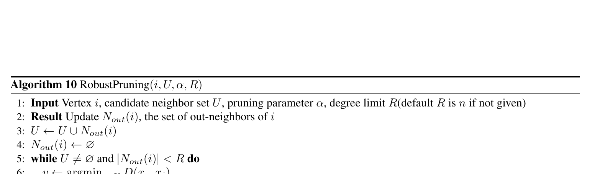
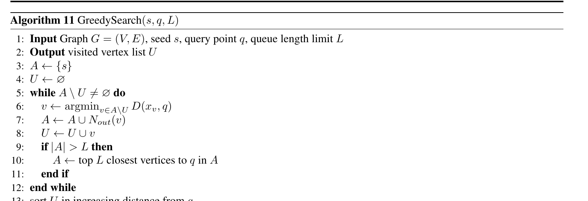
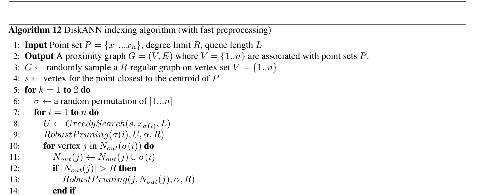
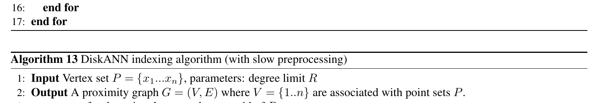

# Lesson 08 — DiskANN recap và cách ghép thành hệ thống retrieval

## Mục tiêu

Kết nối phần appendix DiskANN với toàn bộ khóa học, sau đó chuyển ý tưởng paper thành blueprint cho một hệ thống thực tế.

## 1. RobustPruning trong DiskANN



Standard RobustPruning:

1. gộp candidate `U` với out-neighbor hiện tại;
2. chọn điểm `v` gần center `i` nhất;
3. giữ edge `i→v`;
4. loại các candidate `v'` bị `v` cover theo điều kiện pruning;
5. dừng khi hết candidate hoặc degree đạt `R`.

Đây là cơ chế tạo graph sparse nhưng vẫn điều hướng tốt.

## 2. GreedySearch



Search giữ queue `A` tối đa `L` candidate gần query nhất đã thấy. Mỗi vòng expand candidate gần nhất chưa visited và thêm out-neighbor.

Đây là “engine” traversal mà diverse search kế thừa, nhưng diverse search thay cấu trúc queue bằng phiên bản giới hạn theo color.

## 3. Fast preprocessing



Fast DiskANN:

- khởi tạo random `R`-regular graph;
- chạy hai pass random order;
- với mỗi point, dùng GreedySearch để tạo candidate set;
- RobustPruning candidate set thay vì toàn bộ `V`;
- thêm reverse edge và prune lại node bị vượt degree.

Điểm then chốt: thay vì `O(n)` candidate cho mỗi node, dùng search để lấy neighborhood ứng viên thực tế.

## 4. Slow preprocessing



Slow version prune trên toàn bộ vertex set cho từng point. Nó hữu ích cho phân tích lý thuyết nhưng quá đắt khi `n` lớn.

Paper diverse giữ mô hình tư duy tương tự:

```text
provable diverse indexing
        ↓ chuyển thành heuristic
DiverseSearch + DiversePrune + DiverseIndex
```

## 5. Blueprint cho RAG đa dạng document

Giả sử mỗi chunk có:

```json
{
  "vector": "embedding",
  "document_id": "doc_123",
  "chunk_id": "chunk_7"
}
```

Chọn:

```text
color = document_id
k = số context chunks muốn trả
k' = số chunk tối đa/document
```

### Query path

```text
query text
  ↓ embedding
query vector q
  ↓ diverse graph search
candidate queue giữ tối đa k' / document_id
  ↓
top-k diverse chunks
  ↓
LLM context
```

Nếu muốn nhiều perspective hơn document identity, có thể định nghĩa `ρ` trên document/topic representation, nhưng paper chưa đưa heuristic experimental hoàn chỉnh cho arbitrary `ρ`.

## 6. Blueprint cho shopping/search

- color = seller hoặc brand;
- `k'` là policy “tối đa bao nhiêu kết quả từ cùng seller/brand”;
- diverse index giúp graph có đường tới seller thiểu số trong local neighborhood;
- query-time diverse queue giữ policy ngay trong traversal.

## 7. Parameter checklist

### `k`

Output size. Nên build graph với upper bound đủ lớn nếu workload có nhiều `k` khác nhau.

### `k'`

Constraint trực tiếp theo color. `k'=1` rất mạnh; tăng `k'` làm bài toán gần standard ANN hơn.

### `L`

Search-list size. Tăng `L` thường tăng exploration/recall nhưng tăng latency.

### `R`

Graph degree limit. Tăng `R` có thể tăng connectivity và memory/build/search cost.

### `α`

Pruning aggressiveness/geometry trade-off.

### `m`

Diversity aggressiveness trong DiversePrune. `m` lớn buộc nhiều color cùng “đồng ý” trước khi prune một edge.

## 8. Benchmark protocol nên dùng

1. Chia base/query rõ ràng.
2. Xây exact diverse ground truth cho sample query nhỏ nếu full scan quá đắt.
3. Đo `Recall@k` theo diverse ground truth.
4. Đo latency percentile, không chỉ mean nếu triển khai production.
5. So ít nhất 3 variant giống paper:
   - standard + post-process;
   - standard + diverse search;
   - diverse build + diverse search.
6. Sweep `L`, `m`, `R`, `k'`.
7. Báo memory/index size/build time.

## 9. Checklist correctness trước khi tối ưu

- [ ] Mỗi output có đúng `k` phần tử khi đủ dữ liệu hợp lệ.
- [ ] Không color nào vượt `k'`.
- [ ] Candidate queue invariant không bị phá khi replace.
- [ ] Ground truth dùng cùng diversity rule với algorithm.
- [ ] Reverse edge được prune lại nếu degree vượt `R`.
- [ ] Kết quả deterministic khi seed/random order được cố định cho test.
- [ ] Baseline post-processing dùng cùng distance metric và dataset.

## 10. Tổng kết khóa học

Thông điệp quan trọng nhất là:

> Khi diversity là constraint cốt lõi của output, xử lý diversity chỉ ở bước rerank cuối có thể lãng phí search effort. Thiết kế graph và traversal để diversity trở thành invariant của search có thể cải thiện trade-off recall–latency.

Paper chứng minh điều này ở mức lý thuyết cho một lớp dữ liệu có bounded intrinsic dimension và minh họa hiệu quả thực tế bằng heuristic DiskANN trên seller/brand và semi-synthetic datasets.
