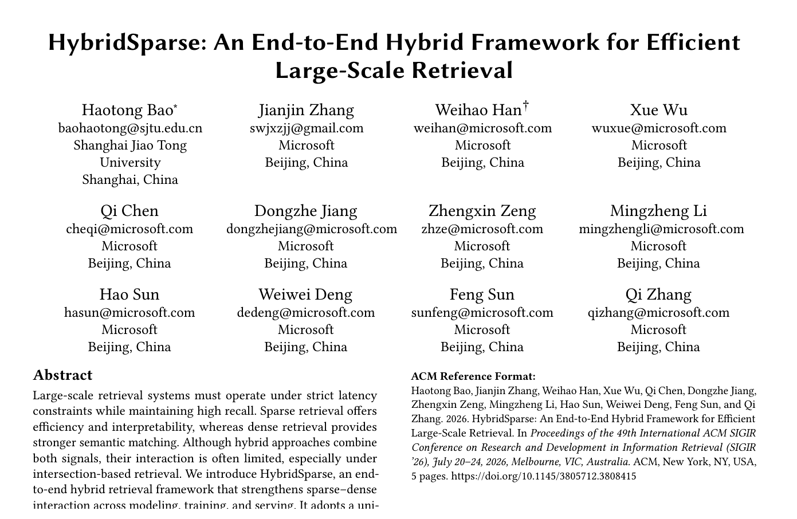

# Bài 1 - Bối cảnh và bài toán Hybrid Retrieval

## 1. Mục tiêu bài học

Sau bài này, bạn cần giải thích được ba câu hỏi:

- Vì sao sparse retrieval vẫn quan trọng dù dense retrieval mạnh về semantic matching?
- Vì sao việc “chạy sparse + chạy dense rồi cộng điểm” chưa giải quyết hết bài toán?
- Vì sao **candidate overlap** đặc biệt quan trọng trong kiểu hybrid retrieval dựa trên intersection?

## 2. Hai hướng retrieval nền tảng

Paper bắt đầu từ bài toán first-stage retrieval ở quy mô lớn, nơi hệ thống phải vừa có **recall cao** vừa đáp ứng **ràng buộc latency**.

### 2.1 Sparse lexical retrieval

Sparse retrieval khai thác tín hiệu từ từ/ngữ trong vocabulary. Điểm mạnh mà paper nhấn mạnh là:

- hiệu quả khi phục vụ ở quy mô lớn;
- dễ diễn giải hơn vì điểm số gắn với lexical terms;
- phù hợp với inverted index.

Nhược điểm chính là **vocabulary mismatch** và khả năng biểu diễn ngữ nghĩa còn hạn chế. Hai câu diễn đạt gần nghĩa nhưng khác từ có thể không tạo được lexical match tốt.

### 2.2 Dense semantic retrieval

Dense retrieval ánh xạ query và document thành vector dense có số chiều thấp hơn vocabulary. Dense representation mạnh ở semantic matching và thường kết hợp ANN index để tìm hàng xóm gần.

Đổi lại, paper lưu ý rằng quá trình nén vào dense embedding có thể làm mất một số lexical signal quan trọng.

## 3. Vì sao cần hybrid retrieval?

Hybrid retrieval muốn dùng **cả lexical signal và semantic signal**. Tuy nhiên, đóng góp trung tâm của paper không chỉ là “có hai loại representation”, mà là làm cho hai nhánh **tương tác và đồng thuận tốt hơn** trong cả:

1. modeling;
2. training;
3. search execution / serving.

Các cách hybrid truyền thống thường rơi vào một trong hai nhóm:

- chạy sparse và dense trên hai index riêng, sau đó fuse/rerank;
- dùng tín hiệu của một nhánh để cải thiện nhánh còn lại.

Theo paper, nhóm đầu có nguy cơ tăng tính toán, latency và tạo score misalignment; nhóm sau thường vẫn có một paradigm chi phối, nên mức tương tác sparse-dense ở first-stage retrieval còn hạn chế.

## 4. Điểm nghẽn của intersection-based hybrid retrieval

OneSparse đã hợp nhất sparse terms và dense **virtual terms** vào một inverted index. Điều này rất quan trọng vì nó giúp hybrid serving không cần hai pipeline retrieval hoàn toàn độc lập.

Nhưng “hợp nhất cấu trúc index” không đồng nghĩa với “hai scorer hành xử đồng nhất”. Nếu sparse branch và dense branch trả về các vùng candidate khác nhau, phép intersection có thể làm giảm candidate overlap. Khi candidate cần thiết bị loại ngay ở first-stage, downstream ranking không thể lấy lại chúng.

Đây là vấn đề mà HybridSparse hướng tới: **tăng alignment giữa sparse và dense trước và trong quá trình candidate generation**, chứ không chỉ fuse điểm ở cuối.

## 5. Ý tưởng chính của HybridSparse

HybridSparse đưa ra bốn thành phần kết nối với nhau:

- **Shared global backbone:** query/document chỉ cần đi qua backbone chung rồi tách thành semantic branch và lexical branch.
- **Co-training:** cả hai branch được tối ưu trong cùng quá trình huấn luyện.
- **Hybrid score regularization:** hybrid score được đưa trực tiếp vào objective.
- **Consistency distillation:** hybrid distribution đóng vai trò teacher để semantic và lexical distributions tiến gần nhau hơn.

Serving vẫn tận dụng unified OneSparse index và multi-way merge, giúp paper giữ trọng tâm vào alignment/training thay vì thêm một online model stage mới.

## 6. Kết quả tổng quan mà paper báo cáo

Trên public benchmarks, HybridSparse vượt các sparse, dense và hybrid baselines được so sánh trong paper. Trong production Bing advertisement retrieval, paper báo cáo **+1.30% RPM** cho HybridSparse ở bước A/B test sau phiên bản trung gian OneSparse-SPLADE.

## 7. Câu hỏi tự kiểm tra

1. Sparse retrieval và dense retrieval giải quyết hai loại tín hiệu khác nhau như thế nào?
2. “Structural unification” khác “behavioral alignment” ở điểm nào?
3. Vì sao intersection có thể biến sự lệch giữa sparse và dense thành vấn đề recall?
4. Bốn thành phần chính của HybridSparse là gì?
