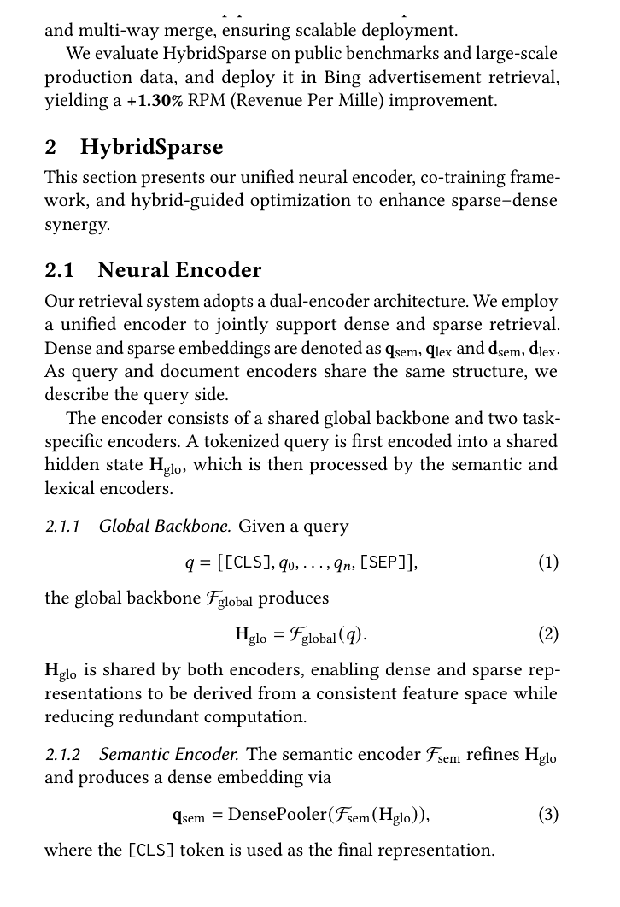

# Bài 2 - Kiến trúc Unified Neural Encoder



## 1. Mục tiêu

Bài này tập trung vào phần `2.1 Neural Encoder`: cách HybridSparse tạo đồng thời dense semantic embedding và sparse lexical embedding từ một feature space chung.

## 2. Dual-encoder ở mức retrieval

Paper mô tả hệ thống theo kiến trúc dual-encoder: query và document đều được encode để phục vụ việc tính similarity/retrieval. Hai phía có cùng cấu trúc, nên paper chỉ trình bày chi tiết phía query.

Ký hiệu:

- `q_sem`: dense semantic embedding của query;
- `q_lex`: sparse lexical embedding của query;
- `d_sem`: dense semantic embedding của document;
- `d_lex`: sparse lexical embedding của document.

## 3. Shared global backbone

Với tokenized query:

$$
q = [[CLS], q_0, ..., q_n, [SEP]]
$$

backbone chung tạo hidden state:

$$
H_{glo} = F_{global}(q)
$$

Điểm quan trọng là `H_glo` được **chia sẻ** cho hai nhánh semantic và lexical.

### Tại sao thiết kế này quan trọng?

Theo lập luận của paper, cùng một feature space giúp:

- giảm redundant computation;
- khiến dense và sparse representation xuất phát từ cùng nền tảng biểu diễn;
- giảm misalignment giữa hai nhánh.

Nói cách khác, hai nhánh không còn giống hai hệ thống hoàn toàn tách biệt chỉ gặp nhau ở bước fuse cuối.

## 4. Semantic encoder

Semantic branch tiếp tục tinh chỉnh `H_glo` bằng `F_sem`, sau đó dùng dense pooler:

$$
q_{sem} = DensePooler(F_{sem}(H_{glo}))
$$

Paper dùng token `[CLS]` làm final representation.

Dense embedding này được dùng cho semantic retrieval, bao gồm ANN search để lấy virtual terms ở serving pipeline.

## 5. Lexical encoder

Lexical branch ánh xạ hidden representation vào vector có kích thước bằng vocabulary. Thiết kế theo phong cách SPLADE:

$$
q_{lex} = \log(1 + Max(ReLU(WF_{lex}(H_{glo}))))
$$

Ý nghĩa thao tác:

1. `F_lex(H_glo)` tạo biểu diễn dành cho lexical task;
2. phép projection `W` đưa token representations lên vocabulary space;
3. `ReLU` giữ activation không âm;
4. `Max` tổng hợp tín hiệu theo token;
5. `log(1 + ...)` nén biên độ score.

Paper áp dụng **FLOPS regularization** để khuyến khích sparsity, vì lexical vector nếu quá dày sẽ làm mất lợi ích của sparse retrieval.

## 6. Điểm nối giữa kiến trúc và bài toán alignment

Kiến trúc shared backbone không tự động bảo đảm hai branch cho score giống nhau, nhưng nó tạo điều kiện để:

- parameter sharing;
- representation consistency;
- co-training ở bước tiếp theo.

Nó là tầng đầu của chiến lược alignment. Bài 3 sẽ xử lý tầng thứ hai: căn chỉnh bằng objective và distillation.

## 7. Sơ đồ ghi nhớ

```text
Tokenized query
      |
      v
 F_global shared backbone
      |
  +---+---+
  |       |
  v       v
F_sem   F_lex
  |       |
Dense   Vocab projection + sparse pooling
  |       |
q_sem   q_lex
```

## 8. Câu hỏi tự kiểm tra

1. Vì sao paper không dùng hai backbone hoàn toàn tách biệt?
2. `[CLS]` được dùng ở nhánh nào?
3. Nhánh lexical tạo sparse vector trong không gian nào?
4. FLOPS regularization phục vụ mục tiêu gì?
