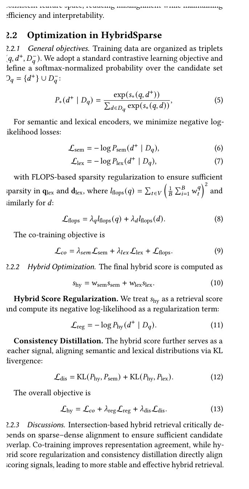

# Bài 3 - Co-training, Hybrid Score Regularization và Consistency Distillation



## 1. Mục tiêu

Bài này giải thích Eq. 5-13 của paper và mối liên hệ giữa từng loss component.

## 2. Dữ liệu huấn luyện dạng triplet

Training data được tổ chức dưới dạng:

$$
(q, d^+, D_q^-)
$$

trong đó:

- `q`: query;
- `d+`: positive document;
- `Dq-`: tập negative documents.

Candidate set:

$$
D_q = \{d^+\} \cup D_q^-
$$

Với mỗi loại scorer `*`, xác suất softmax của positive document được định nghĩa:

$$
P_*(d^+|D_q)=\frac{\exp(s_*(q,d^+))}{\sum_{d\in D_q}\exp(s_*(q,d))}
$$

## 3. Loss riêng cho semantic và lexical branch

Hai negative log-likelihood losses:

$$
L_{sem}=-\log P_{sem}(d^+|D_q)
$$

$$
L_{lex}=-\log P_{lex}(d^+|D_q)
$$

Như vậy, cả dense branch và sparse branch đều phải học cách đưa positive document lên cao trong candidate set.

## 4. FLOPS sparsity regularization

Paper thêm `L_flops` để giữ sparse representation đủ thưa:

$$
L_{flops}=\lambda_q l_{flops}(q)+\lambda_d l_{flops}(d)
$$

Co-training objective cơ bản:

$$
L_{co}=\lambda_{sem}L_{sem}+\lambda_{lex}L_{lex}+L_{flops}
$$

Điểm cần nhớ: **co-training** mới chỉ khiến hai branch được tối ưu đồng thời; paper còn thêm objective trực tiếp trên hybrid score để tăng alignment.

## 5. Hybrid score

Final hybrid score:

$$
s_{hy}=w_{sem}s_{sem}+w_{lex}s_{lex}
$$

Trong public benchmark implementation, paper cho biết sử dụng direct score summation, không weight tuning, nhờ hybrid score regularization.

## 6. Hybrid Score Regularization

Paper coi `s_hy` như một retrieval score thực sự, tạo xác suất `P_hy` và negative log-likelihood:

$$
L_{reg}=-\log P_{hy}(d^+|D_q)
$$

Khác với việc chỉ cộng score lúc inference, `L_reg` buộc **hệ thống hybrid itself** phải tối ưu cho positive target trong training.

## 7. Consistency Distillation

Hybrid score đóng vai trò teacher signal. Hai distribution semantic và lexical được kéo về phía hybrid distribution bằng KL divergence:

$$
L_{dis}=KL(P_{hy},P_{sem})+KL(P_{hy},P_{lex})
$$

Diễn giải: thay vì để hai branch chỉ “cùng đúng” nhưng có phân phối score rất khác nhau, distillation khuyến khích chúng học một cấu trúc ranking tương thích hơn với hybrid teacher.

## 8. Objective cuối cùng

$$
L_{hy}=L_{co}+\lambda_{reg}L_{reg}+\lambda_{dis}L_{dis}
$$

Có thể đọc objective theo ba lớp:

```text
Branch correctness
  -> L_sem + L_lex

Sparse efficiency
  -> L_flops

Hybrid alignment
  -> L_reg + L_dis
```

## 9. Vì sao alignment quan trọng cho intersection?

Paper nhấn mạnh rằng intersection-based hybrid retrieval cần đủ candidate overlap. Nếu semantic và lexical distributions quá lệch:

- branch A có thể ưu tiên candidate mà branch B không retrieve;
- intersection có thể loại candidate tốt;
- downstream ranker không thể phục hồi candidate đã mất.

Do đó `L_reg` và `L_dis` không chỉ là tối ưu score đẹp hơn; chúng nhắm vào reliability của candidate generation.

## 10. Câu hỏi tự kiểm tra

1. `L_co` gồm những thành phần nào?
2. `L_reg` khác `L_sem`/`L_lex` ở chỗ nào?
3. Trong distillation, distribution nào làm teacher?
4. Vì sao KL divergence phù hợp với mục tiêu alignment distribution?
5. Nếu bỏ distillation, production ablation cho thấy R@50 thay đổi theo hướng nào? Hãy trả lời sau khi học Bài 6.
