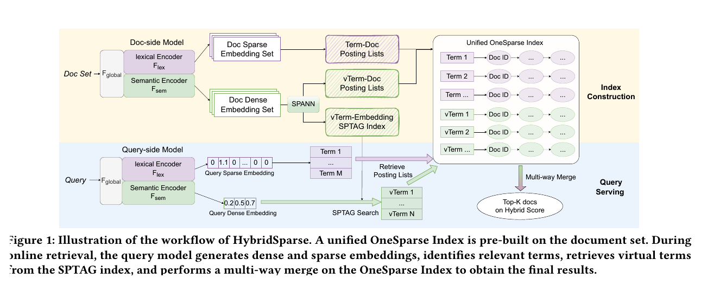
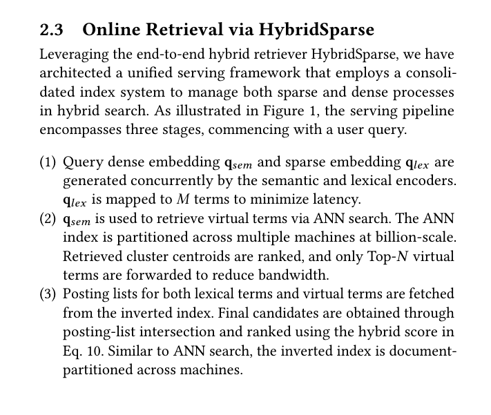

# Bài 4 - Online Retrieval và Unified OneSparse Index





## 1. Mục tiêu

Bài này nối phần model với phần serving: từ `q_sem`, `q_lex` đến Top-K documents.

## 2. Hai pha lớn của hệ thống

Sơ đồ Figure 1 chia pipeline thành:

- **Index Construction** trên document set;
- **Query Serving** khi có query online.

Mục tiêu thiết kế là giữ cả lexical terms và dense-derived virtual terms trong một hệ thống index thống nhất.

## 3. Index construction phía document

Document-side model dùng shared `F_global`, sau đó tách:

- lexical encoder -> document sparse embedding set;
- semantic encoder -> document dense embedding set.

Sparse side hình thành **Term-Doc posting lists**.

Dense side đi qua SPANN/SPTAG-related machinery để tạo:

- virtual-term embedding index;
- vTerm-Doc posting lists.

Hai loại posting list cùng đi vào **Unified OneSparse Index**.

## 4. Query serving - Bước 1: tạo hai representation song song

Khi query đến, semantic và lexical encoders sinh đồng thời:

- `q_sem`;
- `q_lex`.

Paper giới hạn `q_lex` về `M` terms để giảm latency. Đây là điểm cho thấy sparse vector không được dùng toàn bộ vocabulary khi online serving.

## 5. Bước 2: dense embedding -> virtual terms

`q_sem` dùng ANN search để retrieve virtual terms.

Ở billion-scale, ANN index được partition trên nhiều máy. Cluster centroids được rank và chỉ Top-N virtual terms được chuyển tiếp, nhằm giảm bandwidth.

Đây là cầu nối quan trọng: dense retrieval signal được biểu diễn dưới dạng virtual terms để tham gia cùng cơ chế posting list/inverted index.

## 6. Bước 3: posting lists + multi-way merge

Hệ thống lấy posting lists của:

- lexical terms từ `q_lex`;
- virtual terms từ ANN search của `q_sem`.

Sau đó:

1. thực hiện posting-list intersection;
2. tạo final candidate set;
3. rank candidates bằng hybrid score của Eq. 10;
4. trả Top-K documents.

## 7. Vì sao serving framework này đáng chú ý?

Paper giữ lợi ích của OneSparse: không cần hai retrieval pipeline độc lập rồi mới hợp nhất. Thay vào đó, sparse terms và virtual terms cùng tham gia một index + merge pipeline.

Quan trọng hơn, HybridSparse tập trung cải thiện **training và representation alignment**, trong khi online serving không thêm một model stage mới. Production section nói dense và sparse query representations được tạo trong một forward pass, hai retrieval branches chạy concurrent, rồi merge theo existing OneSparse serving pipeline.

## 8. Pseudocode khái niệm

Đây là cách diễn giải trực tiếp từ ba bước của paper, không phải code implementation được paper cung cấp:

```text
q_sem, q_lex = query_model(query)

lexical_terms = top_M_terms(q_lex)
virtual_terms = ANN_search(q_sem, top_N)

posting_lists = fetch_postings(lexical_terms + virtual_terms)
candidates = intersection_and_multiway_merge(posting_lists)

scores = hybrid_score(candidates)
return top_K(scores)
```

## 9. Câu hỏi tự kiểm tra

1. Virtual term có vai trò gì trong unified index?
2. Vì sao chỉ lấy Top-N virtual terms?
3. Tại sao paper nói dense và sparse query representations có thể tạo trong một forward pass?
4. Candidate nào bị bỏ ở intersection có thể được downstream ranking khôi phục không? Theo paper, đây là lý do gì khiến recall quan trọng?
