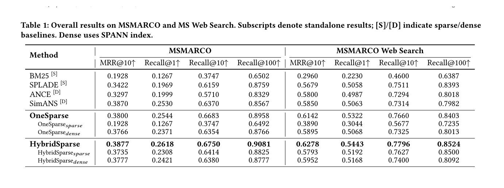

# Bài 5 - Public Benchmark Evaluation

## 1. Dataset

Paper đánh giá trên hai benchmark:

### MSMARCO Passage Retrieval

- 8.8 triệu passages;
- 7K dev queries.

### MSMARCO Web Search

- 101 triệu documents;
- 9K test queries;
- được paper mô tả là large-scale multilingual search.

## 2. Baselines

Paper chia baseline theo nhóm:

- **Sparse:** BM25, SPLADE;
- **Dense:** DPR, ANCE, SimANS (bảng chính hiển thị ANCE và SimANS; phần mô tả baseline có DPR);
- **Hybrid/unified:** OneSparse với dense encoder dựa trên coCondenser.

## 3. Metrics

Hai loại metric chính:

- `MRR@10`: nhấn vào thứ hạng sớm của kết quả phù hợp;
- `Recall@K`: xem ground-truth có xuất hiện trong Top-K hay không.

Paper báo cáo Recall@1, Recall@10 và Recall@100.

## 4. Kết quả chính trên MSMARCO

| Method | MRR@10 | R@1 | R@10 | R@100 |
|---|---:|---:|---:|---:|
| BM25 | 0.1928 | 0.1267 | 0.3747 | 0.6502 |
| SPLADE | 0.3422 | 0.1969 | 0.6159 | 0.8759 |
| ANCE | 0.3297 | 0.1999 | 0.5710 | 0.8329 |
| SimANS | 0.3870 | 0.2530 | 0.6370 | 0.8567 |
| OneSparse | 0.3800 | 0.2544 | 0.6683 | 0.8958 |
| **HybridSparse** | **0.3877** | **0.2618** | **0.6750** | **0.9081** |

Paper báo cáo so với OneSparse, HybridSparse đạt khoảng **+1.7% Recall gain** và **+2.0% MRR improvement** trên MSMARCO theo cách tính của tác giả.

## 5. Kết quả chính trên MS Web Search

| Method | MRR@10 | R@1 | R@10 | R@100 |
|---|---:|---:|---:|---:|
| BM25 | 0.2960 | 0.2230 | 0.4600 | 0.6387 |
| SPLADE | 0.5679 | 0.5058 | 0.7511 | 0.8393 |
| ANCE | 0.5800 | 0.4987 | 0.7294 | 0.8018 |
| SimANS | 0.5850 | 0.5063 | 0.7314 | 0.7982 |
| OneSparse | 0.6142 | 0.5322 | 0.7660 | 0.8403 |
| **HybridSparse** | **0.6278** | **0.5443** | **0.7796** | **0.8524** |

Paper báo cáo so với OneSparse: **+2.3% Recall gain** và **+2.5% MRR improvement** trên MS Web Search.

## 6. Standalone sparse/dense components

Một điểm quan trọng là paper không chỉ báo cáo final HybridSparse. Bảng còn tách:

- `HybridSparse_sparse`;
- `HybridSparse_dense`.

Điều này được dùng để lập luận rằng joint training không chỉ cải thiện fusion cuối mà còn tạo lợi ích cho từng component riêng lẻ.

Ví dụ trên MSMARCO:

- OneSparse sparse MRR@10: `0.1928`;
- HybridSparse sparse MRR@10: `0.3735`.

Dense side cũng tăng nhẹ:

- OneSparse dense MRR@10: `0.3766`;
- HybridSparse dense MRR@10: `0.3777`.

## 7. Implementation details cho public benchmarks

Paper cho biết:

- encoder dựa trên PLM, shared backbone + hai task-specific branches;
- initialization từ coCondenser trên MSMARCO và SimANS trên MS Web Search;
- pre-trained MLM head hỗ trợ sparse term weighting và co-training initialization;
- hybrid scoring dùng direct score summation, không weight tuning trong thí nghiệm này.

## 8. Cách đọc bảng khoa học

Không chỉ nhìn một cột. Với first-stage retrieval:

- `R@100` cho biết khả năng giữ candidate tốt trong tập lớn hơn;
- `R@1` cho thấy model đưa đúng item lên ngay vị trí đầu ra sao;
- `MRR@10` phản ánh thứ hạng của relevant item trong top đầu.

Paper dùng đồng thời các metric để cho thấy HybridSparse không chỉ tăng một điểm riêng lẻ.

## 9. Câu hỏi tự kiểm tra

1. Dataset nào lớn hơn theo số document?
2. Trên MSMARCO, HybridSparse đạt R@100 bao nhiêu?
3. Tại sao việc báo cáo standalone sparse/dense component hữu ích cho lập luận của paper?
4. Vì sao không nên đánh giá retrieval chỉ bằng một metric?
