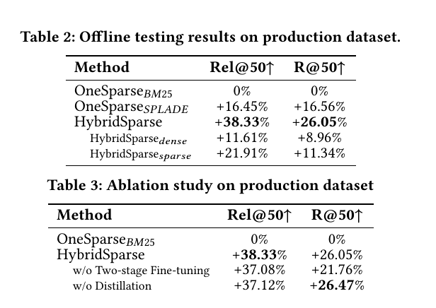
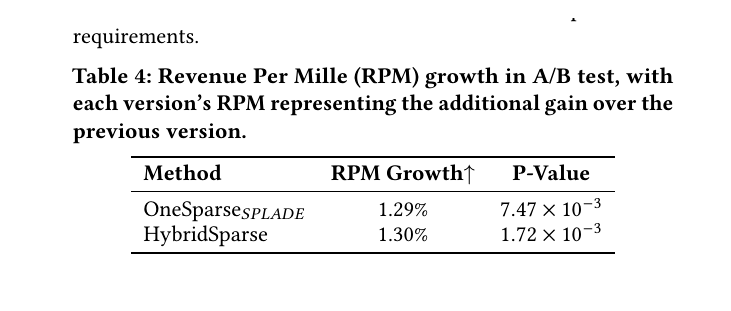

# Bài 6 - Production Experiments, Ablation và Online A/B Test

## 1. Production dataset

Paper dùng dataset nội bộ từ Bing production cho offline experiments:

- tổng cộng **1 tỷ query-ad pairs**;
- **1 triệu pairs** dành cho test;
- **30 triệu ads** được đưa vào ANN index để đánh giá embedding-based retrieval.

## 2. Hai metric production

### Recall of click - R@K

Đánh giá clicked advertisement có nằm trong Top-K retrieval results hay không. Click label đóng vai trò ground truth.

### Relevance degree - Rel@K

Đánh giá average relevance score của Top-K results. Relevance labels được dự đoán bởi một high-precision LLM-based relevance teacher đã được calibrated trên human-annotated query-ad pairs và đánh giá đối chiếu với human judgments trước khi dùng cho offline evaluation.

Paper nói dùng fixed scoring schema và deterministic inference để giảm evaluation variance.

## 3. Một số implementation details production

Paper cung cấp các chi tiết sau:

- dense embedding giảm từ 768 xuống **64 dimensions** qua linear projection;
- WordPiece tokenizer được train trên in-house ads corpus;
- vocabulary size: **50,777**;
- training theo hai stage; stage 2 dùng relevance teacher để self-generate và select hard negatives;
- implementation: Python 3.8, PyTorch 1.12.1;
- training hardware: 8 NVIDIA V100 32GB GPUs và 4 AMD EPYC 7V12 64-Core CPUs.

## 4. Offline production results

Bảng 2 dùng `OneSparse_BM25` làm baseline 0%.

| Method | Rel@50 | R@50 |
|---|---:|---:|
| OneSparse_BM25 | 0% | 0% |
| OneSparse_SPLADE | +16.45% | +16.56% |
| **HybridSparse** | **+38.33%** | **+26.05%** |
| HybridSparse_dense | +11.61% | +8.96% |
| HybridSparse_sparse | +21.91% | +11.34% |

Paper dùng kết quả này để lập luận rằng hybrid training tăng cả recall và relevance so với OneSparse_SPLADE, đồng thời từng branch tách riêng cũng được hưởng lợi.

## 5. Ablation study

| Method | Rel@50 | R@50 |
|---|---:|---:|
| HybridSparse | +38.33% | +26.05% |
| w/o Two-stage Fine-tuning | +37.08% | +21.76% |
| w/o Distillation | +37.12% | +26.47% |

### 5.1 Bỏ two-stage fine-tuning

Cả Rel@50 và R@50 giảm. Paper cho rằng mức giảm lớn hơn về relevance có thể liên quan tới việc thiếu relevance negative samples ở stage 2.

### 5.2 Bỏ distillation

- Rel@50: giảm từ `+38.33%` xuống `+37.12%`;
- R@50: tăng nhẹ từ `+26.05%` lên `+26.47%`.

Paper diễn giải đây là trade-off giữa click-oriented recall và relevance. Dù R@50 trong bảng tăng nhẹ khi bỏ distillation, phần văn bản nhấn mạnh việc chọn cấu hình distillation dựa trên cân bằng production requirements và tầm quan trọng của candidate recall. Khi học paper, cần đọc **bảng số liệu và phần diễn giải cùng nhau**, không tự thay đổi kết luận của tác giả.

## 6. Online A/B test

Paper mô tả hai bước triển khai:

1. `OneSparse_SPLADE` được đưa vào production trước, đạt **+1.29% RPM** so với phiên bản trước, p-value `7.47 × 10^-3`.
2. Sau đó `HybridSparse` đạt thêm **+1.30% RPM** so với phiên bản trước nó, p-value `1.72 × 10^-3`.

Paper ghi chú rằng p-value dưới `5 × 10^-2` được coi là significant trong production setup này.

Điểm cần đọc chính xác: Table 4 nói **mỗi version’s RPM là additional gain over previous version**, không phải cả hai con số đều trực tiếp so với cùng một baseline ban đầu.

## 7. Câu hỏi tự kiểm tra

1. Production offline dataset có bao nhiêu query-ad pairs?
2. Dense embedding được giảm xuống bao nhiêu chiều?
3. Stage 2 của training dùng teacher để làm gì?
4. Vì sao phải đọc chú thích “additional gain over previous version” khi diễn giải RPM?
5. Ablation nào gây giảm R@50 lớn nhất trong bảng?
