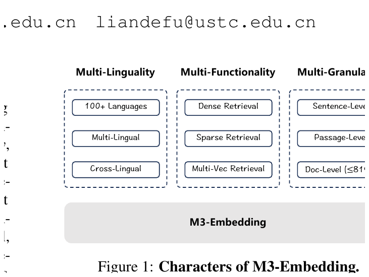

# Khóa học: M3-Embedding - Text Embeddings đa ngôn ngữ, đa chức năng và đa độ dài

Khóa học này được biên soạn trực tiếp từ paper **“M3-Embedding: Multi-Linguality, Multi-Functionality, Multi-Granularity Text Embeddings Through Self-Knowledge Distillation”** của Jianlv Chen và cộng sự. Mục tiêu là biến paper thành một lộ trình học độc lập bằng tiếng Việt, thay vì chỉ tóm tắt từng mục.

> Phạm vi: nội dung kỹ thuật, số liệu, công thức và kết luận thực nghiệm trong khóa học bám theo paper. Các phần “bài tập thiết kế” là hoạt động học tập được xây dựng từ những nguyên lý trong paper, không phải kết quả thực nghiệm mới.



## Sau khóa học, người học có thể

1. Giải thích ba mục tiêu **Multi-Linguality - Multi-Functionality - Multi-Granularity**.
2. Phân biệt và viết được công thức của **dense retrieval**, **sparse/lexical retrieval** và **multi-vector retrieval**.
3. Giải thích vì sao M3 dùng **hybrid retrieval** và cách tổ hợp ba điểm liên quan.
4. Trình bày cơ chế **self-knowledge distillation** và lý do nó đặc biệt hữu ích cho sparse retrieval.
5. Hiểu quy trình xây dữ liệu đa ngôn ngữ, dữ liệu tổng hợp cho long-document retrieval và hard negatives.
6. Giải thích các kỹ thuật **group-by-length, split-batch, gradient checkpointing, cross-GPU broadcasting**.
7. Đọc và phân tích các thí nghiệm trên MIRACL, MKQA, MLDR và NarrativeQA.
8. Phân tích ablation study và các giới hạn mà chính tác giả nêu ra.
9. Thiết kế một pipeline retrieval dựa trên các nguyên lý của paper.

## Cấu trúc thư mục

```text
M3_Embedding_Course/
├── README.md
├── lessons/
│   ├── 01_text_embedding_va_bai_toan.md
│   ├── 02_ba_chuc_nang_retrieval.md
│   ├── 03_data_curation.md
│   ├── 04_hybrid_retrieval.md
│   ├── 05_self_knowledge_distillation.md
│   ├── 06_efficient_batching_va_training.md
│   ├── 07_long_document_va_mcls.md
│   ├── 08_thi_nghiem_va_ket_qua.md
│   ├── 09_ablation_limitations.md
│   └── 10_blueprint_he_thong.md
├── exercises/
│   ├── bai_tap_tong_hop.md
│   └── dap_an_goi_y.md
├── reference/
│   ├── glossary.md
│   ├── paper_map.md
│   └── 2402.03216v5.pdf
└── assets/
    └── 12 ảnh/figure/table trích từ paper
```

## Lộ trình học đề xuất

| Bài | Chủ đề | Trọng tâm |
|---|---|---|
| 1 | Bài toán text embedding | Vì sao M3 cần ba chiều linh hoạt |
| 2 | Ba chức năng retrieval | Dense, sparse, multi-vector |
| 3 | Data curation | 1.2B cặp đa ngôn ngữ + labeled + synthetic |
| 4 | Hybrid retrieval | Candidate retrieval và reranking |
| 5 | Self-knowledge distillation | Ensemble score làm teacher signal |
| 6 | Efficient batching | Train long sequence nhưng vẫn giữ batch lớn |
| 7 | Long document + MCLS | 8192 tokens, MultiLongDoc, Multiple CLS |
| 8 | Thực nghiệm | MIRACL, MKQA, MLDR, NarrativeQA |
| 9 | Ablation + limitations | Thành phần nào thực sự tạo hiệu quả |
| 10 | Blueprint hệ thống | Chuyển ý tưởng paper thành kiến trúc retrieval |

## Cách học

Mỗi bài nên học theo chu kỳ **đọc -> tự diễn giải -> làm câu kiểm tra -> đối chiếu hình/bảng -> giải bài tập**. Với các công thức, không nên học thuộc ký hiệu; hãy luôn trả lời ba câu hỏi: *đầu vào là gì, điểm số đo điều gì, chi phí nằm ở đâu?*

Sau khi hoàn thành Bài 1-9, làm `exercises/bai_tap_tong_hop.md` mà chưa mở đáp án. Bài 10 dùng như một bài capstone để hệ thống hóa toàn paper.
