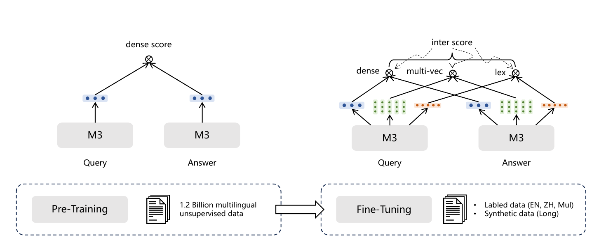

# Bài 2 - Dense, Sparse và Multi-Vector Retrieval trong cùng một model

## 1. Mục tiêu

Bài này đi vào phần cốt lõi của M3: một encoder sinh hidden states nhưng ba nhánh tính relevance score theo ba cách khác nhau.

## 2. Ký hiệu chung

Với query `q`, text encoder sinh hidden states:

\[
H_q = [h_{q,0}, h_{q,1}, ..., h_{q,N}]
\]

Với passage `p`:

\[
H_p = [h_{p,0}, h_{p,1}, ..., h_{p,M}]
\]

Trong kiến trúc của paper, token đầu là `[CLS]`. Từ cùng hai tập hidden states này, M3 tạo ra ba scoring function.

## 3. Dense retrieval

M3 dùng hidden state của `[CLS]`, sau đó normalize:

\[
e_q = norm(H_q[0]), \qquad e_p = norm(H_p[0])
\]

Điểm liên quan:

\[
s_{dense} = \langle e_p, e_q \rangle
\]

### Trực giác

Toàn bộ query được nén thành một vector và passage cũng vậy. Vì thế dense retrieval phù hợp cho bước tìm candidate ở quy mô lớn: representation gọn và phép so sánh tương đối đơn giản.

### Điều model phải học

`[CLS]` phải trở thành một biểu diễn tổng hợp đủ tốt để query và positive passage gần nhau hơn negative passage trong latent space.

## 4. Sparse/Lexical retrieval

M3 không chỉ dùng `[CLS]`. Với mỗi token `t`, hidden state được ánh xạ thành một scalar bằng ma trận học được `W_lex`:

\[
w_{qt} = ReLU(W_{lex}^{T}H_q[i])
\]

Nếu một term xuất hiện nhiều lần trong query, paper giữ **trọng số lớn nhất** của term đó. Passage được xử lý tương tự.

Điểm lexical được tính trên các term cùng xuất hiện:

\[
s_{lex} = \sum_{t \in q \cap p} w_{qt} \cdot w_{pt}
\]

### Trực giác

Thay vì coi mọi term quan trọng như nhau, model học term nào mang nhiều tín hiệu retrieval hơn. Đây là sparse representation vì relevance tập trung trên các term/token cụ thể.

### Hệ quả quan trọng với cross-lingual retrieval

Khi query và passage ở hai ngôn ngữ khác nhau, số term cùng xuất hiện rất ít. Paper quan sát sparse retrieval giảm hiệu quả rõ trong benchmark cross-lingual MKQA. Đây là giới hạn tự nhiên của cơ chế dựa trên lexical overlap.

## 5. Multi-vector retrieval

M3 chiếu toàn bộ hidden states qua `W_mul`, rồi normalize:

\[
E_q = norm(W_{mul}^{T}H_q), \qquad E_p = norm(W_{mul}^{T}H_p)
\]

Sau đó dùng late interaction kiểu ColBERT:

\[
s_{mul}=\frac{1}{N}\sum_{i=1}^{N}\max_{j=1}^{M} E_q[i]\cdot E_p[j]^T
\]

### Cách đọc công thức

Với **mỗi token của query**, tìm token của passage có tương tác tốt nhất. Sau đó lấy trung bình các điểm tốt nhất đó. Vì vậy relevance không còn bị ép thành một quan hệ duy nhất giữa hai vector tổng hợp.

### Đổi lại bằng chi phí

Paper coi multi-vector retrieval là đắt hơn đáng kể. Trong thí nghiệm, nó thường được dùng để **rerank một tập candidate nhỏ hơn** thay vì chạy trực tiếp trên toàn corpus.

## 6. So sánh ba chức năng

| Thuộc tính | Dense | Sparse | Multi-vector |
|---|---|---|---|
| Representation chính | 1 vector `[CLS]` | trọng số theo term | nhiều vector theo token |
| Score | dot product | tổng trọng số term trùng | late interaction MaxSim |
| Fine-grained interaction | thấp | theo lexical term | cao |
| Phù hợp candidate retrieval | cao | cao | chi phí lớn hơn |
| Điểm mạnh được paper quan sát | semantic retrieval tổng quát | rất mạnh ở long-doc trong MLDR | cải thiện nhờ tương tác chi tiết |
| Điểm yếu nổi bật | có thể bỏ lỡ tín hiệu từ khóa | cross-lingual ít token trùng | tốn compute/storage hơn |

## 7. Vì sao một encoder có thể làm cả ba?

Ba score đọc những phần khác nhau của cùng hidden states:

- `[CLS]` phục vụ dense;
- token hidden states + scalar projection phục vụ sparse;
- token hidden states + vector projection phục vụ multi-vector.

Điều khó không nằm ở việc “có ba head”, mà nằm ở việc **training ba objective không xung đột đến mức làm chất lượng suy giảm**. Đó là lý do self-knowledge distillation ở Bài 5 trở thành đóng góp quan trọng.

## 8. Tự kiểm tra

1. Vì sao sparse retrieval giữ max weight khi một term lặp lại?
2. Trong công thức multi-vector, phép `max_j` có vai trò gì?
3. Vì sao multi-vector thường phù hợp với reranking hơn first-stage retrieval?
4. Từ công thức, dự đoán vì sao sparse retrieval gặp bất lợi trong cross-lingual retrieval.
