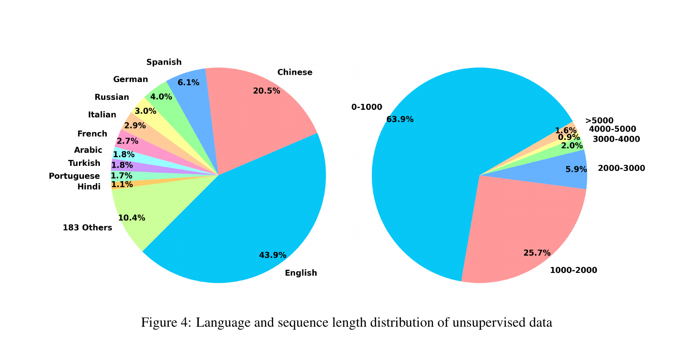

# Bài 3 - Data Curation: xây nền dữ liệu cho embedding đa ngôn ngữ và long-document

## 1. Tại sao dữ liệu là một phần của phương pháp?

Một model muốn đồng thời mạnh ở hơn 100 ngôn ngữ, cross-lingual matching và document dài không thể chỉ dựa vào một benchmark fine-tuning nhỏ. M3 vì thế dùng **ba nguồn dữ liệu bổ sung cho nhau**:

1. unsupervised data từ corpora lớn;
2. supervised/labeled fine-tuning data;
3. synthetic data để lấp khoảng trống, đặc biệt cho long-document retrieval.


## 2. Unsupervised multilingual data

Paper khai thác các cấu trúc giàu ngữ nghĩa có sẵn trong corpora, ví dụ:

- title - body;
- title - abstract;
- instruction - output.

Nguồn gồm Wikipedia, S2ORC, xP3, mC4, CC-News và dữ liệu MTP. Để học **cross-lingual semantic space**, paper bổ sung sentence pairs song song từ NLLB và CCMatrix.

Sau lọc dữ liệu xấu và cặp relevance thấp, tập unsupervised đạt khoảng:

- **1.2 tỷ text pairs**;
- **194 ngôn ngữ**;
- **2655 cross-lingual correspondences**.

Bảng appendix chia 1.2B thành các nhóm lớn như MTP, S2ORC/Wikipedia, xP3/mC4/CC-News, NLLB/CCMatrix và một phần text-code nhỏ hơn.

## 3. Supervised fine-tuning data

Paper gom nhiều dataset retrieval/NLI đã có nhãn.

### Tiếng Anh

Ví dụ: HotpotQA, TriviaQA, NQ, MS MARCO, COLIEE, PubMedQA, SQuAD và NLI từ SimCSE.

### Tiếng Trung

Ví dụ: DuReader, mMARCO-ZH, T2-Ranking, LawGPT, CMedQAv2, NLI-zh, LeCaRDv2.

### Các ngôn ngữ khác

MIRACL và Mr. TyDi cung cấp dữ liệu đa ngôn ngữ cho fine-tuning.

Điểm thiết kế cần học ở đây là **không ép một nguồn dữ liệu làm mọi việc**. Unsupervised data tạo độ phủ rộng; labeled data cung cấp tín hiệu retrieval chính xác hơn ở giai đoạn fine-tune.

## 4. Synthetic long-document data: MultiLongDoc

Long-document retrieval thiếu dữ liệu huấn luyện chất lượng. Paper tạo dữ liệu tổng hợp bằng cách:

1. lấy bài dài từ Wikipedia, Wudao và mC4;
2. chọn ngẫu nhiên một paragraph;
3. dùng GPT-3.5 sinh **một câu hỏi cụ thể** dựa trên paragraph đó;
4. ghép câu hỏi với **toàn bài dài** làm text pair cho fine-tuning.

Ý tưởng then chốt: evidence có thể chỉ nằm ở một phần của document, nhưng model phải học đưa toàn document vào representation/retrieval process.

Appendix mô tả MultiLongDoc với 13 ngôn ngữ, tổng cộng **41,434 mẫu train**, **2,600 dev**, **3,800 test**, corpus khoảng **493,709 documents**, và average document length trong bảng là **4,737 tokens**.

## 5. Tránh shortcut ở đầu document

Paper nhận thấy long text như news thường có những câu đầu mang tính tóm tắt. Nếu giữ nguyên, model có thể học shortcut: chỉ dựa vào phần mở đầu.

Biện pháp được dùng:

- chia document thành ba segment;
- xáo trộn thứ tự segment rồi ghép lại;
- áp dụng thao tác này cho passage với xác suất **0.2%** trong training.

Mục tiêu là khiến relevant segment có thể xuất hiện ở nhiều vị trí, buộc encoder học representation bền hơn theo vị trí.

## 6. Phân bố ngôn ngữ và độ dài



Figure 4 cho thấy dữ liệu unsupervised không cân bằng hoàn toàn giữa ngôn ngữ. English và Chinese chiếm phần lớn; đồng thời phần lớn chuỗi nằm ở nhóm 0-1000 tokens. Điều này giúp giải thích vì sao appendix và phần limitations đều nhấn mạnh sự khác biệt tiềm năng về chất lượng giữa các ngôn ngữ.

## 7. Bài học thiết kế dữ liệu

Từ paper có thể rút ra một chuỗi tư duy:

```text
Độ phủ ngôn ngữ rộng          -> unsupervised multilingual corpora
Alignment giữa ngôn ngữ       -> parallel sentence pairs
Tín hiệu retrieval chất lượng -> labeled retrieval/NLI datasets
Thiếu long-doc supervision    -> synthetic MultiLongDoc
Nguy cơ shortcut vị trí       -> segment shuffling
```

Đây là cách data curation trở thành một phần của kiến trúc hệ thống, không chỉ là khâu tiền xử lý.

## 8. Tự kiểm tra

1. Ba nhóm dữ liệu của M3 khác vai trò nhau như thế nào?
2. Vì sao parallel sentences quan trọng cho cross-lingual embedding space?
3. MultiLongDoc tạo query từ paragraph nhưng ghép với toàn document để đạt mục tiêu gì?
4. Segment shuffling nhằm chống shortcut nào?
