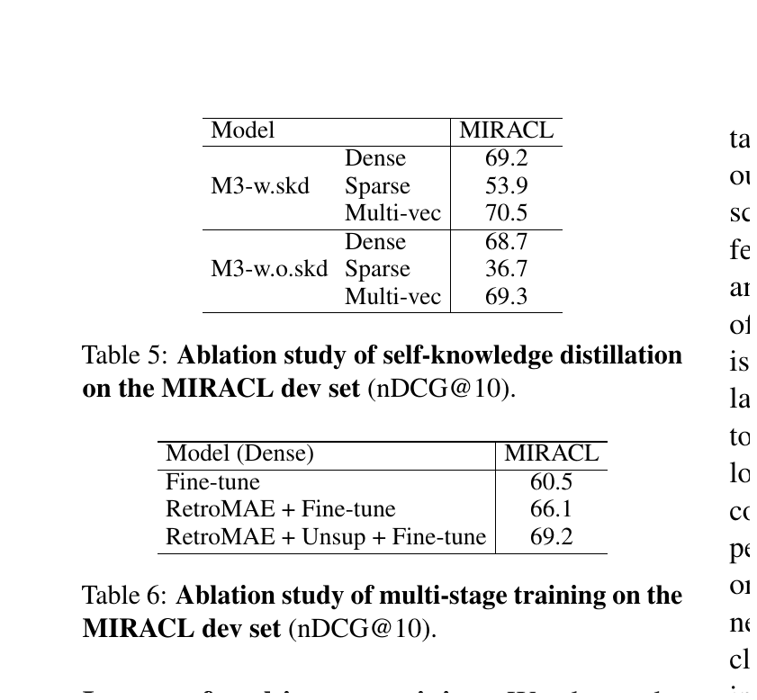

# Bài 5 - Self-Knowledge Distillation

## 1. Vấn đề: nhiều objective có thể xung đột

M3 muốn một encoder đồng thời tối ưu dense, sparse và multi-vector retrieval. Nếu chỉ cộng ba loss độc lập, gradient từ các nhiệm vụ có thể kéo representation theo các hướng không hoàn toàn tương thích. Paper đặc biệt quan sát sự không tương thích giữa dense và sparse objective.

Self-knowledge distillation được dùng để biến **tổ hợp dự đoán của chính ba retrieval function** thành teacher signal.

## 2. Loss cơ sở: InfoNCE

Với query `q`, positive passage `p*` và tập negative `P'`, dạng tổng quát:

\[
L_s = -\log\frac{\exp(s(q,p^*)/\tau)}{\sum_{p\in\{p^*,P'\}}\exp(s(q,p)/\tau)}
\]

Trong đó `s` có thể là `s_dense`, `s_lex` hoặc `s_mul`.

Mục tiêu trực giác: positive phải có score cao hơn negatives.

## 3. Tạo integrated teacher score

Paper dùng weighted ensemble:

\[
s_{inter}=w_1s_{dense}+w_2s_{lex}+w_3s_{mul}
\]

Lập luận là ba predictor có bản chất khác nhau. Ensemble của chúng có thể cung cấp một relevance signal giàu hơn từng predictor riêng lẻ.

## 4. Loss không distillation

Paper trước hết định nghĩa loss kết hợp:

\[
L=\frac{\lambda_1L_{dense}+\lambda_2L_{lex}+\lambda_3L_{mul}+L_{inter}}{4}
\]

Điểm cần chú ý: `L_inter` đã đưa integrated score vào objective, nhưng chưa phải distillation mềm từ teacher distribution.

## 5. Distillation loss

Integrated score được biến thành phân phối qua softmax và đóng vai trò teacher. Với từng scoring branch:

\[
L'_*=-p(s_{inter})\log p(s_*)
\]

Sau đó:

\[
L'=\frac{\lambda_1L'_{dense}+\lambda_2L'_{lex}+\lambda_3L'_{mul}}{3}
\]

Loss cuối:

\[
L_{final}=\frac{L+L'}{2}
\]

### Ý nghĩa

Mỗi branch không chỉ học “positive cao hơn negative” từ hard labels; nó còn học **cấu trúc tương đối của relevance score** mà ensemble ba branch tạo ra.

## 6. Training theo nhiều giai đoạn

Paper thực hiện:

### Giai đoạn 1 - Pre-training

- encoder nền là XLM-RoBERTa được thích nghi bằng RetroMAE;
- dùng lượng lớn unsupervised data;
- chỉ train dense retrieval bằng contrastive learning.

### Giai đoạn 2 - Fine-tuning

- thiết lập đủ dense, sparse và multi-vector;
- bật self-knowledge distillation;
- dùng labeled + synthetic data;
- thêm hard negatives theo ANCE.

Do `W_lex` khởi tạo ngẫu nhiên khiến sparse score ban đầu kém ổn định, paper đặt trong training:

- `w1 = 1`, `w2 = 0.3`, `w3 = 1`;
- `lambda1 = 1`, `lambda2 = 0.1`, `lambda3 = 1`.

Tức là sparse branch được giảm trọng số trong giai đoạn đầu để tránh một branch chưa ổn định phá teacher ensemble.

## 7. Ablation cho thấy tác động ở đâu lớn nhất

MIRACL nDCG@10:

| Branch | Có SKD | Không SKD | Chênh lệch |
|---|---:|---:|---:|
| Dense | 69.2 | 68.7 | +0.5 |
| Sparse | 53.9 | 36.7 | **+17.2** |
| Multi-vector | 70.5 | 69.3 | +1.2 |

Ablation là bằng chứng quan trọng nhất trong paper cho vai trò của SKD: lợi ích không phân bố đều. Sparse branch được cải thiện rất mạnh, phù hợp với lập luận rằng multi-objective training gây xung đột và integrated teacher giúp điều hòa các branch.

## 8. Phân biệt self-distillation với teacher bên ngoài

Trong thiết kế này, teacher signal không đến từ một cross-encoder riêng. Nó được tạo từ **chính các retrieval function của M3** thông qua ensemble score. Đây là lý do paper gọi phương pháp là self-knowledge distillation.

## 9. Tự kiểm tra

1. `s_inter` vừa xuất hiện ở retrieval vừa xuất hiện ở training như thế nào?
2. Vì sao giảm `lambda2` lúc đầu có ý nghĩa khi `W_lex` khởi tạo ngẫu nhiên?
3. Ablation nào cho thấy branch hưởng lợi nhiều nhất từ SKD?
4. Teacher của M3 khác một teacher cross-encoder ngoài model ở điểm nào?
