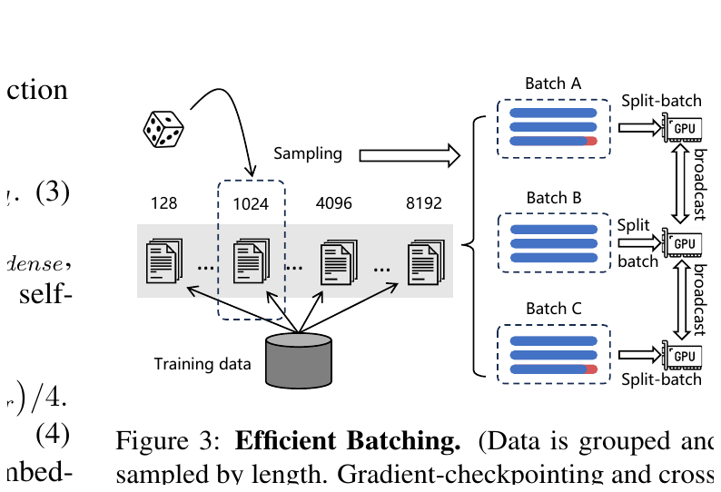
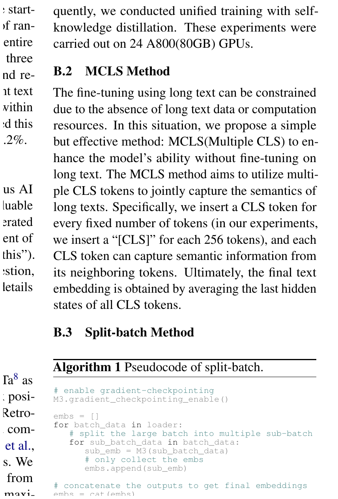
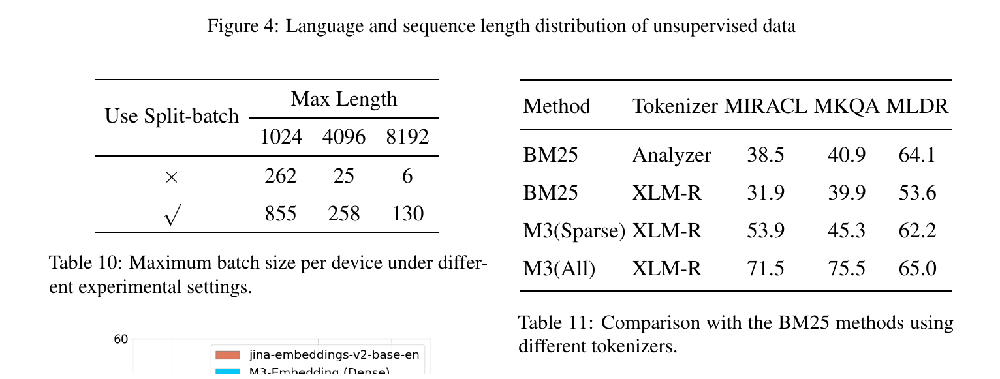

# Bài 6 - Efficient Batching và chi tiết training

## 1. Mâu thuẫn cốt lõi

Embedding training hưởng lợi từ **batch lớn** vì mỗi batch tạo nhiều in-batch negatives. Nhưng long sequence làm memory/computation tăng mạnh, khiến batch phải nhỏ lại. M3 cần cả hai:

- sequence đủ dài để học multi-granularity tới 8192 tokens;
- batch đủ lớn để embedding có tính phân biệt tốt.

Efficient batching là cách paper giải quyết mâu thuẫn này.



## 2. Group by sequence length

Dữ liệu được tiền xử lý thành các nhóm theo độ dài. Khi tạo mini-batch, mẫu được lấy từ **cùng nhóm độ dài**.

Lợi ích trực tiếp: giảm padding. Nếu một batch trộn document 300 tokens và 8000 tokens, các mẫu ngắn phải padding rất nhiều. Gom độ dài giúp GPU dành compute cho token thật hơn.

## 3. Load balance giữa GPU

Paper cố định random seed khi sampling data cho các GPU. Mục tiêu là giúp workload giữa các device cân bằng hơn, giảm thời gian một GPU phải chờ GPU khác ở mỗi training step.

## 4. Split-batch cho long sequence

Khi sequence dài, mini-batch được chia tiếp thành nhiều **sub-batch**:

```text
large batch
  ├── sub-batch 1 -> encode -> embeddings
  ├── sub-batch 2 -> encode -> embeddings
  ├── sub-batch 3 -> encode -> embeddings
  └── ...
concat embeddings -> loss trên batch lớn logic
```

Điểm quyết định là **gradient checkpointing**. Nếu giữ toàn bộ intermediate activations của mọi sub-batch, memory cuối cùng vẫn phình ra tương tự xử lý batch lớn một lần. Paper vì thế encode từng sub-batch với checkpointing để giảm activation memory rồi thu thập embeddings.



## 5. Cross-GPU broadcasting

Embeddings sinh trên các GPU được broadcast để mỗi device có thể truy cập embeddings từ các device khác. Việc này làm tập **in-batch negatives** hiệu dụng lớn hơn trong distributed training.

## 6. Mức tăng batch size

Paper báo cáo split-batch đặc biệt hiệu quả khi sequence dài.



Table 10 - maximum batch size per device:

| Max length | Không split-batch | Có split-batch |
|---:|---:|---:|
| 1024 | 262 | 855 |
| 4096 | 25 | 258 |
| 8192 | 6 | 130 |

Ở length 8192, mức tăng là hơn **20 lần**, đúng với mô tả trong main paper.

## 7. Batch size tổng theo length range

Appendix Table 9 cho thấy batch size được giảm dần khi chuỗi dài hơn:

| Length range | Unsupervised | Fine-tuning |
|---|---:|---:|
| 0-500 | 67,200 | 1,152 |
| 500-1000 | 54,720 | 768 |
| 1000-2000 | 37,248 | 480 |
| 2000-3000 | 27,648 | 432 |
| 3000-4000 | 21,504 | 336 |
| 4000-5000 | 17,280 | 336 |
| 5000-6000 | 15,072 | 288 |
| 6000-7000 | 12,288 | 240 |
| 7000-8192 | 9,984 | 192 |

Điều này cho thấy “batch lớn” không có nghĩa là cùng một batch size cho mọi độ dài. M3 điều chỉnh batch theo memory footprint của từng bucket.

## 8. Hyperparameters trong appendix

### 8.1 Nền tảng encoder / RetroMAE adaptation

- foundational model: XLM-RoBERTa đã pretrain thêm;
- max position mở rộng lên 8192;
- RetroMAE adaptation dùng Pile, Wudao và mC4;
- khoảng **184 triệu text samples**, phủ **105 ngôn ngữ**;
- learning rate `7e-5`;
- batch size 32, gradient accumulation 16;
- 32 A100 40GB, 20,000 steps.

### 8.2 Pre-training với massive unsupervised data

- max query length: 512;
- max passage length: 8192;
- learning rate `5e-5`;
- warmup ratio 0.1;
- weight decay 0.01;
- 25,000 steps;
- 96 A800 80GB.

### 8.3 Fine-tuning

- 7 negatives cho mỗi query;
- khoảng 6000 steps đầu warm-up dense, sparse và multi-vector;
- sau đó unified training với SKD;
- 24 A800 80GB.

Các con số này cho thấy training recipe của paper có quy mô compute rất lớn. Khi học phương pháp, cần tách **ý tưởng thuật toán** khỏi **khả năng tái hiện đúng quy mô phần cứng**.

## 9. Tự kiểm tra

1. Group-by-length giảm loại lãng phí nào?
2. Vì sao split-batch phải đi cùng gradient checkpointing theo mô tả của paper?
3. Cross-GPU broadcasting làm tăng loại negative nào?
4. Tại sao batch size cần phụ thuộc length bucket?
