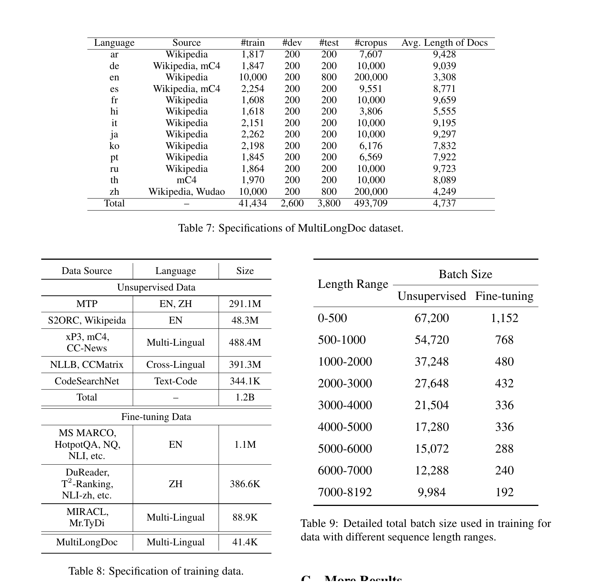
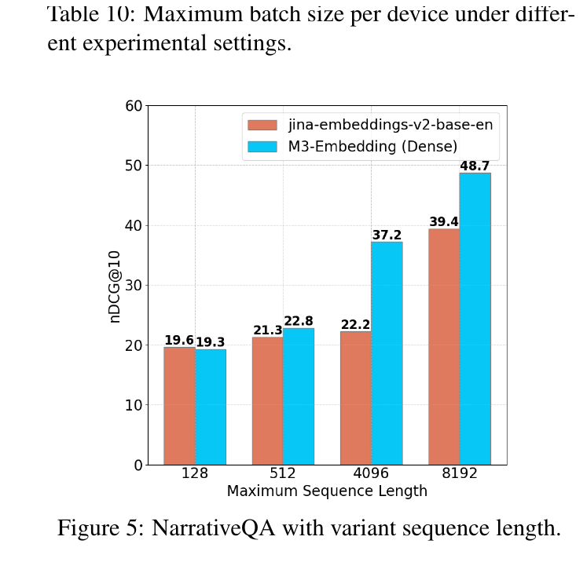

# Bài 7 - Long-Document Retrieval và MCLS

## 1. Mục tiêu long-document của M3

M3 được thiết kế cho input tới **8192 tokens**. Đây không chỉ là việc kéo dài positional embedding; model còn cần dữ liệu dài, batching phù hợp và evaluation riêng cho long-doc retrieval.

## 2. MultiLongDoc

Tập synthetic MultiLongDoc được xây từ các bài dài ở Wikipedia, Wudao và mC4. Evidence paragraph được dùng để sinh query, nhưng retrieval target là toàn bài dài. Bảng dữ liệu trong appendix cho thấy 13 ngôn ngữ và document length trung bình khác nhau đáng kể.

Cách xây này tạo supervision trực tiếp cho tình huống “một document dài chỉ chứa một vùng nhỏ trả lời query”.

## 3. Kết quả trên MLDR

Trên MLDR test, nDCG@10 trung bình của M3:

| Mode | Avg nDCG@10 |
|---|---:|
| Dense | 52.5 |
| Sparse | 62.2 |
| Multi-vector | 57.6 |
| Dense + Sparse | 64.8 |
| All | **65.0** |

Một quan sát nổi bật của paper: **sparse retrieval mạnh hơn dense khoảng 10 điểm trung bình** trên MLDR. Điều này khác MIRACL, nơi dense/multi-vector mạnh hơn sparse rõ rệt. Long-document setting vì thế làm lexical signal trở nên rất quan trọng.

## 4. Tác động của long-document fine-tuning

Khi bỏ long-document data khỏi fine-tuning (`Dense-w.o.long`), MLDR average giảm xuống **41.2**. Điều này chứng minh dữ liệu dài trong fine-tuning có đóng góp đáng kể.

Tuy nhiên, model không có long-doc fine-tuning vẫn khá cạnh tranh so với nhiều baseline ngắn, gợi ý rằng pre-training đã tạo một phần khả năng xử lý sequence dài.

## 5. MCLS - Multiple CLS

Nếu không có long-text data hoặc compute để fine-tune, paper đề xuất **MCLS**.

Cách làm:

1. chèn `[CLS]` sau mỗi block cố định;
2. trong thí nghiệm, paper chèn một `[CLS]` mỗi **256 tokens**;
3. mỗi CLS thu semantic information từ vùng lân cận;
4. lấy **trung bình last hidden states của tất cả CLS** làm final document embedding.

MCLS không yêu cầu long-document fine-tuning mới.

Trong MLDR ablation:

- Dense-w.o.long: **41.2**;
- Dense-w.o.long + MCLS: **45.0**.

MCLS cải thiện đáng kể trong điều kiện thiếu long-doc fine-tuning, dù vẫn thấp hơn model được train đầy đủ.

## 6. Sequence length và NarrativeQA

Figure 5 so sánh M3 dense với jina-embeddings-v2-base-en ở các maximum sequence length. M3 tăng từ khoảng 19.3 ở length 128 lên 48.7 ở 8192. Paper dùng xu hướng này để lập luận rằng lợi thế của M3 tăng khi input dài hơn.

Trên NarrativeQA đầy đủ, bảng chính báo cáo:

| M3 mode | nDCG@10 |
|---|---:|
| Dense | 48.7 |
| Sparse | 57.5 |
| Multi-vector | 55.4 |
| Dense + Sparse | 60.1 |
| All | **61.7** |

## 7. Tokenizer và sparse long-doc

Appendix so sánh BM25 dùng Lucene Analyzer với BM25 dùng tokenizer XLM-R. Paper lưu ý Lucene Analyzer tạo nhiều unique terms hơn và có hiệu quả retrieval cao hơn cho BM25, nhưng cũng làm latency tăng vì vocabulary/term set lớn hơn.

Cùng tokenizer XLM-R, M3 sparse vượt BM25 trong MIRACL và MKQA; trên MLDR, M3 sparse cạnh tranh nhưng không vượt BM25 dùng Lucene Analyzer. Đây là một nuance quan trọng: learned sparse weights rất mạnh, nhưng tokenizer/analyzer vẫn ảnh hưởng lớn đến lexical retrieval.

## 8. Tự kiểm tra

1. Vì sao query được sinh từ một paragraph nhưng target lại là toàn document?
2. MCLS dùng nhiều `[CLS]` để giải quyết hạn chế gì?
3. Long-doc fine-tuning ảnh hưởng thế nào đến MLDR dense score?
4. Vì sao tokenizer là biến quan trọng khi so sparse retrieval với BM25?
