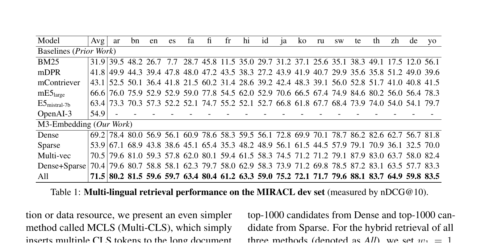
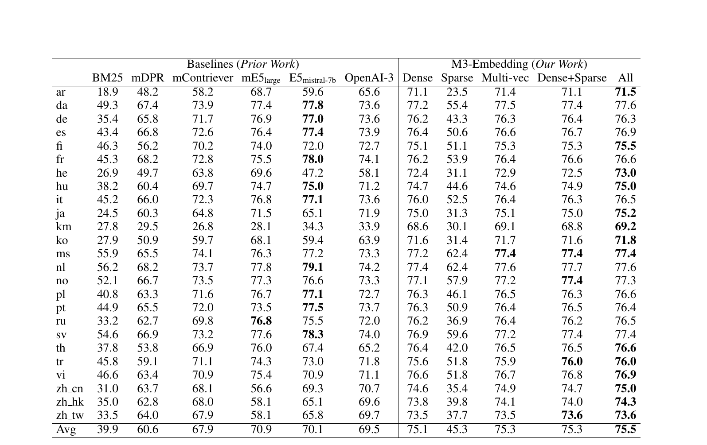
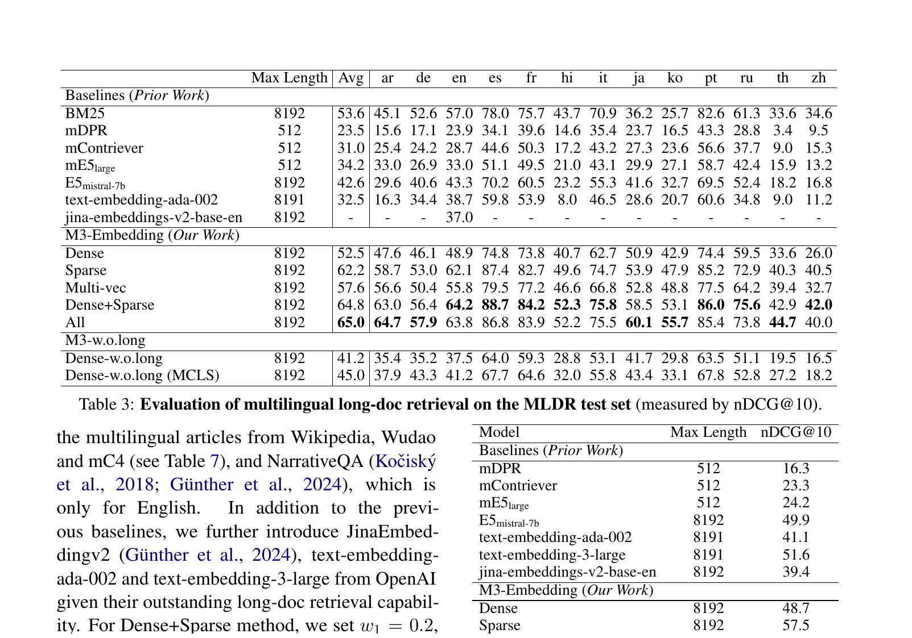

# Bài 8 - Đọc thực nghiệm: MIRACL, MKQA, MLDR và NarrativeQA

## 1. Nguyên tắc đọc kết quả

Không nên chỉ nhìn giá trị cao nhất. Với M3, cần xem bốn câu hỏi:

1. model có giữ chất lượng trên nhiều ngôn ngữ không?
2. cross-lingual retrieval có ổn định không?
3. ba retrieval function riêng lẻ hoạt động ra sao?
4. hybrid và long-document setting thay đổi bức tranh như thế nào?

## 2. MIRACL - multilingual retrieval

MIRACL gồm ad-hoc retrieval cho **18 ngôn ngữ**, query và passage cùng ngôn ngữ. Metric chính trong paper: **nDCG@10**.



Average nDCG@10 trong Table 1:

- BM25: 31.9
- mDPR: 41.8
- mContriever: 43.1
- mE5-large: 66.6
- E5-mistral-7b: 63.4
- M3 Dense: **69.2**
- M3 Multi-vector: **70.5**
- M3 All: **71.5**

Theo kết quả do paper báo cáo, M3 dense đã rất mạnh trên multilingual retrieval và tổ hợp cả ba function đạt average cao nhất trong bảng.

## 3. MKQA - cross-lingual retrieval

MKQA setting trong paper: query ở **25 ngôn ngữ không phải tiếng Anh**, retrieval từ English Wikipedia. Metric chính: **Recall@100**.



Average Recall@100:

| Model/mode | Avg |
|---|---:|
| mE5-large | 70.9 |
| E5-mistral-7b | 70.1 |
| OpenAI-3 | 69.5 |
| M3 Dense | 75.1 |
| M3 Sparse | 45.3 |
| M3 Multi-vector | 75.3 |
| M3 All | **75.5** |

### Hai điểm cần hiểu

**Thứ nhất**, sparse giảm mạnh vì query và passage khác ngôn ngữ, nên lexical overlap hạn chế.

**Thứ hai**, paper nhấn mạnh M3 tương đối ổn định ở nhiều ngôn ngữ, gồm một số ngôn ngữ low-resource, và gắn điều này với pre-training đa ngôn ngữ quy mô lớn.

## 4. MLDR - multilingual long-document retrieval

MLDR được paper xây từ multilingual articles của Wikipedia, Wudao và mC4. Metric: **nDCG@10**.



Điểm average đáng chú ý:

- E5-mistral-7b: 42.6
- text-embedding-ada-002: 32.5
- M3 Dense: 52.5
- M3 Sparse: 62.2
- M3 Dense+Sparse: 64.8
- M3 All: **65.0**

Khác với MIRACL/MKQA, sparse trở thành một thành phần cực mạnh trong long-doc retrieval.

## 5. NarrativeQA - long-document tiếng Anh

Table 4:

- E5-mistral-7b: 49.9
- text-embedding-3-large: 51.6
- M3 Dense: 48.7
- M3 Sparse: 57.5
- M3 Multi-vector: 55.4
- M3 Dense+Sparse: 60.1
- M3 All: **61.7**

Bảng này cho thấy một nuance quan trọng: **M3 Dense không phải luôn cao nhất so với mọi baseline ở mọi benchmark**, nhưng multi-functionality cho phép hybrid mode đạt kết quả mạnh hơn.

## 6. Cách paper dùng baseline

Baseline gồm:

- lexical: BM25;
- multilingual dense: mDPR, mContriever, mE5-large;
- large-model embedding: E5-mistral-7b;
- một số OpenAI embedding models trong long-doc/cross-lingual tables;
- Jina Embedding v2 ở long-doc setting.

Paper cũng cố kiểm soát một số yếu tố so sánh, ví dụ sử dụng tokenizer XLM-RoBERTa cho BM25 trong main experiment để latency/vocabulary gần hơn M3, rồi appendix tách riêng ảnh hưởng của Lucene Analyzer.

## 7. Đừng bỏ qua metric

### nDCG@10

Quan tâm cả vị trí xếp hạng trong top 10; relevant result ở vị trí cao được đánh giá tốt hơn.

### Recall@100

Hỏi liệu relevant passage có xuất hiện trong top 100 hay không. Phù hợp đánh giá candidate retrieval trong cross-lingual setting.

Trong khóa học này, định nghĩa trực giác đủ để đọc paper; paper không nhằm giới thiệu mới các metric này.

## 8. Kết luận thực nghiệm theo cấu trúc

```text
Multilingual (MIRACL): dense mạnh, multi-vector/hybrid cải thiện thêm
Cross-lingual (MKQA): dense/multi-vector mạnh, sparse yếu do lexical mismatch
Long-doc (MLDR): sparse trở nên rất mạnh, hybrid tốt nhất
Long-doc English (NarrativeQA): hybrid tận dụng được thế mạnh nhiều function
```

## 9. Tự kiểm tra

1. Vì sao không nên lấy kết quả sparse ở MKQA để kết luận sparse branch “train thất bại”? 
2. Benchmark nào cho thấy sparse có vai trò đặc biệt lớn?
3. M3 Dense và M3 All khác nhau về loại năng lực nào đang được đánh giá?
4. Tại sao cần đọc metric trước khi so con số giữa các benchmark?
