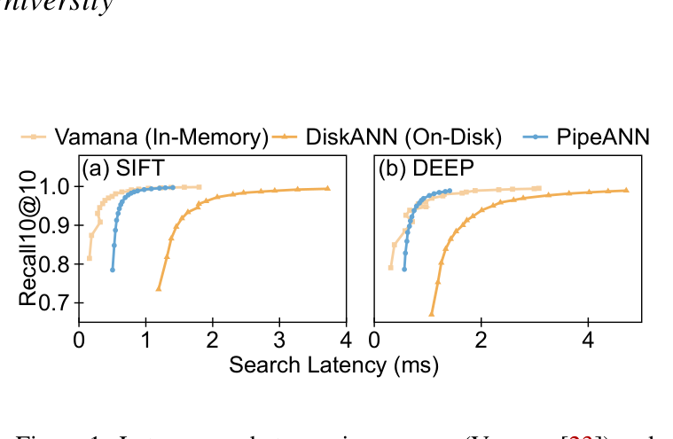
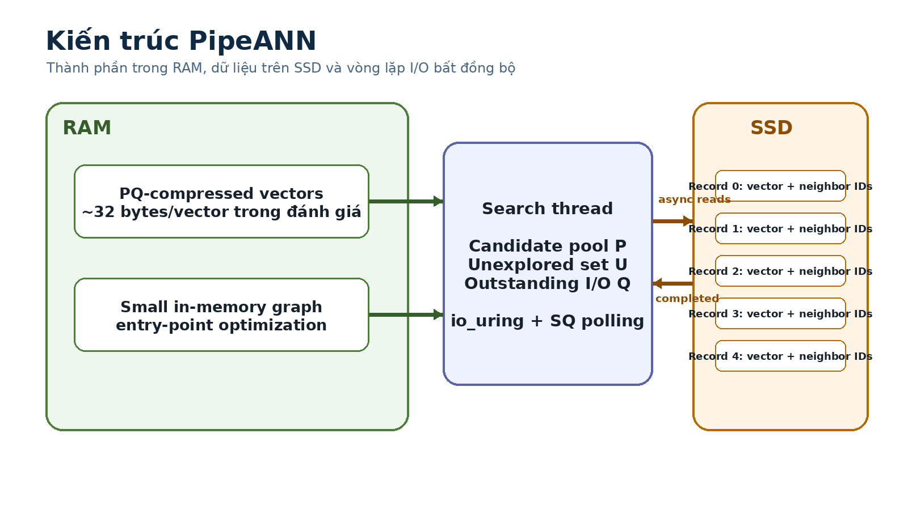

# Bài 00 - Tổng quan khóa học và bộ thuật ngữ

## 1. Bài toán trung tâm

Vector search tìm các vector gần nhất với một query vector. Trong không gian nhiều chiều, tìm chính xác top-k có thể quá tốn kém, vì vậy hệ thống thực tế thường dùng **Approximate Nearest Neighbor Search (ANNS)**.

Paper tập trung vào một họ ANNS rất quan trọng: **graph-based ANNS**. Mỗi vector là một node, các cạnh nối đến các vector lân cận. Khi query, hệ thống không quét toàn bộ dữ liệu mà duyệt graph từ một entry point và dần tiến về vùng gần query.

Vấn đề xuất hiện khi graph index quá lớn để đặt hoàn toàn trong RAM và phải lưu trên SSD. Cùng một best-first search vốn rất nhanh trong memory lại có latency lớn hơn đáng kể khi chạy on-disk.

Paper đặt câu hỏi thiết kế hệ thống:

> Có thể sửa cách scheduling của best-first search để thuật toán “hợp” với SSD hơn, thay vì chỉ tối ưu data layout hay tăng phần cứng không?

Câu trả lời của paper là **PipeSearch** và hệ thống **PipeANN**.

## 2. Ba lớp kiến thức cần tách riêng

### Lớp A - Search algorithm

- candidate pool chứa các vector tốt nhất đã biết;
- thuật toán chọn vector chưa explore gần query nhất;
- đọc record của vector;
- mở rộng neighbors;
- cập nhật candidate pool;
- dừng khi không còn candidate cần explore.

### Lớp B - Storage behavior

SSD có hai đặc tính quan trọng trong paper:

- latency I/O ở mức microsecond hoặc hàng chục microsecond;
- có thể xử lý nhiều read request bất đồng bộ, song song.

Do đó, nếu thuật toán cứ “compute xong → chờ I/O → compute tiếp”, CPU và SSD không được overlap tốt.

### Lớp C - System scheduling

PipeANN không thay đổi ý nghĩa của bài toán top-k; nó thay đổi **cách phát I/O và cách xen kẽ compute** để rút ngắn critical path.

## 3. Bộ thuật ngữ dùng xuyên suốt

| Ký hiệu / thuật ngữ | Ý nghĩa |
|---|---|
| `q` | query vector |
| `k` | số nearest neighbors cần trả về |
| `L` | candidate pool length |
| `W` | I/O pipeline width; số read tối đa in-flight |
| `P` | candidate pool |
| `E` | explored pool |
| `U` | tập vector đã đọc xong nhưng chưa explore |
| `Q` | tập I/O đang chưa hoàn tất |
| PQ | Product Quantization; dùng compressed vectors trong RAM để tính khoảng cách xấp xỉ |
| recall10@10 | mức độ tìm đúng top-10 neighbors trong top-10 kết quả trả về |
| latency | thời gian cho một query |
| throughput / QPS | số query hoàn tất mỗi giây |
| I/O waste | read phát ra nhưng không đóng góp tốt vào search path / top-k, làm tăng I/O per search |

## 4. Mental model quan trọng nhất

Không nên nhìn PipeANN như một “ANN index mới hoàn toàn”. Hãy nhìn nó như một **cách tổ chức execution** cho graph search on-disk:

1. giữ navigation metadata đủ dùng trong RAM;
2. phát nhiều disk reads bất đồng bộ;
3. không buộc compute của step trước phải hoàn tất rồi mới phát I/O của step sau;
4. điều chỉnh mức speculative I/O theo trạng thái search;
5. giảm tích tụ các vector đã đọc nhưng chưa explore.

## 5. Câu hỏi dẫn đường

Trong các bài sau, luôn thử trả lời bốn câu hỏi:

1. **Critical path đang nằm ở đâu?**
2. **SSD có đang rảnh trong lúc CPU compute không?**
3. **CPU có đang chờ một I/O chậm trong batch không?**
4. **Tăng concurrency có làm phát quá nhiều I/O vô ích không?**

Nếu trả lời được bốn câu này, bạn đã nắm phần lớn logic của paper.
