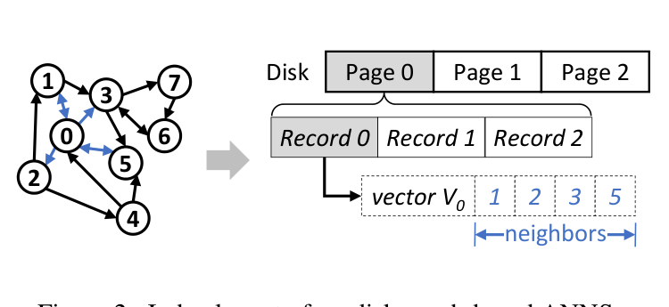

# Bài 01 - Graph ANNS và best-first search

## Mục tiêu

Sau bài này, bạn cần hiểu graph index được lưu thế nào trên disk, candidate pool vận hành ra sao, và tại sao `W` là tham số vừa liên quan đến thuật toán vừa liên quan đến I/O.

## 1. Graph-based ANNS

Trong graph-based ANNS, mỗi vector là một node. Node chứa danh sách neighbor IDs. Search bắt đầu từ một entry point, sau đó lặp:

1. chọn các candidate tốt nhất hiện có;
2. lấy neighbor list của chúng;
3. thêm các neighbor tiềm năng vào candidate pool;
4. giữ lại `L` vector gần query nhất;
5. tiếp tục đến khi candidate pool đã được explore hết.

Ý tưởng này tránh phải đọc toàn bộ dataset.

## 2. Layout on-disk

Paper lưu graph dưới dạng nhiều record trên SSD. Mỗi record chứa:

- full vector;
- neighbor IDs của vector đó.



Trong RAM, hệ thống có thể giữ PQ-compressed vectors để tính khoảng cách với neighbor mà không phải read disk chỉ để biết neighbor nào có vẻ gần query.

Điều này tạo một phân tách quan trọng:

- **metadata / compressed distance information**: đủ nhẹ để ở RAM;
- **full record**: ở SSD và chỉ read khi cần explore.

## 3. Candidate pool `P`

Candidate pool có chiều dài cố định `L`, chứa các vector gần query nhất đã biết tại thời điểm hiện tại.

Một cách hình dung:

```text
P = [v7, v12, v3, v91, ...]
     gần q --------------> xa q
```

Mỗi entry thường có:

- vector ID;
- khoảng cách xấp xỉ đến query;
- trạng thái đã explore / chưa explore.

Khi explore một vector, ta đọc neighbor list, tính PQ distance của neighbors với query, chèn chúng vào `P`, rồi prune để chỉ còn top-`L`.

## 4. Best-first search

Best-first luôn ưu tiên các vector gần query nhất trong candidate pool.

Trong phiên bản on-disk, `W` được dùng như beam width / pipeline width:

- `W = 1`: greedy search, mỗi step đọc 1 vector;
- `W > 1`: beam search, mỗi step batch-read `W` vector gần nhất chưa explore.

Pseudo-code sư phạm:

```text
initialize P with a start vector
E = empty

while there is an unexplored vector in P:
    V = W nearest unexplored vectors in P
    synchronously read all records in V
    mark V explored

    for each record in V:
        inspect neighbors
        estimate neighbor distance using PQ data
        insert promising neighbors into P

    keep only L nearest candidates in P

return exact top-k among explored vectors
```

Điểm cần chú ý là từ **synchronously**. Đây là nguồn của vấn đề ở Bài 02.

## 5. Tại sao trong RAM `W = 1` thường hợp lý?

Trong paper, memory access có latency thấp hơn compute rất nhiều. Nếu đọc từng vector một:

- ta có neighbor information sớm nhất;
- quyết định next vector chính xác hơn;
- ít đọc/compute thừa hơn.

Do đó greedy search có thể hiệu quả.

## 6. Tại sao trên SSD lại tăng `W`?

Khi full vector nằm trên SSD, read một record chậm hơn explore record đó. Nếu vẫn `W = 1`, mỗi bước phải chờ I/O nối tiếp.

Tăng `W` cho phép:

- có nhiều read cùng lúc;
- khai thác parallel I/O của NVMe SSD;
- giảm số round I/O tuần tự.

Nhưng `W` càng lớn cũng khiến thuật toán đọc trước nhiều vector khi chưa có đầy đủ neighbor information. Đây là khởi nguồn của **speculative I/O** và **I/O waste**.

## 7. Hình dung hai loại chi phí

Giả sử mỗi record cần:

- 50 µs I/O;
- 10 µs compute để explore neighbors.

Nếu `W = 1` và không overlap:

```text
I/O 50 → compute 10 → I/O 50 → compute 10 → ...
```

Phần lớn thời gian CPU chờ SSD.

Nếu `W = 8` nhưng vẫn batch-synchronous:

```text
issue 8 reads → đợi read chậm nhất → compute 8 records → issue batch tiếp
```

Bạn đã dùng parallelism, nhưng vẫn tạo một **barrier** giữa các batch.

Đó chính là điểm PipeSearch muốn phá bỏ.

## Kiểm tra nhanh

1. `L` khác `W` ở điểm nào?
2. Tại sao `W = 1` giảm waste nhưng có thể làm latency on-disk cao?
3. Tại sao tăng `W` không tự động đảm bảo SSD được tận dụng 100%?
