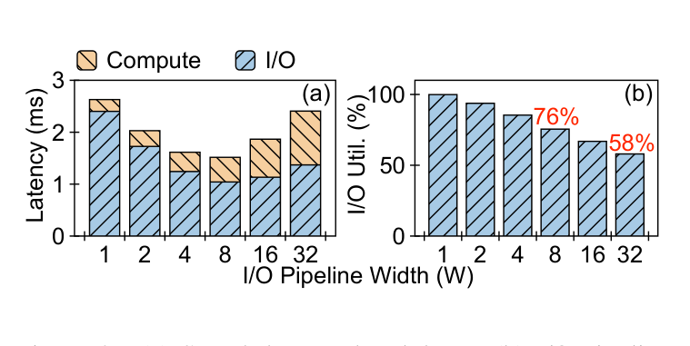
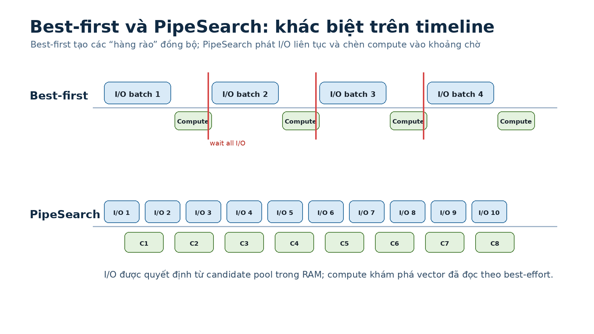

# Bài 02 - Vì sao best-first search mismatch với SSD?

## Mục tiêu

Bài này là “problem statement” quan trọng nhất của paper. Nếu hiểu đúng hai mismatch, phần thiết kế PipeSearch sẽ trở nên tự nhiên.

## 1. Hai đặc tính SSD mà thuật toán phải tôn trọng

Paper nhấn mạnh:

1. **I/O latency dài hơn compute** ở graph traversal on-disk.
2. **SSD hỗ trợ nhiều I/O bất đồng bộ song song**.

Một thuật toán tốt cho SSD nên cố gắng:

- giữ nhiều I/O hữu ích in-flight;
- tận dụng thời gian chờ I/O để compute;
- tránh barrier không cần thiết giữa các batch.

## 2. Issue 1 - Ordered compute và I/O giữa các search step

Best-first theo từng step:

```text
read current best vectors
        ↓
wait all reads
        ↓
explore neighbors
        ↓
update candidate pool
        ↓
choose next batch
```

Batch tiếp theo phụ thuộc vào kết quả compute của batch trước.

Trên SSD, dependency này biến thành critical path dài vì thời gian I/O không được che bằng compute.

Paper đo được:

- với `W = 1`, compute latency chỉ bằng **9.5%** I/O latency;
- với `W = 8` - cấu hình có overall latency thấp nhất trong thí nghiệm motivation - compute latency vẫn bằng **45.6%** I/O latency.

Tức là có một lượng compute đủ lớn để overlap với I/O, nhưng best-first truyền thống không tận dụng được tốt.

## 3. Issue 2 - Synchronous I/O trong từng batch

Khi `W > 1`, best-first batch-read nhiều record nhưng phải đợi toàn bộ batch hoàn tất trước khi tiếp tục.

SSD không có latency giống nhau cho mọi request. Nếu một request chậm hơn:

```text
read 1 ─────── done
read 2 ─────────── done
read 3 ─────────────────── done   ← tail
read 4 ───────── done
                 ↑
          phải chờ read 3
```

Trong khoảng chờ tail request, các slot I/O đã trống nhưng thuật toán chưa phát batch tiếp theo.

Paper đo utilization:

- `W = 8`: I/O pipeline chỉ đầy trung bình **76%**;
- `W = 32`: chỉ **58%**.



## 4. Timeline trực quan



Ở best-first, barrier giữa các batch tạo ra hai loại khoảng trống:

- CPU idle khi chờ I/O;
- SSD pipeline không đầy khi chờ request chậm nhất của batch.

## 5. Insight quan trọng: dependency này chỉ là “pseudo-dependency”

Thoạt nhìn, ta có thể nghĩ phải explore vector trước mới biết read gì tiếp theo. Paper chỉ ra điều này không hoàn toàn đúng.

Candidate pool trong RAM đã chứa neighbor IDs và PQ-distance estimates của các candidate hiện tại. Vì vậy, trong nhiều thời điểm, ta **có thể chọn một candidate gần nhất chưa read và phát I/O ngay**, dù:

- các I/O trước vẫn đang chạy;
- một số record đã đọc xong nhưng chưa explore;
- candidate pool chưa được cập nhật bằng toàn bộ neighbor information mới nhất.

Đây là một quyết định speculative, nhưng graph ANNS có nhiều search path nên không nhất thiết phá convergence.

## 6. Vì sao graph search có “độ mềm” mà B+ tree không có?

Paper đối chiếu với scalar index như B+ tree:

- một object thường có một search path logic chính;
- nếu đi sai nhánh thì có thể không đến đúng nơi.

Trong graph ANN:

- mỗi vector có nhiều in-edges;
- có nhiều đường đi để tới vùng gần query;
- best-first chỉ đang ước lượng một short path, không phải unique path.

Vì vậy có thể relax thứ tự explore một chút để đổi lấy pipeline parallelism.

## 7. Kết luận bài

Best-first không chậm trên SSD chỉ vì “SSD chậm hơn RAM”. Vấn đề sâu hơn là **cách ordering của thuật toán không phù hợp với khả năng async/parallel của SSD**.

PipeSearch sẽ sửa đúng hai điểm:

- bỏ strict compute-I/O order giữa các step;
- không đợi cả batch hoàn tất mới phát I/O tiếp.

## Kiểm tra nhanh

- Nếu SSD có latency hoàn toàn đồng đều, issue 2 có giảm không? Có, nhưng issue 1 vẫn tồn tại.
- Nếu compute gần như bằng 0, overlap compute-I/O còn hữu ích không? Ít hơn; paper cũng giải thích pipelining hiệu quả nhất khi compute và I/O cùng order of magnitude.
