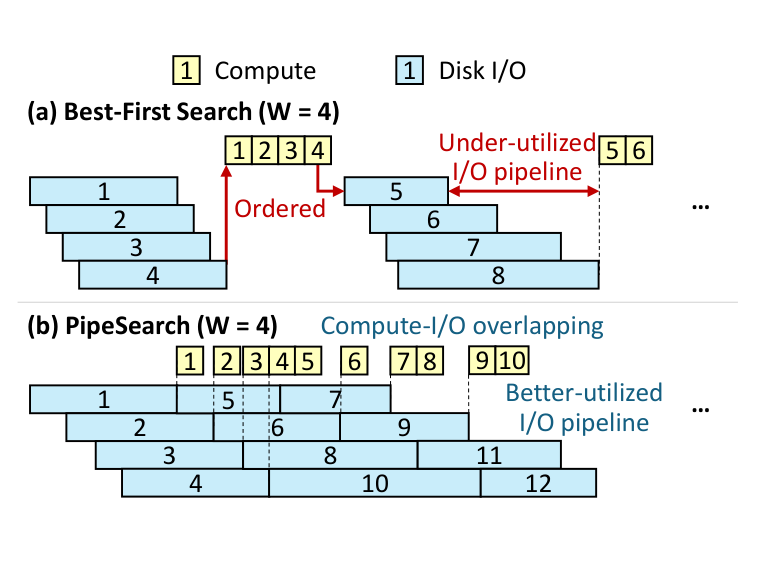
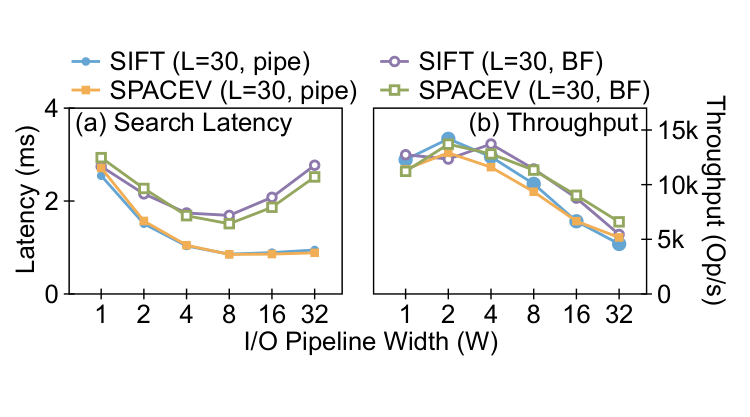
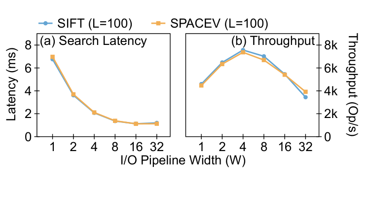
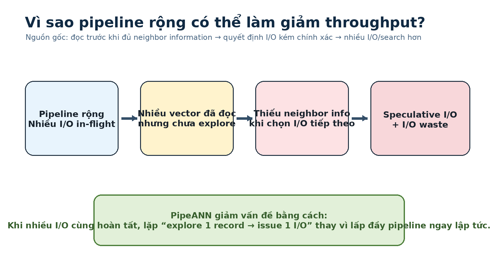

# Bài 03 - PipeSearch: overlap compute và I/O

## 1. Ý tưởng cốt lõi

PipeSearch giữ tinh thần best-first nhưng **không ép các search step chạy theo thứ tự cứng**.

Nó duy trì:

- `P`: candidate pool;
- `E`: explored vectors;
- `U`: record đã read xong nhưng chưa explore;
- `Q`: I/O đang in-flight;
- `W`: pipeline width.

Khi pipeline chưa đầy, PipeSearch có thể phát read cho candidate tốt nhất hiện có ngay lập tức. Trong khi SSD đang xử lý các request đó, CPU explore record gần nhất trong `U`.



## 2. Vòng lặp PipeSearch theo cách dễ học

```text
while search chưa hội tụ:

    if số I/O in-flight < W:
        chọn candidate gần nhất trong P chưa được issue read
        issue asynchronous read
        đưa request vào Q

    nếu U có record chưa explore:
        lấy record gần query nhất
        explore neighbor list
        tính PQ distance cho neighbors
        cập nhật P

    poll I/O completion:
        record nào đọc xong thì chuyển từ Q sang U
```

Khác biệt lớn nhất là **issue I/O, compute và completion polling cùng tồn tại trong một vòng lặp**, thay vì chia thành batch barrier.

## 3. Hai lợi ích trực tiếp

### 3.1 Compute-I/O overlapping

Trong best-first:

```text
I/O → compute → I/O → compute
```

Trong PipeSearch:

```text
I/O ──────────────
     compute ─────
         I/O ─────────────
              compute ────
```

Compute được nhét vào thời gian SSD đang làm việc.

### 3.2 I/O pipeline utilization cao hơn

Khi một request xong, PipeSearch có thể phát request mới mà không cần đợi toàn bộ batch.

Điều này giảm “lỗ hổng” do tail latency trong batch.

## 4. Điều kiện để pipelining có ích

Paper chỉ ra hai cực đoan:

- nếu I/O rất ngắn như memory access, greedy search đã tốt;
- nếu I/O quá dài trong khi compute cực ngắn, pipeline có thể gần giống best-first vì không có đủ compute để overlap.

On-disk graph ANNS nằm ở vùng thuận lợi: compute và I/O cùng order of magnitude.

Ở `W = 32`, paper quan sát compute latency khoảng **75.6% / 72.7%** I/O latency trong hai dataset ở phần motivation, tạo nhiều cơ hội overlap.

## 5. Nhưng PipeSearch chưa phải đáp án cuối

Pipeline càng rộng thì latency có thể giảm, nhưng throughput có thể xấu đi vì **I/O waste**.



Với `L = 30`:

- `W = 8` cho latency thấp;
- `W = 2` cho throughput cao hơn đáng kể;
- tại `W = 8`, throughput thấp hơn cấu hình `W = 2` khoảng 71.0% / 72.4% trong hai dataset được paper mô tả.

Khi đổi `L = 100`, điểm tối ưu đổi:



- `W = 16` cho latency thấp nhất;
- `W = 4` cho throughput cao nhất.

Tức là **không có một W tĩnh luôn tối ưu**.

## 6. So sánh trực tiếp với best-first

Ở `W = 8`, PipeSearch giảm latency so với best-first:

- **50.7%** trên SIFT;
- **56.3%** trên SPACEV.

Nhưng throughput chỉ còn:

- **88.1%**;
- **82.5%**.

Ở `W = 16`, throughput còn **75.8% / 73.8%** của best-first.

## 7. Nguồn gốc I/O waste

Có hai nguồn chính.

### Nguồn 1 - Pipeline quá rộng

Khi phát nhiều I/O trước khi có neighbor information mới, ta dễ đọc record mà sau đó hóa ra không cần thiết.

Paper ghi nhận `W = 32` có average I/O/search cao hơn `W = 8` khoảng **2.44× / 2.24×** trong hai dataset motivation.

### Nguồn 2 - Read-but-unexplored accumulation

Record đã đọc xong nhưng nằm chờ trong `U`. Nếu CPU chưa explore chúng, candidate pool thiếu neighbor information mà các record này sẽ cung cấp.

Khi đó scheduler tiếp tục ra quyết định dựa trên thông tin “cũ” và phát thêm I/O speculative.



## 8. Hai challenge dẫn tới PipeANN

Paper kết thúc phần PipeSearch bằng hai câu hỏi:

1. Làm sao thay đổi `W` trong **một search duy nhất** để lấy cả low latency lẫn high throughput?
2. Làm sao tránh tích tụ read-but-unexplored vectors?

Bài 04 và 05 trả lời hai câu này.
