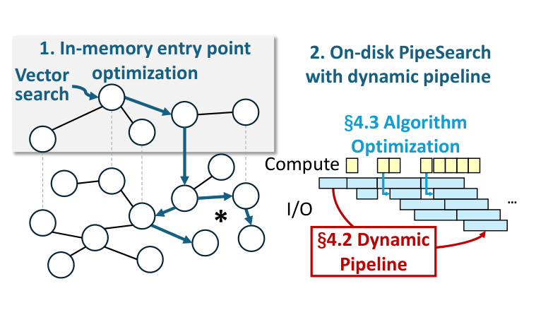
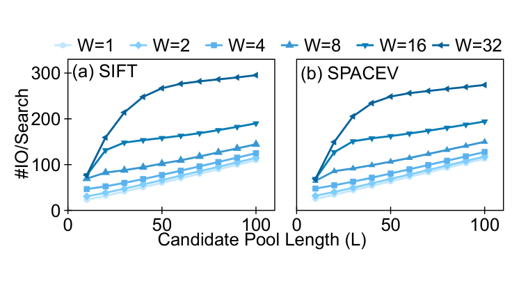
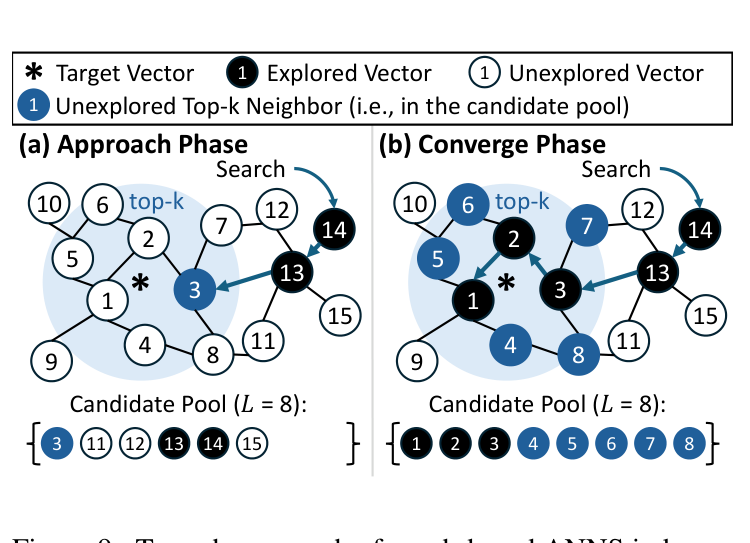
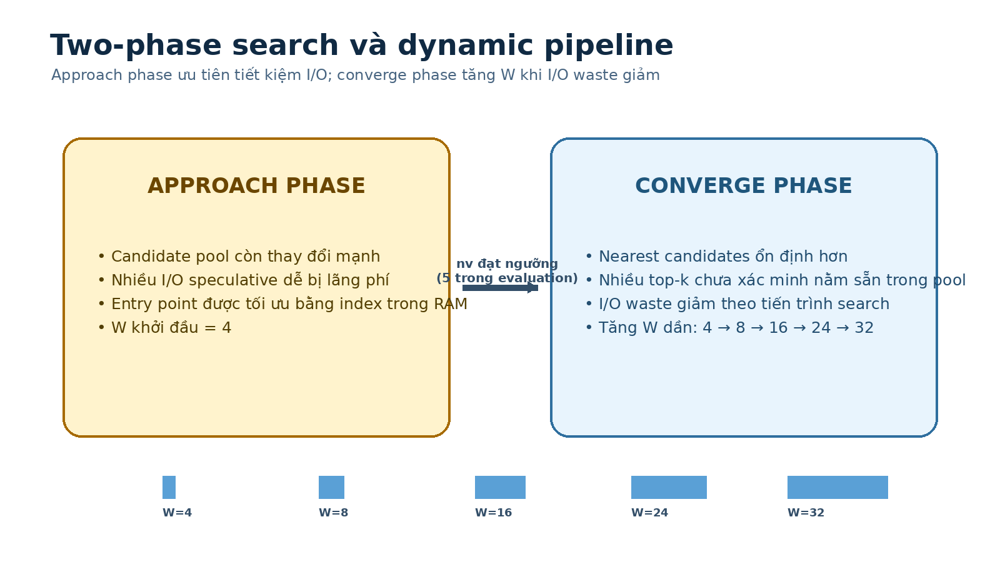

# Bài 04 - PipeANN: two-phase search và dynamic pipeline

## 1. PipeANN thêm gì lên PipeSearch?

PipeANN là hệ thống hoàn chỉnh xây trên PipeSearch và bổ sung hai nhóm kỹ thuật:

1. **Dynamic pipeline width** - không giữ `W` cố định từ đầu đến cuối.
2. **Algorithm optimization** - giảm I/O waste khi nhiều read hoàn tất cùng lúc.

Bài này tập trung vào nhóm 1.

## 2. Quan sát then chốt: I/O waste giảm theo tiến trình search

Paper đo average I/O/search khi thay đổi `L` và phát hiện:

- đầu search: tăng `W` gây waste lớn;
- sau một turning point: slope của I/O/search giảm và gần với trường hợp lý tưởng `W = 1`;
- `W` càng lớn thì turning point đến muộn hơn.

## 3. Search tự nhiên chia thành hai phase

### 3.1 Approach phase

Search còn đang “đi tới” vùng target:

- candidate gần nhất thay đổi nhanh;
- các vector trên critical path chưa ổn định;
- phát quá nhiều read speculative dễ lãng phí.

Do đó PipeANN:

- dùng **in-memory entry-point optimization** để vào vùng tốt nhanh hơn;
- bắt đầu PipeSearch với pipeline nhỏ, mặc định `W = 4`.

### 3.2 Converge phase

Khi đã gần vùng target:

- nearest candidate ổn định hơn;
- candidate pool chứa nhiều “unverified top-k neighbors”;
- có thể read nhiều candidate gần query song song mà ít waste hơn.

Do đó PipeANN tăng `W` dần.

## 4. Entry-point optimization

PipeANN sample **1%** dataset làm entry points và xây một graph index nhỏ trong RAM.

Ở online search:

1. traverse in-memory graph;
2. chọn các entry point tốt;
3. bắt đầu on-disk PipeSearch từ các entry này.

Paper dùng Vamana cho index trong RAM và đặt maximum out-degree mặc định **32**, nhỏ hơn một số cấu hình graph search thông thường vì index này chỉ phục vụ entry-point selection.

Ý nghĩa hệ thống:

> Nếu có thể bỏ bớt phần “approach” tốn waste bằng một index nhỏ trong RAM, PipeSearch dành nhiều thời gian hơn ở vùng mà pipelining hiệu quả.

## 5. Làm sao nhận biết đã sang converge phase?

Paper ước lượng số vector đã được recall, ký hiệu `n_v`.

Sau khi explore một vector, PipeANN duyệt candidate pool để tìm vector đầu tiên chưa issue read. Vị trí của nó được dùng như upper-bound approximation cho số vector đã recall.

Trực giác:

- approach phase: explore một record thường tìm ra candidate gần hơn → estimate thường thấp;
- converge phase: khó tìm candidate gần hơn → số candidate đã “ổn định” tăng dần.

Trong evaluation, khi estimate đạt **5**, PipeANN bắt đầu điều chỉnh pipeline. Trước đó, `W = 4`.

## 6. Dynamic approach để tăng W

Paper đề xuất hai cách: static và dynamic. Dynamic là mặc định.

Dynamic approach đo tỷ lệ:

> trong các I/O vừa hoàn tất, bao nhiêu record vẫn nằm trong candidate pool?

Nếu tỷ lệ > **0.9**, pipeline width tăng thêm 1.

Ý nghĩa:

- tỷ lệ cao: các read speculative hiện tại đang khá “đúng”;
- scheduler có thể mạnh dạn tăng concurrency.

## 7. Static approach để đối chiếu

Static approach profile dataset trước, rồi ánh xạ số vector recalled → W.

Trong thí nghiệm Figure 17, mapping dùng:

| # vectors recalled | 0 | 10 | 20 | 30 | 40 |
|---:|---:|---:|---:|---:|---:|
| Pipeline width | 4 | 8 | 16 | 24 | 32 |

Paper cho thấy dynamic approach chỉ nhỉnh hơn static tối đa khoảng **6.1% latency** và **9.1% throughput**, cho thấy PipeANN không quá nhạy với cách adjustment cụ thể.

## 8. Mental model

Hãy nghĩ dynamic pipeline như một “gas pedal”:

- đầu search: chưa biết đường rõ → đi chậm để tránh rẽ sai;
- gần đích: đã có nhiều candidate tốt → tăng tốc và song song hóa.

Điểm quan trọng là **pipeline width là state-dependent**, không chỉ là config tĩnh.
