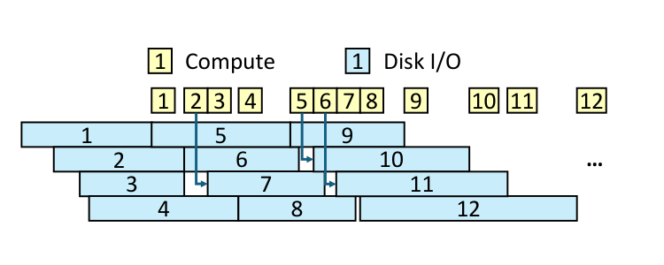

# Bài 05 - Giảm I/O waste và triển khai PipeANN

## 1. Vấn đề còn lại: nhiều I/O hoàn tất cùng lúc

Giả sử `W = 8`. Nếu I/O completion rải đều theo thời gian, mỗi lần một request hoàn tất, CPU có thể:

1. explore record vừa về;
2. cập nhật candidate pool;
3. issue request mới.

Khi đó mỗi I/O mới chỉ “thiếu” neighbor information của tối đa `W` record đang in-flight.

Nhưng SSD có thể trả nhiều completion gần như cùng lúc.

Nếu ta lập tức lấp đầy toàn bộ slot trống:

- chưa kịp explore các record vừa về;
- candidate pool thiếu neighbor information của nhiều record;
- I/O mới được chọn bằng thông tin kém cập nhật;
- waste tăng.

## 2. Algorithm optimization của PipeANN

Thay vì:

```text
4 I/O hoàn tất
→ issue 4 I/O mới ngay
→ sau đó mới compute
```

PipeANN làm:

```text
I/O hoàn tất nhiều request
→ issue 1 read
→ explore 1 record
→ update P
→ issue 1 read
→ explore 1 record
→ ...
```



Mục tiêu là đảm bảo quyết định I/O mới được cập nhật neighbor information thường xuyên hơn.

## 3. Hiệu quả trong breakdown

Trong Figure 16:

- thay best-first bằng PipeSearch (`+Pipe`) giảm latency xuống **55.1%** của baseline ở recall 0.9, nhưng throughput còn **88.5%**;
- thêm algorithm optimization (`+AlgOpt`) tăng throughput lên **1.08×** nhờ giảm average I/O/search xuống **91.8%** so với bước trước;
- sau đó dynamic pipeline giúp cải thiện thêm, đặc biệt ở recall cao.


## 4. Overlap initialization

PipeANN phải chờ disk I/O đầu tiên để lấy neighbor information. Paper đo khoảng **~50 µs** trên NVMe SSD của họ.

Hệ thống overlap thời gian này với việc khởi tạo local PQ table cho query.

Đây là một pattern hệ thống rất đáng học:

> Khi không tránh được một latency cố định, tìm một công việc độc lập có thể đưa vào cùng critical path.

## 5. Tránh cache pollution

Local PQ table initialization cần đọc global PQ table, nhưng dữ liệu này không được dùng trong search sau đó. Đưa nó vào cache có thể đẩy dữ liệu hữu ích ra ngoài.

Paper dùng **non-temporal load trong AVX512** để giảm cache pollution.

Điểm đáng học không phải riêng AVX512, mà là nguyên tắc:

- tối ưu latency không chỉ ở I/O scheduling;
- micro-architecture và memory hierarchy cũng có thể ảnh hưởng đến critical path.

## 6. Asynchronous I/O với io_uring

PipeANN dùng `io_uring`:

- mỗi search thread có private io_uring;
- phát read bằng `prep_read`;
- poll completion bằng non-blocking `peek_batch_cqe`;
- bật SQ polling để giảm latency issue/poll.

Paper cho rằng polling quan trọng với PipeANN hơn best-first vì PipeANN muốn tận dụng mọi khoảng thời gian I/O tiết kiệm được cho compute, thay vì đợi interrupt/batch barrier.

## 7. Memory footprint

Trong billion-scale evaluation, PipeANN cần **<40 GB RAM**:

- khoảng **32 GB** cho PQ-compressed vectors, 32 bytes/vector;
- `<4 GB` cho in-memory graph index;
  - 2.4 GB trên SIFT1B;
  - 3.1 GB trên SPACEV1B;
- thêm overhead nhỏ cho data structures khác.

Trong khi đó graph index trên disk lớn hơn 600 GB:

- 636 GB cho SIFT1B;
- 892 GB cho SPACEV1B.

Paper mô tả memory-to-disk ratio khoảng **1:15**.

## 8. Mở rộng ngoài SSD

Paper thảo luận PipeSearch có thể áp dụng cho remote memory nếu có đặc tính tương tự:

- access latency ở mức µs;
- hỗ trợ parallel/asynchronous access.

Ví dụ:

- RDMA;
- CXL-based remote memory.

Khi đó:

- graph index ở remote memory;
- PQ vectors + small entry index ở local memory;
- thay `io_uring read` bằng RDMA read hoặc CXL prefetch tương ứng.

Đây là một bài học systems tổng quát: **alignment giữa algorithm và hardware interface** có thể quan trọng ngang với lựa chọn data structure.
