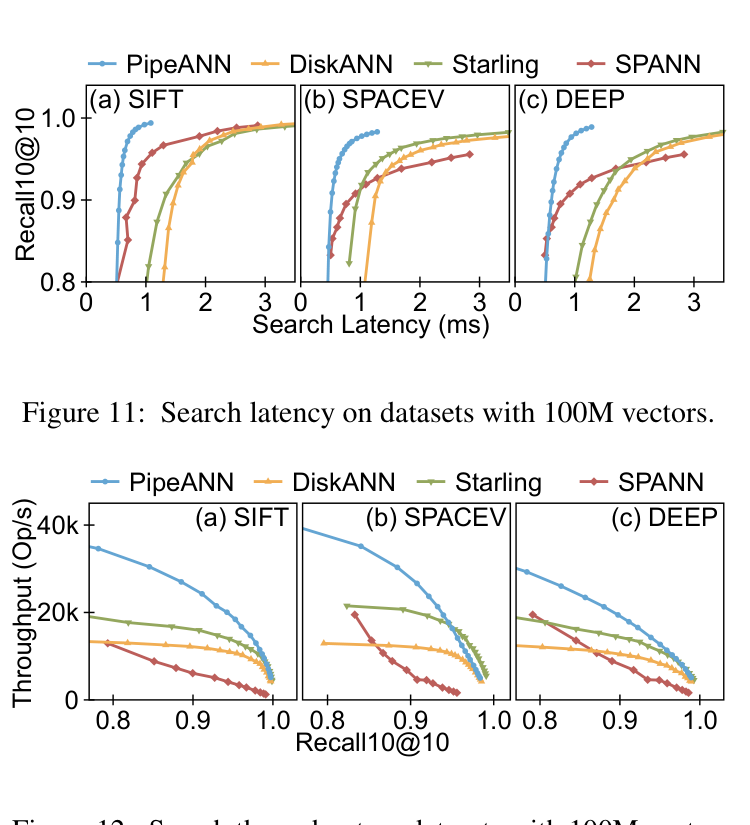
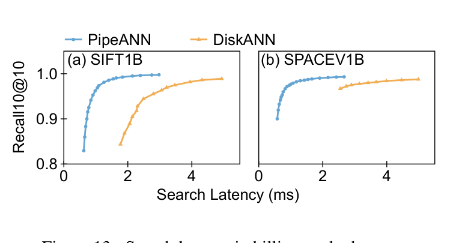
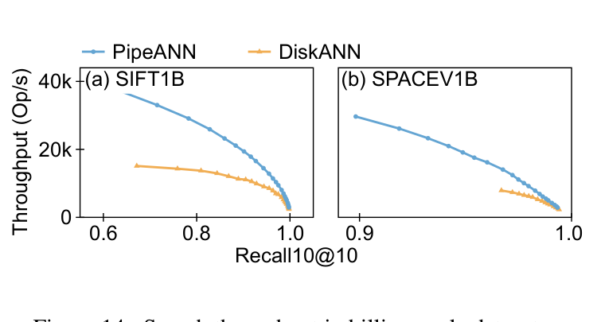
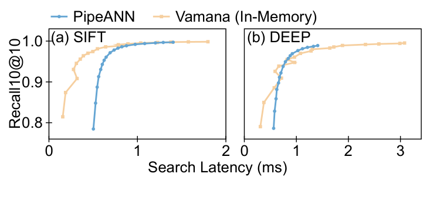
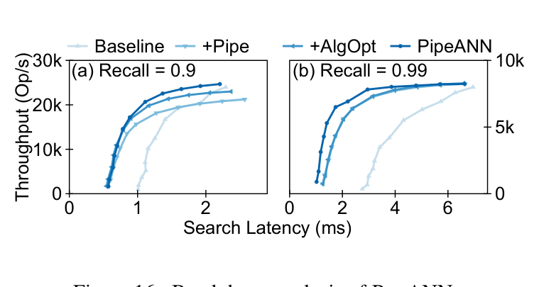
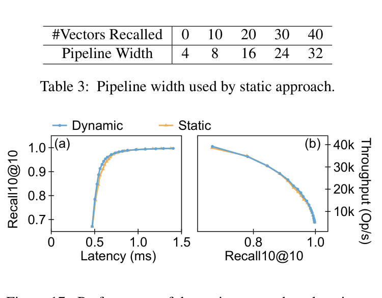
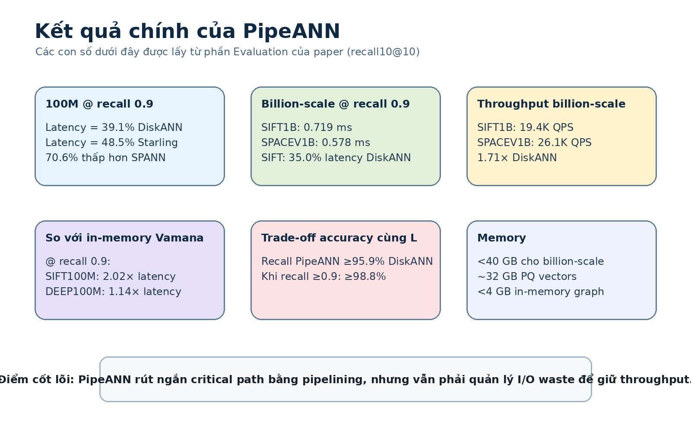

# Bài 06 - Đọc và hiểu Evaluation của PipeANN

## 1. Câu hỏi evaluation

Paper tổ chức evaluation để trả lời sáu câu hỏi:

1. Latency và throughput so với on-disk ANNS khác thế nào?
2. Có scale đến billion vectors không?
3. Khoảng cách latency với in-memory Vamana còn bao nhiêu?
4. Từng kỹ thuật đóng góp bao nhiêu?
5. Static và dynamic pipeline adjustment khác nhau thế nào?
6. PipeANN đánh đổi throughput và accuracy ra sao?

## 2. Experimental setup

Server:

- **CPU:** 2 × 28-core Intel Xeon Gold 6330 @ 2.00 GHz;
- **RAM:** 512 GB DDR4;
- **SSD:** Samsung PM9A3 3.84 TB;
- **OS:** Ubuntu 22.04, Linux 5.15.

Baselines:

- **DiskANN:** graph-based, best-first/beam search;
- **Starling:** cải thiện locality bằng record reordering + in-memory entry optimization;
- **SPANN:** cluster-based on-disk ANN;
- **Vamana:** in-memory graph baseline ở phần 5.4.

Datasets:

| Dataset | #vectors | Type | Dim | #queries |
|---|---:|---|---:|---:|
| SIFT1B | 1B | uint8 | 128 | 10,000 |
| SPACEV1B | 1.4B | int8 | 100 | 29,316 |
| SIFT100M | 100M | uint8 | 128 | 10,000 |
| DEEP100M | 100M | float | 96 | 10,000 |
| SPACEV100M | 100M | int8 | 100 | 29,316 |

Metric chính: **recall10@10**, tập trung nhiều vào recall = 0.9.

## 3. Overall performance trên 100M vectors

### Latency @ recall 0.9

PipeANN có latency trung bình bằng:

- **39.1%** DiskANN;
- **48.5%** Starling.

So với SPANN, PipeANN có latency **thấp hơn 70.6%** ở recall 0.9.

Paper lưu ý ở recall thấp như 0.8, overhead approach phase có thể khiến PipeANN không chiếm ưu thế so với SPANN.

### Throughput @ recall 0.9

Với 56 threads, PipeANN có throughput cao nhất trong nhóm so sánh ở recall 0.9, cao hơn các hệ thống khác **1.35× trung bình**.

Ở recall 0.99, Starling có thể có throughput tốt hơn do record reordering giảm I/O/search; PipeANN cần nhiều speculative I/O hơn.

## 4. Billion-scale

Ở recall 0.9:

| Dataset | Latency | Throughput |
|---|---:|---:|
| SIFT1B | **0.719 ms** | **19.4K QPS** |
| SPACEV1B | **0.578 ms** | **26.1K QPS** |

So với DiskANN:

- trên SIFT1B, PipeANN đạt **35.0% latency**;
- throughput cao hơn **1.71×**.

Paper giải thích billion-scale có search path dài hơn, nên latency tuyệt đối tăng so với 100M nhưng đồng thời tạo thêm cơ hội pipelining.

## 5. So với in-memory Vamana

Ở recall 0.9:

- SIFT100M: PipeANN = **2.02×** latency Vamana;
- DEEP100M: PipeANN = **1.14×** latency Vamana.

Ở recall thấp 0.8, khoảng cách lớn hơn vì search kết thúc khi approach phase vẫn chiếm phần lớn execution.

Paper cho rằng khoảng cách nhỏ hơn trên DEEP vì distance computation cho Vamana đắt hơn, trong khi PipeANN dùng PQ distance cho neighbors.

## 6. Breakdown: kỹ thuật nào tạo giá trị?

Chuỗi tích lũy:

1. **Baseline:** best-first + in-memory entry point.
2. **+Pipe:** thay best-first bằng PipeSearch.
3. **+AlgOpt:** thêm xử lý completion one-by-one.
4. **PipeANN:** thêm dynamic pipeline.

Điểm chính:

- `+Pipe`: latency xuống **55.1%**, throughput còn **88.5%** ở recall 0.9;
- `+AlgOpt`: throughput tăng lên **1.08×** và average I/O/search xuống **91.8%**;
- dynamic pipeline ở recall 0.99 giảm latency xuống **81.1%** và tăng throughput **1.07×** so với stage trước.

## 7. Dynamic vs static adjustment

Dynamic approach nhỉnh hơn static tối đa:

- **6.1%** về latency;
- **9.1%** về throughput.

Điều quan trọng hơn con số là dynamic approach tự theo dõi trạng thái search thay vì phụ thuộc profiling mapping cố định.

## 8. Bảng tổng hợp nhanh

## 9. Cách đọc evaluation đúng

Không nên chỉ rút ra “PipeANN nhanh hơn”. Cần giữ các điều kiện:

- metric là recall10@10;
- các con số khác nhau giữa recall 0.8, 0.9, 0.99;
- latency đo với 1 thread, throughput với 56 threads trong phần overall;
- Starling có reordering nhưng không được dùng billion-scale trong setup do overhead build/search trong điều kiện thí nghiệm;
- PipeANN có trade-off I/O waste rõ ở recall thấp và khi so với ideal best-first throughput.

Đây là cách đọc paper systems: **performance claim luôn đi cùng workload, target accuracy, hardware và baseline configuration**.
