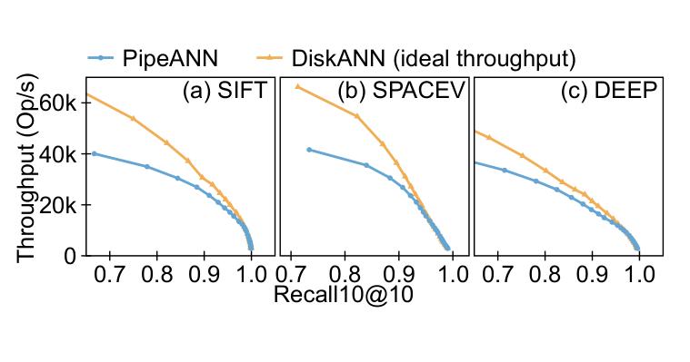
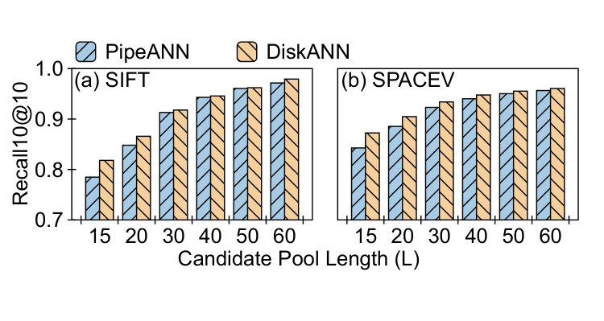

# Bài 07 - Trade-off, related work và kết luận

## 1. PipeANN không loại bỏ hoàn toàn throughput trade-off

Để tạo “ideal throughput” baseline, paper chạy DiskANN với `W = 1` nhưng multiplex nhiều query bất đồng bộ trên mỗi core để vẫn saturate SSD.

So với baseline này, PipeANN có throughput thấp hơn ở recall thấp vì speculative I/O.

Ở recall = 0.8, throughput drop của PipeANN:

- SIFT: **31.6%**;
- SPACEV: **34.1%**;
- DEEP: **17.5%**.

Khi recall = 0.95, drop giảm còn:

- **14.7% / 6.15% / 4.90%**.

Lý do: converge phase kéo dài hơn, nơi pipeline rộng gây ít waste hơn.

## 2. Accuracy trade-off khi giữ cùng `L`

PipeANN relax best-first ordering nên có thể làm recall thấp hơn nếu giữ nguyên search parameter `L`.

Paper báo cáo:

- recall PipeANN ít nhất bằng **95.9%** recall DiskANN trong thí nghiệm này;
- khi target recall ≥ 0.9, tỷ lệ tăng lên ít nhất **98.8%**.

Paper giải thích PipeANN có thể xem gần giống best-first với effective candidate pool khoảng `L - W`, vì một I/O có thể thiếu neighbor information của tối đa `W` record. Khi `L` lớn, chênh lệch `L-W` so với `L` ít ảnh hưởng hơn.

## 3. Khi nào PipeANN có vẻ phù hợp nhất theo paper?

Paper nhấn mạnh use case có latency budget mức millisecond, ví dụ large-scale search và recommendation.

Đặc biệt ở recall tương đối cao, PipeANN tận dụng converge phase dài để overlap compute/I/O tốt và thu hẹp khoảng cách với in-memory search.

Ngược lại, ở recall thấp:

- approach phase chiếm tỷ lệ lớn;
- pipeline khó tăng rộng;
- overhead entry/search và I/O waste tương đối rõ hơn.

## 4. So sánh ý tưởng với related work

### DiskANN

- graph-based on-disk;
- dùng beam search để tăng parallel I/O;
- vẫn giữ best-first batch ordering.

PipeANN tập trung vào việc bỏ barrier và pipeline execution.

### Starling

- reorders disk records để tăng locality;
- dùng in-memory entry-point optimization.

Paper coi record reordering là orthogonal: có thể kết hợp với PipeANN, nhưng họ không tích hợp vì overhead reordering lớn ở billion-scale setup.

### SPANN

- cluster-based;
- tìm cluster gần nhất trong memory rồi đọc các cluster song song;
- critical path I/O ngắn, nhưng coarse-grained hơn graph index.

### VBASE

Paper nhắc VBASE cũng quan sát hiện tượng two-phase/relaxed monotonicity, nhưng dùng cho mục tiêu khác: similarity search có tags. PipeANN tận dụng two-phase behavior để điều chỉnh I/O pipeline và waste.

## 5. Giới hạn được paper thừa nhận

PipeANN vẫn dùng speculative I/O. Vì vậy:

- throughput có thể thấp hơn greedy/best-first lý tưởng nếu chỉ tối ưu throughput;
- có thể cần `L` lớn hơn để đạt cùng accuracy;
- lợi ích phụ thuộc balance giữa compute latency và storage latency;
- thiết kế tối ưu cho SSD-like media, không phải mọi loại storage đều chắc chắn có cùng lợi ích.

## 6. Kết luận kỹ thuật

Paper không chỉ giới thiệu một mẹo tối ưu ANN. Nó minh họa một nguyên tắc systems rộng hơn:

> Một thuật toán được thiết kế theo giả định của memory hierarchy cũ có thể để lãng phí khả năng của hardware mới. Hiệu năng có thể tăng mạnh khi thay đổi ordering/scheduling để khớp với hardware concurrency.

Trong PipeANN:

- best-first vẫn cung cấp ranking logic;
- candidate pool vẫn là trung tâm;
- nhưng execution được biến từ step-wise synchronous thành pipeline bất đồng bộ, state-dependent.

Đây là lý do paper có giá trị cho cả người học vector database lẫn operating systems/storage systems.
