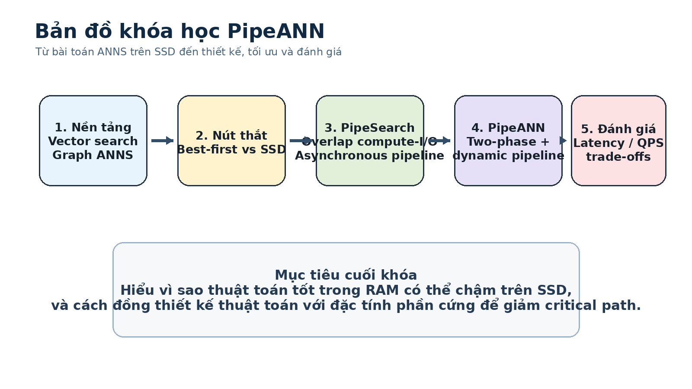

# Khóa học: PipeANN - Low-Latency Graph-Based Vector Search trên SSD

Khóa học này được biên soạn lại từ paper **“Achieving Low-Latency Graph-Based Vector Search via Aligning Best-First Search Algorithm with SSD”** của Hao Guo và Youyou Lu, OSDI 2025.

Mục tiêu không phải là tóm tắt paper theo từng trang, mà là **giảng lại nội dung thành một lộ trình học độc lập**: từ nền tảng vector search, vấn đề của best-first search trên SSD, ý tưởng PipeSearch, thiết kế PipeANN, đến cách đọc và diễn giải kết quả thực nghiệm.

## Bạn sẽ học được gì?

Sau khóa học, bạn có thể:

- giải thích graph-based approximate nearest neighbor search (ANNS) và vai trò của candidate pool;
- phân biệt greedy search, beam search và PipeSearch;
- lý giải vì sao best-first search phù hợp trong RAM nhưng không khai thác tốt SSD;
- hiểu cách PipeSearch overlap compute với I/O bất đồng bộ;
- hiểu trade-off giữa pipeline width, latency, throughput và I/O waste;
- mô tả kiến trúc PipeANN: entry-point optimization, two-phase search, dynamic pipeline và algorithm optimization;
- đọc đúng các thí nghiệm của paper trên SIFT, SPACEV và DEEP;
- tự xây một simulator nhỏ để quan sát tác động của scheduling lên latency và utilization.

## Cấu trúc khóa học

| Bài | Nội dung |
|---|---|
| [00](00_course_overview.md) | Tổng quan, thuật ngữ và cách học |
| [01](01_graph_ann_and_best_first.md) | Graph ANNS và best-first search |
| [02](02_why_best_first_mismatches_ssd.md) | Vì sao best-first mismatch với SSD |
| [03](03_pipesearch.md) | PipeSearch: phá strict compute-I/O order |
| [04](04_pipeann_dynamic_pipeline.md) | PipeANN: two-phase search và dynamic pipeline |
| [05](05_algorithm_optimization_and_implementation.md) | Giảm I/O waste và triển khai io_uring |
| [06](06_evaluation.md) | Đọc toàn bộ evaluation |
| [07](07_tradeoffs_related_work_conclusion.md) | Trade-off, giới hạn, related work và kết luận |
| [08](08_lab_simulator.md) | Lab: mô phỏng best-first và PipeSearch |
| [09](09_cheatsheet.md) | Cheat sheet tổng hợp |
| [Bài tập](exercises/questions.md) | Câu hỏi ôn tập và bài tập |
| [Đáp án](exercises/answers.md) | Gợi ý/đáp án |

## Tài nguyên hình ảnh

- `images/original_figures/`: các figure chính được crop trực tiếp từ paper để đối chiếu.
- `images/diagrams/`: sơ đồ giảng dạy được dựng lại để giải thích cơ chế dễ hơn.
- `source/osdi25-guo.pdf`: paper gốc được giữ kèm trong gói học.

## Cách học đề xuất

1. Đọc Bài 01-02 để nắm chính xác vấn đề.
2. Trước khi đọc Bài 03, tự trả lời: “Nếu SSD có thể xử lý nhiều read song song, tại sao phải đợi cả batch?”
3. Đọc Bài 03-05 để hiểu thiết kế.
4. Đọc Bài 06 cùng các figure gốc, không chỉ đọc con số.
5. Làm Bài 08 để biến ý tưởng scheduling thành trực giác thực nghiệm.
6. Dùng `09_cheatsheet.md` để ôn trước khi thuyết trình hoặc đọc lại paper.

> **Lưu ý nguồn:** mọi kết luận định lượng trong khóa học đều bám theo paper. Các ví dụ mô phỏng và bài tập thực hành là nội dung sư phạm được xây dựng thêm để giúp học, không phải code hay thí nghiệm bổ sung của tác giả.
