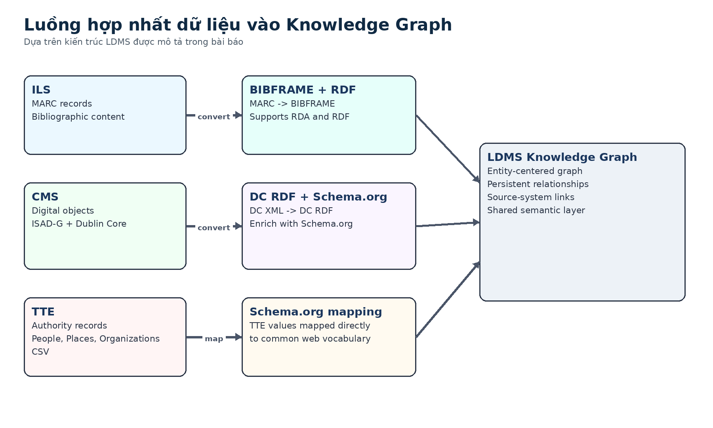

# Bài 01 - Linked Data và Semantic Web trong thư viện

## Mục tiêu

Sau bài này, bạn có thể giải thích Linked Data giải quyết vấn đề gì trong thư viện, RDF đóng vai trò gì, và vì sao một mô hình entity-centered có lợi cho khám phá tài nguyên.

## 1. Từ “record” sang “entity + relationship”

Trong các hệ thống thư viện truyền thống, metadata thường nằm trong nhiều hệ thống và nhiều định dạng khác nhau. Một bản ghi có thể mô tả sách, một hệ thống khác lưu ảnh hoặc tư liệu lưu trữ, trong khi một hệ thống authority lại quản lý tên người, địa điểm và tổ chức.

Linked Data đưa ra một cách tổ chức khác: mỗi đối tượng được xem như một **entity có định danh**, và các mối quan hệ giữa entity được biểu diễn bằng các statement theo chuẩn RDF. Khi hai hệ thống cùng tham chiếu được tới một entity, dữ liệu không còn bị “kẹt” trong từng silo riêng lẻ.

Trong paper, hướng tiếp cận này được đặt trong bối cảnh các sáng kiến lớn như BIBFRAME của Library of Congress và các dự án Linked Data của OCLC. Trọng tâm không chỉ là chuyển đổi định dạng, mà là biến tiêu đề hoặc chuỗi văn bản thành **entity có quan hệ, có URI và có thể truy vấn thống nhất**.

## 2. RDF là lớp biểu diễn quan hệ

RDF cho phép biểu diễn tri thức dưới dạng các quan hệ giữa các thực thể. Khi một người là tác giả của một tác phẩm, hoặc một bài viết “about” một tổ chức, quan hệ đó có thể trở thành dữ liệu máy hiểu được thay vì chỉ là văn bản hiển thị.

Điều này quan trọng với discovery vì người dùng thường không biết chính xác tài nguyên nào tồn tại. Họ bắt đầu từ một bài viết, một người hoặc một chủ đề rồi lần theo quan hệ. Knowledge Graph chính là cấu trúc phù hợp cho kiểu khám phá này.

## 3. Vì sao BIBFRAME chưa đủ cho toàn bộ bài toán

Paper nhấn mạnh một giới hạn thực tế: NLB quản lý cả tài nguyên thư viện, tài nguyên số và dữ liệu lưu trữ. BIBFRAME được tạo ra chủ yếu cho bibliographic resources, nên không tự nhiên bao phủ tất cả các loại tài nguyên khác. Vì vậy NLB sử dụng một lớp mô hình hóa rộng hơn, kết hợp BIBFRAME, Dublin Core và Schema.org trong một hệ thống Linked Data Management System (LDMS).

## 4. Ý tưởng cốt lõi cần ghi nhớ

- **Linked Data**: kết nối entity bằng các quan hệ chuẩn hóa.
- **RDF**: cách biểu diễn các statement giữa entity.
- **Persistent URI**: giúp authority control và liên kết ổn định.
- **Shared/extensible model**: cho phép dữ liệu từ nhiều domain cùng tồn tại trong một graph.
- **Knowledge Graph**: lớp kết nối để discovery không bị giới hạn bởi từng hệ thống nguồn.

## Kiểm tra nhanh

1. Vì sao việc chỉ thống nhất giao diện tìm kiếm vẫn chưa đủ nếu metadata phía sau vẫn nằm trong nhiều silo?
2. Điểm khác nhau về tư duy giữa “record-centric” và “entity-centric” là gì?
3. Vì sao paper không chọn chỉ dùng BIBFRAME cho toàn bộ dữ liệu NLB?

## Tóm tắt

Linked Data không chỉ là một định dạng mới. Trong case study này, nó là chiến lược để hợp nhất nhiều hệ thống metadata quanh entity và relationship, từ đó tạo nền tảng cho discovery và recommendation xuyên bộ sưu tập.

*Nguồn học: paper, phần Background và Implementation Challenges, pp. 1-2.*
