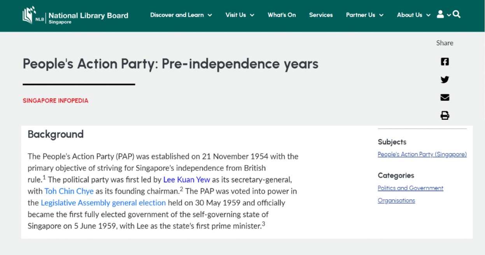

# Bài 02 - Bài toán khám phá tài nguyên và mục tiêu của Singapore Infopedia Widget

## Mục tiêu

Sau bài này, bạn có thể xác định khoảng trống trải nghiệm người dùng trước khi có widget và chuyển khoảng trống đó thành mục tiêu hệ thống.

## 1. Discovery gap

Singapore Infopedia là bách khoa toàn thư trực tuyến về lịch sử, văn hóa, nhân vật và sự kiện của Singapore. Trước khi triển khai Linked Data, người dùng có thể đọc một bài đầy đủ nhưng **không có con đường trực tiếp để khám phá thêm tài nguyên vật lý hoặc số liên quan tới các entity xuất hiện trong bài**.

Ví dụ trong paper là một bài về People’s Action Party có nhắc tới Lee Kuan Yew. Người đọc có thể muốn tìm sách, hình ảnh, audio, video hoặc hồ sơ authority liên quan, nhưng giao diện bài viết ban đầu không tự nối họ tới các nguồn đó.

Vấn đề này không phải thiếu nội dung; NLB đã có một bộ sưu tập rộng. Vấn đề là **nội dung có tồn tại nhưng quan hệ giữa nội dung và ngữ cảnh người dùng đang xem chưa được surfacing**.

## 2. Giải pháp: recommendation dựa trên graph

Singapore Infopedia Widget được xây như một recommendation engine. Nó dùng metadata của bài viết và các kết nối trong Linked Data Knowledge Graph để gợi ý entity và resource liên quan.

Các entity chính được paper nêu gồm:

- Work
- Person
- Organization
- Place
- Topic

Nhờ vậy, người dùng không chỉ nhận một danh sách kết quả search chung chung mà có thể đi từ entity đang đọc sang các tài nguyên có quan hệ rõ ràng.

## 3. Bốn mục tiêu thiết kế

Widget được xây với bốn mục tiêu:

1. Tăng khả năng khám phá tài nguyên liên quan trong bộ sưu tập NLB.
2. Khai thác Linked Data Knowledge Graph để cải thiện recommendation.
3. Tạo trải nghiệm khám phá liên thông, trực quan.
4. Hỗ trợ đặc biệt cho sinh viên và nhà nghiên cứu - nhóm người dùng chính của Infopedia.

## 4. Bài học thiết kế sản phẩm

Case study cho thấy một pattern quan trọng: khi kho nội dung đã lớn, bài toán không nhất thiết là “thêm nội dung” mà là **nâng chất lượng đường dẫn giữa các nội dung đã có**. Knowledge Graph tạo lớp dữ liệu; widget biến lớp dữ liệu đó thành hành vi người dùng nhìn thấy được.

## Bài tập nhỏ

Viết một câu problem statement theo mẫu:

> Người dùng đang ở [trang/nội dung hiện tại] nhưng không dễ dàng khám phá [loại tài nguyên liên quan], dù dữ liệu đã tồn tại trong [các nguồn]. Hệ thống cần dùng [metadata/relationship] để nối hai lớp này.

## Tóm tắt

Singapore Infopedia Widget ra đời để biến các quan hệ vốn đã có trong metadata thành một trải nghiệm khám phá cụ thể trong giao diện đọc bài.

*Nguồn học: paper, Problem Statement and Objectives, p. 3.*
