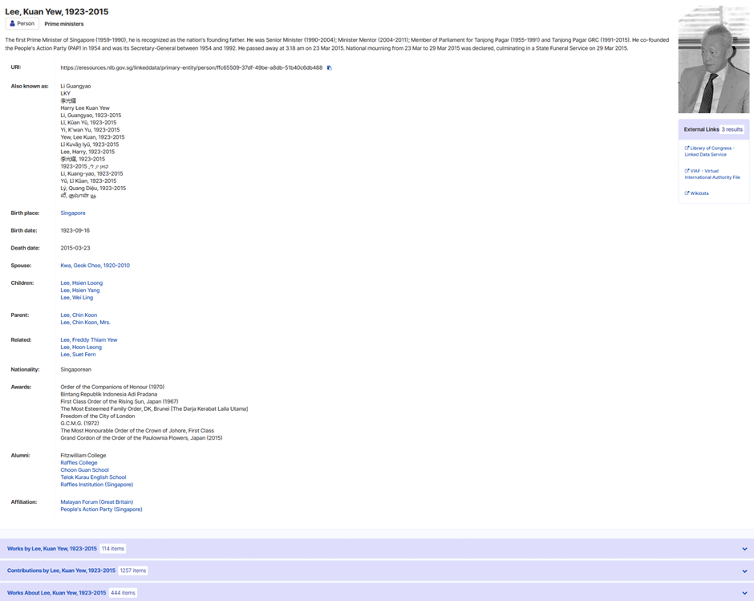
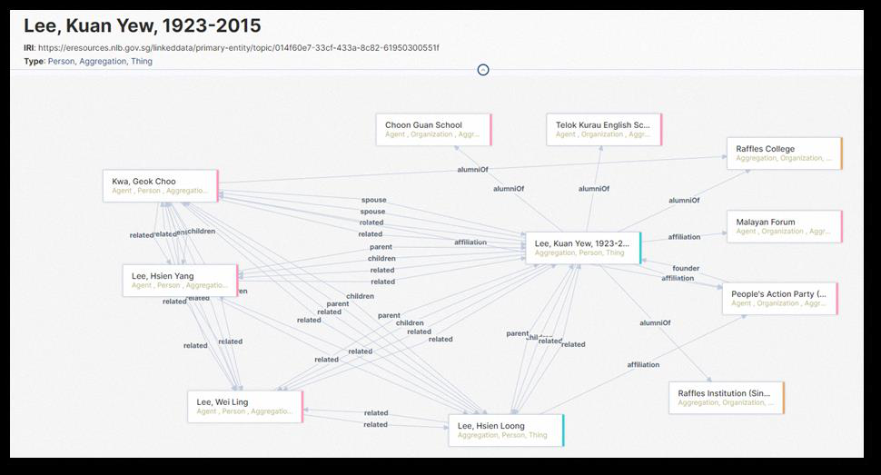

# Bài 04 - Knowledge Graph, authority records và mạng quan hệ entity

## Mục tiêu

Sau bài này, bạn có thể giải thích vì sao authority data là lõi của entity resolution và cách một authority record mở rộng thành mạng quan hệ để phục vụ discovery.

## 1. Authority record không chỉ là “tên chuẩn”

NLB duy trì các authority mang tính user-centric, Singapore-centric và Southeast Asian-centric. Điều này cho phép hệ thống giữ các tên và ngữ cảnh địa phương mà authority quốc tế có thể không bao phủ đầy đủ.

Một authority record có thể chứa tên thay thế, ngày sinh, quan hệ gia đình, affiliation, tác phẩm và các thuộc tính mô tả khác. Nhờ đó, entity không còn là một chuỗi ký tự đơn giản mà là một node giàu ngữ cảnh.

## 2. Từ authority record tới Knowledge Graph

Figure 3 trong paper minh họa một Person entity được nối với nhiều Person và Organization entity khác. Những cạnh quan hệ như spouse, parent, affiliation, alumniOf hoặc founder tạo ra nhiều đường đi khám phá.

Điểm quan trọng ở đây là discovery có thể vượt ra khỏi bài Infopedia ban đầu. Người dùng chọn một entity, mở authority record, rồi tiếp tục sang các Work hoặc resource liên quan nằm ở OPAC, Archives Online hoặc National Library Online.

## 3. “Invisible integration”

Người dùng không cần biết dữ liệu đến từ ILS, CMS hay TTE. Họ chỉ thấy một mạng nội dung thống nhất. LDMS đóng vai trò lớp tích hợp ẩn: giữ source system metadata và quan hệ entity, trong khi widget chỉ surfacing phần cần thiết.

## 4. Local authority làm tăng giá trị ngữ nghĩa

Paper đặc biệt nhấn mạnh các authority phù hợp ngữ cảnh Singapore và Đông Nam Á, ví dụ tên địa phương hoặc dialect names. Đây là lý do local entity sau này còn được đưa vào scoring: locality không chỉ là thuộc tính địa lý, mà là một tín hiệu về mức độ phù hợp với mission và collection của NLB.

## Câu hỏi suy luận

1. Nếu chỉ lưu tên “Lee Kuan Yew” mà không có authority record, hệ thống sẽ mất những đường discovery nào?
2. Vì sao authority control cải thiện cả precision và recall trong search/discovery?
3. Một hệ thống content library của doanh nghiệp có thể dùng loại authority entity nào tương đương Person/Place/Organization?

## Tóm tắt

Authority data cung cấp node chuẩn hóa; Knowledge Graph cung cấp các cạnh giữa node. Khi hai thứ kết hợp, discovery chuyển từ truy vấn theo từ khóa sang duyệt theo ngữ nghĩa và quan hệ.

*Nguồn học: paper, NLB’s Knowledge Graph, pp. 4-6.*
