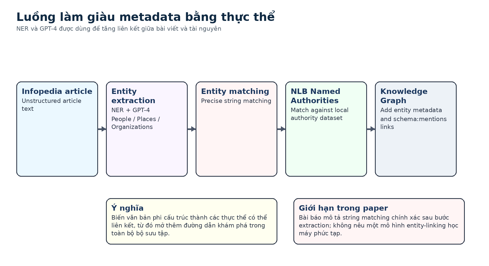

# Bài 05 - Named Entity Recognition và GenAI để làm giàu metadata

## Mục tiêu

Sau bài này, bạn có thể mô tả vì sao cần entity extraction từ unstructured text, GPT-4 được dùng ở bước nào, và entity matching nối kết quả extraction với authority data ra sao.

## 1. Tại sao metadata catalogue chưa đủ

Một bài Infopedia chứa nhiều tên người, địa điểm và tổ chức trong phần prose. Nếu chỉ dùng các subject đã catalog, nhiều entity được nhắc trong văn bản sẽ không trở thành điểm điều hướng trong Knowledge Graph.

NLB vì vậy chạy một quá trình NER riêng để nhận diện các Singapore-related People, Places và Organizations xuất hiện trong bài.

## 2. Entity Extraction

Paper mô tả việc sử dụng GPT-4 để xác định các entity như person, place và organization trong text, có hỗ trợ bằng prompt engineering. Mục tiêu là biến unstructured article content thành danh sách entity candidate.

Điểm cần giữ đúng phạm vi: paper không cung cấp prompt cụ thể, metric chính xác, hay benchmark chi tiết của extraction trong bài này. Vì vậy khóa học không tự tạo ra các thông số đó.

## 3. Entity Matching

Sau extraction, entity được align với **NLB Named Authorities Dataset** bằng precise string matching. Khi match thành công, hệ thống có thể gắn bài viết với entity đã tồn tại trong Knowledge Graph.

Đây là bước rất quan trọng: extraction trả về “một chuỗi giống tên”; matching mới biến chuỗi đó thành một node cụ thể trong graph.

## 4. `schema:mentions` và metadata mới

Kết quả làm giàu được dùng để bổ sung các entity được nhắc tới vào article metadata. Quan hệ `schema:mentions` sau đó trở thành một trong các tín hiệu của ranking algorithm.

Như vậy pipeline có vòng logic rõ ràng:

**article text -> entity extraction -> entity matching -> graph relationship -> discovery/ranking**.

## 5. Rủi ro thiết kế nhìn từ paper

Paper cho biết integration này tạo ra các thách thức phức tạp và cần strategic planning. Dù không liệt kê toàn bộ lỗi extraction/matching, ta có thể xác định những điểm phải kiểm soát trong phạm vi case study:

- entity phải được match đúng authority;
- local authority data phải đủ phong phú;
- quan hệ mới phải không làm nhiễu ranking;
- schema dùng để lưu quan hệ phải nhất quán.

## Tóm tắt

NER và GPT-4 không được dùng thay Knowledge Graph; chúng được dùng để **bổ sung liên kết vào Knowledge Graph** bằng cách khai thác entity đang ẩn trong văn bản.

*Nguồn học: paper, pp. 6 và 10.*
