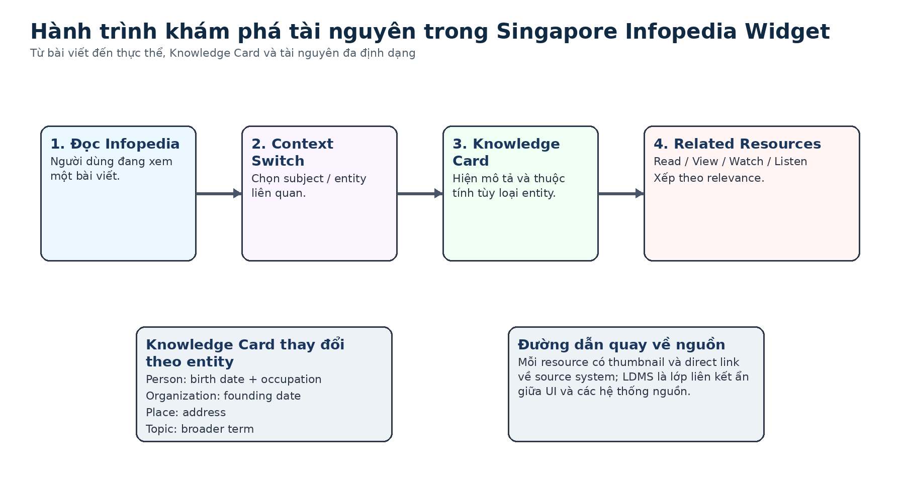
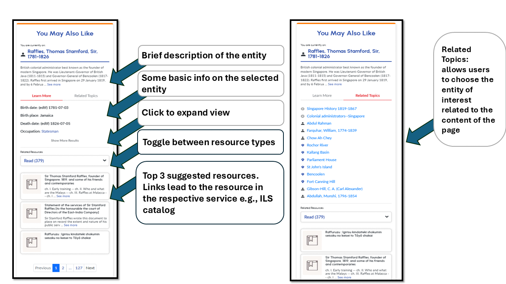
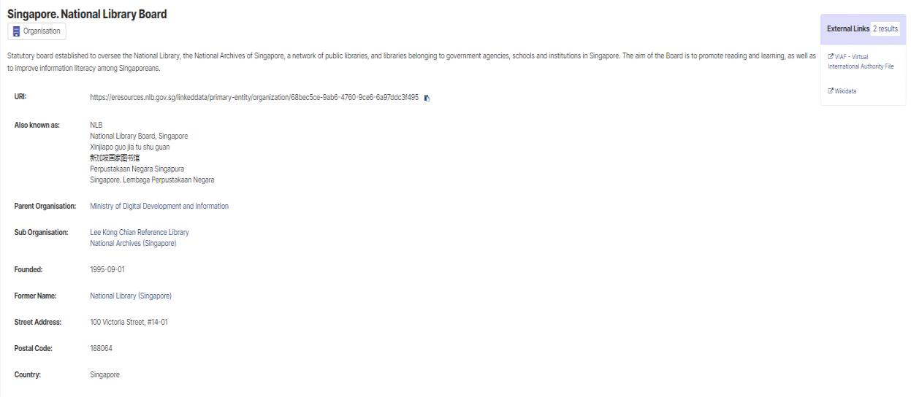
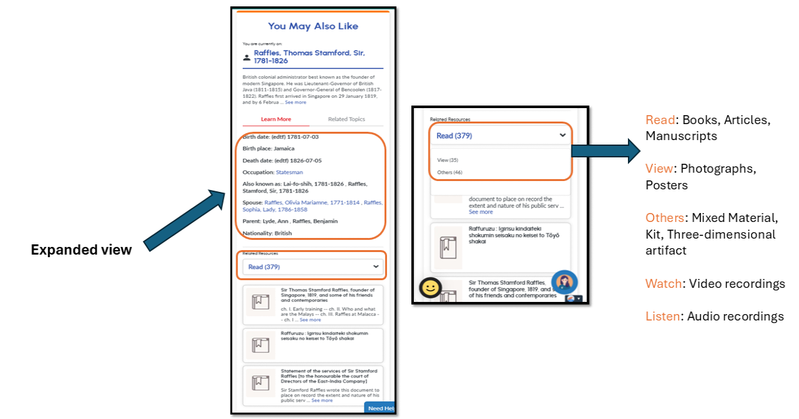

# Bài 06 - Kiến trúc Widget API và trải nghiệm khám phá

## Mục tiêu

Sau bài này, bạn có thể mô tả kiến trúc generic API, Context Switch, Knowledge Card, resource type choice và cách LDMS ẩn sự phức tạp của các source systems.

## 1. Generic API để có thể tái sử dụng

NLB thiết kế service theo hướng generic: API lấy dữ liệu khả dụng từ Knowledge Graph, còn UI quyết định field/value nào sẽ hiển thị. Mục tiêu là để cùng service có thể tích hợp vào web service khác, đồng thời UI vẫn tùy biến theo thiết kế riêng.

Đây là tách biệt quan trọng giữa **semantic/data service** và **presentation layer**.

## 2. Context Switch

Context Switch cho phép người dùng chọn subject/entity liên quan đến bài Infopedia. Subject đến từ cataloguing process; các entity bổ sung từ NER cũng được lưu trong Knowledge Graph để dùng tại đây.

Khi context thay đổi, nội dung Knowledge Card và resource list cũng thay đổi theo entity đang chọn.

## 3. Knowledge Card

Knowledge Card hiển thị entity description và một số thuộc tính tùy loại:

- **Person**: birth date, occupation.
- **Organization**: founding date.
- **Place**: address.
- **Topic**: broader term.

Điểm UX đáng chú ý là card không cố nhồi mọi field trong graph. UI chọn các field phù hợp với entity type, trong khi API vẫn giữ khả năng trả dữ liệu rộng hơn.

## 4. Bốn nhóm resource type

Widget gom resource theo định dạng:

- `read`: tài liệu dạng text;
- `view`: ảnh tĩnh;
- `watch`: moving images / video;
- `listen`: audio.

Paper cho biết các item không phân loại rõ vào bốn nhóm này được bỏ khỏi UI để tránh một nhóm “others” gây khó hiểu hoặc chồng lấn.

## 5. Resource listing

Resource được hiển thị theo relevance, có thumbnail và direct link về source system. LDMS giữ thông tin entity lẫn nguồn gốc tài nguyên, nên nó trở thành cầu nối ẩn giữa widget và các hệ thống như OPAC hay Archives Online.

## 6. Pattern kiến trúc có thể tái sử dụng

Case study thể hiện một pattern rõ:

**Knowledge Graph -> generic API -> context-aware UI -> deep links tới hệ thống nguồn**.

Điều này giúp hệ thống discovery mới không cần thay thế toàn bộ các hệ thống cũ; nó đặt một semantic layer lên trên để kết nối chúng.

## Tóm tắt

Widget thành công khi semantic relationships được biến thành các interaction đơn giản: chọn context, xem Knowledge Card, chọn loại tài nguyên và mở resource liên quan.

*Nguồn học: paper, Widget Architecture, Context Switch, Knowledge Card, Resource Type Choice và Resource Listing, pp. 6-9.*
