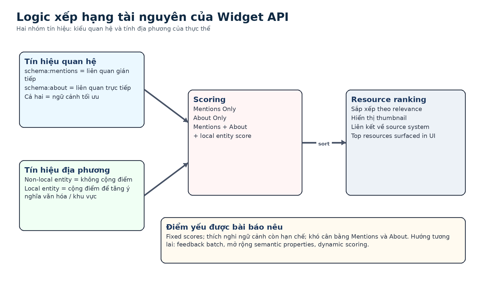

# Bài 07 - Ranking tài nguyên bằng quan hệ ngữ nghĩa

## Mục tiêu

Sau bài này, bạn có thể phân tích các tín hiệu ranking trong widget, phân biệt `schema:about` với `schema:mentions`, và giải thích local entity score.

## 1. Hai nhóm điểm

Ranking algorithm dùng:

1. **Relational type scores** - điểm dựa trên kiểu quan hệ giữa resource/content và entity.
2. **Local entity scores** - điểm bổ sung cho entity có liên hệ với local source entities.

## 2. `schema:mentions`

`schema:mentions` thể hiện entity được nhắc trong article. Paper xem đây là quan hệ gián tiếp: entity có thể không phải chủ đề chính nhưng vẫn tạo ra một đường khám phá hữu ích.

## 3. `schema:about`

`schema:about` mô tả chủ đề hoặc entity mà nội dung trực tiếp nói tới. Trong widget API, resource có `schema:about` nhận điểm cao hơn vì được coi là trực tiếp liên quan đến core subject matter.

## 4. Ba primary scoring states

Paper mô tả ba trường hợp:

- **Mentions Only**: chỉ có `schema:mentions`.
- **About Only**: chỉ có `schema:about`.
- **Mentions and About**: cả hai cùng xuất hiện, được xem là mức contextual relevance tối ưu trong hệ thống hiện tại.

Bài báo không công bố con số điểm cụ thể cho từng trạng thái, vì vậy không nên tự gán trọng số số học khi tái hiện hệ thống.

## 5. Secondary scoring: local entity

- **Non-Local Entity**: không cộng thêm điểm.
- **Local Entity**: cộng thêm điểm để tăng cultural/regional significance.

Điều này phản ánh bản chất Singapore-centric của Knowledge Graph và collection.

## 6. Từ metadata enrichment đến ranking

`schema:mentions` không chỉ đến từ cataloguing thủ công. Paper mô tả pipeline entity extraction + entity matching để làm giàu metadata, sau đó dùng metadata đó trong graph và ranking.

Vì vậy ranking phụ thuộc trực tiếp vào chất lượng enrichment phía trước.

## 7. Hạn chế hiện tại

Paper nêu ba vấn đề:

- quá phụ thuộc vào fixed scores;
- contextual adaptation còn hạn chế, chưa tận dụng tốt engagement/history;
- khó cân bằng Mentions và About trong các chủ đề rộng hoặc nuanced.

## Bài tập phân tích

Giả sử có ba resource A/B/C:

- A: `about` entity X;
- B: `mentions` entity X;
- C: vừa `about` vừa `mentions` entity X và X là local entity.

Không tự gán số điểm. Hãy chỉ giải thích thứ tự tín hiệu mà hệ thống paper cho là mạnh/yếu hơn và lý do.

## Tóm tắt

Ranking của widget là semantic ranking dựa trên loại quan hệ và local relevance, không phải một mô hình recommendation học từ hành vi người dùng ở phiên bản được paper mô tả.

*Nguồn học: paper, Ranking Algorithm, pp. 9-10.*
