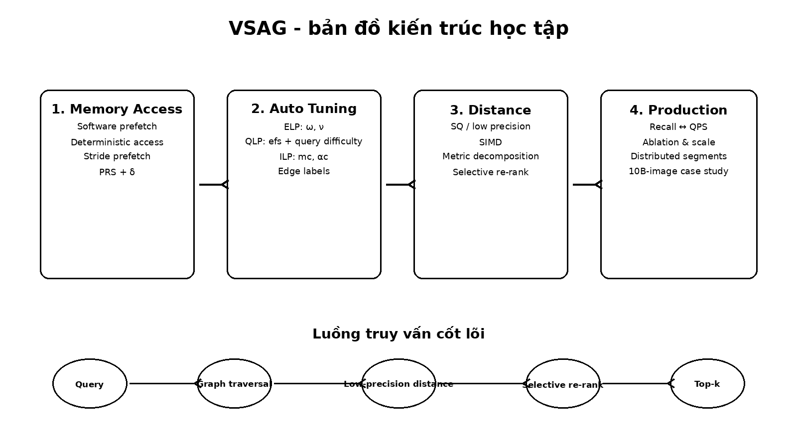

# Khóa học: VSAG - Tối ưu Graph-based Approximate Nearest Neighbor Search

Khóa học này chuyển nội dung học thuật của **VSAG: An Optimized Search Framework for Graph-based Approximate Nearest Neighbor Search** thành một lộ trình học độc lập bằng tiếng Việt. Nội dung tập trung vào tư duy hệ thống: tại sao graph-based ANNS bị nghẽn ở memory access, distance computation và parameter tuning; VSAG xử lý từng nút thắt như thế nào; và cách đọc kết quả thực nghiệm để hiểu giá trị của từng tối ưu.

## Bạn sẽ học được gì?

Sau khóa học, người học có thể:

- giải thích quy trình tìm kiếm ANN trên proximity graph và ba bottleneck chính của triển khai production;
- phân tích software prefetch, deterministic access, stride prefetch và Partial Redundant Storage (PRS);
- phân biệt Environment-Level, Query-Level và Index-Level Parameters;
- giải thích cơ chế edge labeling giúp thay đổi cấu hình index ở runtime mà không rebuild toàn bộ index;
- mô tả kiến trúc low-precision search + selective high-precision re-ranking;
- đọc Recall/QPS, ablation study, tuning cost và scalability experiment;
- liên hệ các kỹ thuật với vector database, product search và RAG/LLM retrieval.

## Lộ trình đề xuất

1. `lessons/01_problem_and_background.md`
2. `lessons/02_vsag_architecture.md`
3. `lessons/03_memory_prefetch.md`
4. `lessons/04_prs_storage.md`
5. `lessons/05_parameter_tuning.md`
6. `lessons/06_ilp_labeling.md`
7. `lessons/07_distance_computation.md`
8. `lessons/08_experiments.md`
9. `lessons/09_production_case_study.md`
10. `lessons/10_algorithms_and_appendix.md`
11. `lessons/11_synthesis.md`

Bài tập nằm trong `exercises/`. Ảnh minh họa gốc từ paper và các sơ đồ học tập được đặt trong `images/`.

## Cách học

Mỗi bài nên đi theo chu trình: đọc mục tiêu → học khái niệm → đọc hình → tự giải thích lại bằng lời của mình → làm câu kiểm tra → chuyển sang bài tiếp theo. Với các bài 3, 5, 6 và 7, nên vẽ lại luồng thuật toán bằng tay hoặc pseudo-code để kiểm tra mức hiểu.

## Nguồn

Nguồn chính: Zhong et al., **VSAG: An Optimized Search Framework for Graph-based Approximate Nearest Neighbor Search**, PVLDB Vol. 18, No. 12, 2025. Paper công bố artifact tại repository VSAG. Bản PDF nguồn được giữ trong `source/` để đối chiếu học thuật.

> Lưu ý bản quyền: các hình có tiền tố `paper_` là phần trích hình từ tài liệu nguồn để phục vụ học tập/đối chiếu. Các hình có tiền tố `didactic_` và `chart_` là sơ đồ/biểu đồ học tập được dựng lại từ thông tin định lượng trong tài liệu.
