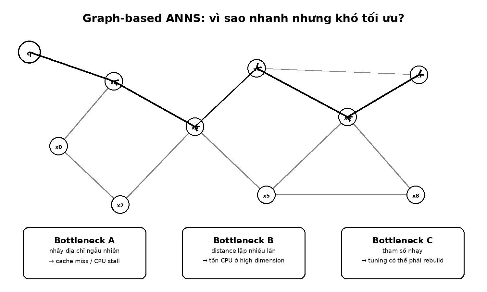
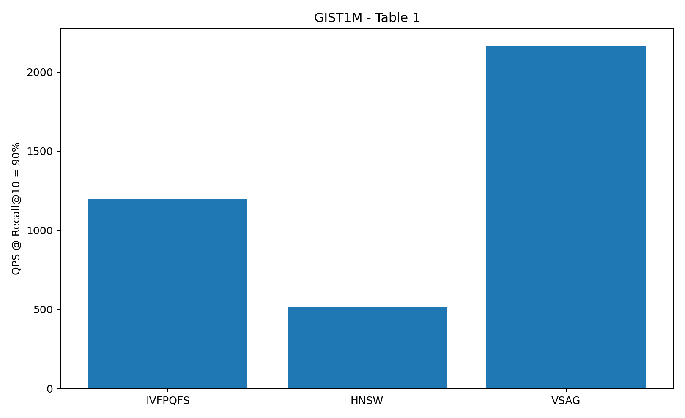

# Bài 01 - Bài toán ANNS và ba bottleneck của graph search

## Mục tiêu

Sau bài này, bạn có thể giải thích Approximate Nearest Neighbor Search (ANNS), cách graph-based ANNS hoạt động và vì sao một thuật toán có recall tốt vẫn có thể gặp bottleneck nghiêm trọng khi chạy production.



## 1. Từ exact nearest neighbor đến ANNS

Một vector database lưu nhiều vector chiều cao. Với query vector `x_q`, mục tiêu là tìm `k` vector gần nhất theo một metric như Euclidean distance hoặc inner product.

Exact search phải so sánh query với quá nhiều vector khi dataset lớn. Khi số chiều tăng, chi phí còn tăng mạnh. ANNS chấp nhận đánh đổi một phần rất nhỏ độ chính xác để giảm đáng kể thời gian truy vấn. Vì vậy hệ thống production thường theo dõi hai đại lượng song song:

- **Recall@k**: tỷ lệ true nearest neighbors xuất hiện trong kết quả approximate;
- **QPS**: số query xử lý mỗi giây.

Tư duy quan trọng: một hệ thống ANN tốt không chỉ “QPS cao” hoặc “recall cao”, mà phải tạo ra đường trade-off tốt giữa hai đại lượng.

## 2. Graph-based ANNS hoạt động thế nào?

Các phương pháp như HNSW và VAMANA xây một graph trong đó:

- mỗi node đại diện cho một vector;
- edge nối những vector gần nhau;
- khi có query, thuật toán bắt đầu từ một hoặc một số node, sau đó greedily di chuyển qua các neighbor có khoảng cách tốt hơn với query;
- một candidate pool giữ các điểm hứa hẹn để tiếp tục mở rộng.

Điểm mạnh của graph search là có thể đạt recall cao với số vector thực sự kiểm tra nhỏ hơn rất nhiều so với full scan.

## 3. Bottleneck 1 - Random memory access

Graph traversal không đọc vector theo thứ tự tuần tự trong RAM. Từ node hiện tại, thuật toán có thể nhảy đến các neighbor nằm ở những vị trí bộ nhớ rất xa nhau. Điều này làm locality kém và tăng cache miss.

Với vector GIST1M 960 chiều lưu bằng `float32`, một vector chiếm `960 × 4 = 3840 bytes`. Với cache line 64 bytes, riêng một vector có thể cần khoảng **60 cache-line transactions** nếu dữ liệu chưa ở cache.

Khi CPU phải chờ dữ liệu từ memory, arithmetic unit có thể rơi vào trạng thái idle. Đây là lý do một cải tiến về layout hoặc prefetch có thể tăng QPS mạnh dù độ phức tạp thuật toán theo nghĩa Big-O không đổi.

## 4. Bottleneck 2 - Distance computation

Mỗi neighbor tiềm năng cần được đánh giá bằng distance. Với high-dimensional vectors, việc lặp lại phép tính này hàng nghìn lần/query tạo ra phần đáng kể runtime.

VSAG xem tổng chi phí distance theo hai phần:

```text
cost = n_lp × t_lp + n_hp × t_hp
```

Trong đó:

- `n_lp`: số lần tính distance low-precision;
- `t_lp`: chi phí mỗi lần low-precision;
- `n_hp`: số lần tính high-precision;
- `t_hp`: chi phí mỗi lần high-precision.

Chiến lược không phải chỉ làm mọi phép tính nhanh hơn; VSAG vừa giảm `t_lp` bằng quantization/SIMD, vừa giảm `n_hp` bằng selective re-ranking.

## 5. Bottleneck 3 - Parameter tuning

Graph-based ANNS có nhiều tham số ảnh hưởng mạnh tới performance. Ví dụ:

- maximum degree của graph;
- candidate pool khi build/search;
- pruning rate;
- prefetch stride/depth.

Vấn đề lớn là không phải tham số nào cũng có thể đổi sau khi index đã build. Một số tham số thay đổi cấu trúc graph, nên tuning kiểu brute-force có thể phải rebuild index nhiều lần.

Trong ví dụ GIST1M của paper, tuning tốt có thể làm QPS tăng từ 1,530 lên 2,182, nhưng brute-force tuning tốn hơn 60 giờ. Vì vậy tuning tự động là một phần của kiến trúc chứ không chỉ là bước phụ sau cùng.

## 6. Mục tiêu thiết kế của VSAG

VSAG tập trung đồng thời vào ba lớp vấn đề:

1. **Memory access** - giảm cache miss và che giấu memory latency.
2. **Parameter tuning** - chọn cấu hình tốt mà không phải rebuild nhiều index.
3. **Distance computation** - dùng low precision nơi có thể, high precision khi thực sự cần.

Ở GIST1M, bảng tổng quan của paper cho thấy tại `Recall@10 = 90%`, VSAG đạt 2167.3 QPS, so với 511.9 QPS của HNSW trong bảng so sánh đầu bài.



## Tự kiểm tra

1. Tại sao graph search có locality kém hơn inverted-file search?
2. Vì sao cache miss có thể làm CPU “nhàn rỗi” dù thuật toán đang thực hiện nhiều phép tính?
3. `Recall@10 = 90%` có ý nghĩa gì?
4. Vì sao tham số thay đổi topology đắt hơn tham số chỉ thay đổi search-time behavior?

## Kết luận

VSAG không giải quyết một bottleneck đơn lẻ. Nó coi ANNS production là bài toán phối hợp giữa **memory hierarchy, graph topology, precision và tuning cost**. Đây là khung tư duy xuyên suốt toàn khóa học.

**Đối chiếu nguồn:** §1, Table 1, §3.1, §5.1.
