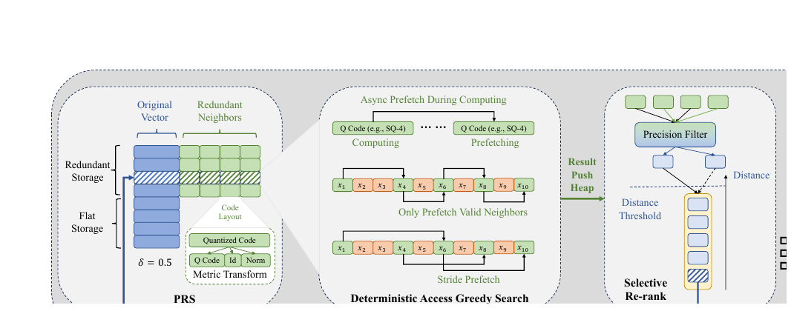

# Bài 02 - Kiến trúc tìm kiếm end-to-end của VSAG

## Mục tiêu

Bài này ghép các kỹ thuật riêng lẻ thành một luồng search hoàn chỉnh: storage → graph traversal → prefetch → low-precision distance → heap → selective re-rank → top-k, dưới sự điều khiển của auto-tuner.



## 1. Hai biểu diễn vector trong cùng hệ thống

VSAG lưu đồng thời:

- **quantized code / low-precision representation** để tính distance nhanh trong phần lớn quá trình traversal;
- **original high-precision vector** để xác nhận chính xác hơn ở bước cuối.

Sự tồn tại song song của hai biểu diễn cho phép hệ thống dùng precision như một tài nguyên có thể phân bổ. Không phải candidate nào cũng xứng đáng nhận một phép tính FLOAT32 đầy đủ.

## 2. PRS là lớp storage chứ không chỉ là cache trick

Partial Redundant Storage (PRS) cho phép một phần neighbor vector được lưu dư thừa ngay gần graph node. Mục tiêu là chuyển một phần access pattern từ random thành contiguous/sequential để tận dụng hardware prefetch tốt hơn.

Tham số `δ` điều khiển tỷ lệ redundancy:

- `δ = 0`: không redundant, tiết kiệm memory;
- `δ = 1`: full redundancy, ưu tiên khả năng prefetch và CPU utilization;
- giá trị giữa 0 và 1 tạo trade-off.

## 3. Deterministic Access Greedy Search

Một graph hop không ngay lập tức fetch toàn bộ vector của neighbor. VSAG trước tiên xử lý metadata/ID để xác định neighbor nào thực sự hợp lệ:

- chưa visited;
- edge label phù hợp với pruning threshold runtime;
- chưa vượt maximum degree runtime.

Chỉ những neighbor hợp lệ mới được đưa vào batch prefetch và tính distance. Đây là ý nghĩa của “deterministic access”: quyết định trước data nào chắc chắn cần tính rồi mới phát memory request.

## 4. Stride prefetch tạo pipeline

Software prefetch là asynchronous. Nếu prefetch quá muộn, CPU vẫn stall; nếu quá sớm, cache line có thể bị evict trước lúc dùng.

VSAG dùng `ω` - prefetch stride - để tạo khoảng cách giữa thời điểm phát prefetch và thời điểm thật sự sử dụng dữ liệu. `ν` điều khiển prefetch depth, tức số cache line được nạp.

Mục tiêu là overlap:

```text
compute(current candidate)
        ||
prefetch(future candidate)
```

Thay vì:

```text
fetch → wait → compute → fetch → wait → compute
```

## 5. Heap và candidate pool

Các candidate sau khi tính low-precision distance được đưa vào candidate pool/heap. Search tiếp tục bằng node gần nhất chưa expand.

Các tham số như `efs` kiểm soát lượng candidate được giữ. Pool lớn thường tăng recall nhưng giảm QPS. Vì vậy đây là đối tượng thích hợp cho query-level tuning.

## 6. Selective Re-rank

Khi traversal kết thúc, VSAG không dùng high precision cho toàn bộ candidate. Một precision filter chọn subset cần re-rank. Những candidate vượt qua filter mới nhận exact/high-precision distance.

Cơ chế này xử lý lỗi quantization mà không biến toàn bộ search trở lại full-precision.

## 7. Self-tuned parameters bao trùm cả vòng đời

VSAG phân tham số thành ba tầng:

- **Environment-level:** phụ thuộc CPU/memory/platform, chủ yếu ảnh hưởng QPS;
- **Query-level:** thay đổi theo difficulty của query và trade-off recall/QPS;
- **Index-level:** tác động cấu trúc graph, truyền thống cần rebuild để thay đổi.

Điểm kiến trúc quan trọng là auto-tuner không nằm ngoài search engine. Nó liên kết trực tiếp với prefetch, candidate pool, edge filtering và index representation.

## 8. Cách đọc Figure 1

Hãy đọc từ trái sang phải:

1. storage chứa original vector, quantized code và phần neighbor redundancy;
2. graph search chỉ prefetch neighbor hợp lệ;
3. low-precision distance tạo candidates;
4. precision filter xác định ai cần high precision;
5. selective re-rank trả về kết quả;
6. self-tuned parameters điều khiển ba lớp môi trường/query/index.

Đường “Pop Heap and Visit” cho thấy search là vòng lặp: chọn candidate gần nhất chưa expand → mở rộng neighbor → push candidates → tiếp tục.

## Tự kiểm tra

- Tại sao PRS và software prefetch bổ sung cho nhau thay vì thay thế nhau?
- Tại sao high-precision vector vẫn cần tồn tại nếu traversal chủ yếu dùng quantized code?
- Candidate pool lớn ảnh hưởng QPS và recall theo hướng nào?

**Đối chiếu nguồn:** §2.1-§2.3, Figure 1.
