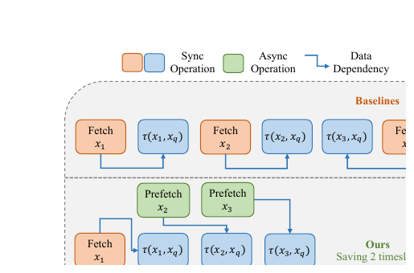
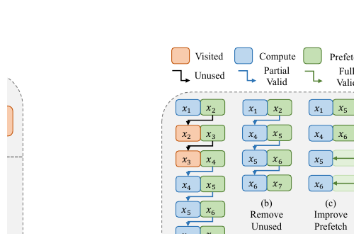
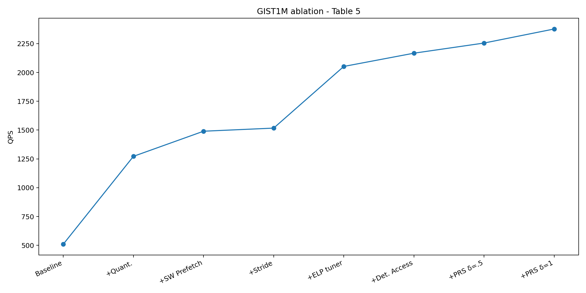

# Bài 03 - Memory Access Optimization: Software Prefetch, Deterministic Access và Stride

## Mục tiêu

Hiểu rõ pipeline che giấu memory latency và lý do “prefetch đúng dữ liệu, đúng lúc” quan trọng hơn việc chỉ phát thật nhiều lệnh prefetch.

## 1. Passive access tạo chuỗi stall



Ở cách thông thường, CPU chạm một địa chỉ chưa có trong cache, chờ memory subsystem nạp dữ liệu, rồi mới tiếp tục tính distance. Chuỗi hoạt động có xu hướng nối tiếp:

`fetch x1 → compute x1 → fetch x2 → compute x2 → ...`

Software prefetch cho phép nạp `x2` trong khi CPU đang tính `x1`, biến memory latency thành phần thời gian được overlap với computation.

## 2. Prefetch không tự động hiệu quả

Prefetch chỉ hữu ích khi:

- địa chỉ được nạp thực sự sẽ dùng;
- dữ liệu tới cache trước lúc CPU cần;
- không tới quá sớm;
- không tới quá sớm đến mức bị evict;
- không gây cache pollution quá mức.

Graph search khiến các điều kiện này khó đạt vì neighbor có thể đã visited hoặc bị filter.

## 3. Deterministic Access: lọc trước, fetch sau



VSAG batch-process danh sách neighbor chỉ bằng metadata nhẹ trước. Neighbor hợp lệ phải thỏa:

```text
j chưa thuộc visited
L_j ≤ α_s
số neighbor hợp lệ < m_s
```

Sau đó các neighbor còn lại được nhóm lại để prefetch và tính distance.

Lợi ích chính:

- giảm prefetch wasted cho node đã visited;
- giảm memory traffic vô ích;
- tạo một sequence hợp lý hơn để pipeline prefetch hoạt động.

## 4. Stride Prefetch và biến ω

Giả sử memory fetch mất khoảng thời gian tương đương hai lần distance computation. Nếu chỉ prefetch candidate kế tiếp, khoảng cách thời gian có thể không đủ. Stride prefetch phát request cho candidate cách hiện tại `ω` bước.

Pseudo-flow:

```text
prefetch N[0 : ω]
for k in neighbors:
    if k + ω < len(neighbors):
        prefetch N[k + ω]
    x = load N[k]
    d = distance(x, query)
```

`ω` phải phù hợp với CPU speed và memory latency. Vì thế paper xếp `ω` vào environment-level parameter và auto-tune nó.

## 5. Prefetch depth ν

`ν` biểu diễn số cache lines bắt đầu từ địa chỉ vector được prefetch. Vector dimensionality khác nhau làm số cache line cần nạp khác nhau. CPU architecture cũng có behavior khác nhau. Vì vậy `ν` phụ thuộc môi trường hơn là semantic của query.

## 6. Algorithm 1 - cấu trúc tư duy

Deterministic Access Greedy Search có thể chia thành 5 pha:

1. duy trì candidate pool `C` và visited set `V`;
2. lấy candidate gần nhất chưa expand;
3. scan neighbor IDs và lọc valid neighbors;
4. prefetch + compute distance theo stride pipeline;
5. selective re-rank ở cuối.

Điểm tinh tế là ID access và vector access có chi phí khác nhau. Kiểm tra ID/label có thể rẻ hơn nhiều so với chạm vector data, nên VSAG trì hoãn vector load đến khi biết candidate cần dùng.

## 7. Thực nghiệm cache miss

Trong Table 5 trên GIST1M:

- baseline L3 miss rate: **93.89%**;
- sau quantization: **67.42%**;
- sau software prefetch + stride + ELP tuner + deterministic access: **39.23%**.

QPS trên cùng chuỗi tối ưu tăng từ 510 lên 2167 trước khi thêm PRS.



Điểm học quan trọng: stride prefetch riêng lẻ chỉ tăng ít nếu `ω` và `ν` chưa được tune. Cơ chế và tuning của cơ chế phải đi cùng nhau.

## Tự kiểm tra

1. Vì sao “visited check trước khi prefetch” có thể giảm cache miss?
2. `ω` quá nhỏ và quá lớn có rủi ro gì?
3. Tại sao prefetch parameter được xếp là environment-level chứ không phải index-level?

**Đối chiếu nguồn:** §3.1, §3.2, Algorithm 1, Table 5.
