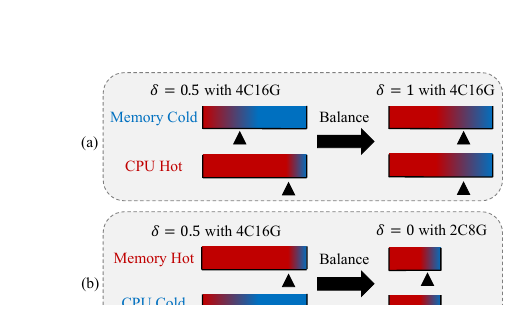

# Bài 04 - PRS: dùng redundancy để cân bằng CPU và memory

## Mục tiêu

Hiểu Partial Redundant Storage (PRS), hardware prefetch, redundancy ratio `δ` và cách VSAG biến memory-layout thành một biến tối ưu hóa workload-aware.

## 1. Giới hạn của software prefetch

Software prefetch có ba giới hạn chính:

- instruction chỉ mang tính advisory, không đảm bảo dữ liệu sẽ được nạp đúng như mong muốn;
- nhiều process/thread có thể cạnh tranh L3 cache và gây cache pollution;
- software prefetch có overhead riêng.

Trong khi đó hardware prefetch rất mạnh khi access pattern có tính tuần tự.

## 2. Graph layout vốn không tuần tự

Partition-based index thường gom vector gần nhau thành vùng liên tục, nên hardware prefetch dễ nhận ra pattern. Graph-based index truy cập neighbor theo edge và thường nhảy địa chỉ ngẫu nhiên.

PRS thay đổi physical layout: nó **co-locate** compressed neighbor vectors gần node đang chứa neighbor list. Khi search mở rộng một node, các vector neighbor có thể được đọc theo một vùng nhớ liên tục hơn.

## 3. Redundant storage không phải “waste” đơn giản

Đổi lại locality tốt hơn, cùng một vector có thể xuất hiện trong nhiều vùng neighbor-local storage. Đây là redundancy có chủ đích.

Nếu phần vector redundantly stored được quantize mạnh, memory overhead được giảm so với việc duplicate full FLOAT32 vectors.

## 4. Redundancy ratio δ

`δ` điều khiển tỷ lệ neighbor vector được lưu redundant:

- `δ = 1`: ưu tiên tối đa hardware prefetch và CPU utilization;
- `δ = 0`: tối thiểu memory footprint;
- `0 < δ < 1`: cân bằng hai tài nguyên.

### Khi compute-bound / throughput cao

Nếu CPU nóng nhưng memory còn dư, tăng `δ` có thể làm cache/data availability tốt hơn và giảm idle cycle.

### Khi memory-constrained

Nếu memory là bottleneck nhưng throughput target vừa phải, giảm `δ` giúp index nhỏ hơn và có thể dùng instance nhỏ hơn.

Paper minh họa 4C16G và 2C8G như hai cấu hình tài nguyên khác nhau để nhấn mạnh rằng một layout tối ưu trên máy này chưa chắc tối ưu trên máy khác.

## 5. Đọc ablation của PRS

Trong Table 5, sau deterministic access, GIST1M đạt 2167 QPS. Khi tăng redundancy:

- `δ = 0.5`: 2255 QPS;
- `δ = 1`: 2377 QPS.

Nhưng trên SIFT1M, QPS sau deterministic access là 5027 và giảm khi bật PRS mạnh hơn. Điều này cho thấy PRS không phải tối ưu “luôn bật tối đa”. Nếu workload đã CPU-bound, thêm data movement/layout overhead có thể không giúp.

## 6. Bài học hệ thống

PRS minh họa một nguyên tắc quan trọng của system optimization:

> Dùng thêm một loại tài nguyên có thể giúp giải phóng một loại tài nguyên khác.

Ở đây, VSAG dùng thêm memory để giảm memory-latency stalls và cải thiện CPU utilization. Quyết định tối ưu không thể tách khỏi instance shape và workload target.

## Tự kiểm tra

- Vì sao sequential memory access thuận lợi cho hardware prefetch?
- `δ = 1` có phải luôn là lựa chọn tốt nhất không?
- Nếu dịch vụ memory-constrained nhưng QPS target không cao, nên suy nghĩ về `δ` theo hướng nào?

**Đối chiếu nguồn:** §3.3.1-§3.3.3, Figure 4, Table 5.
