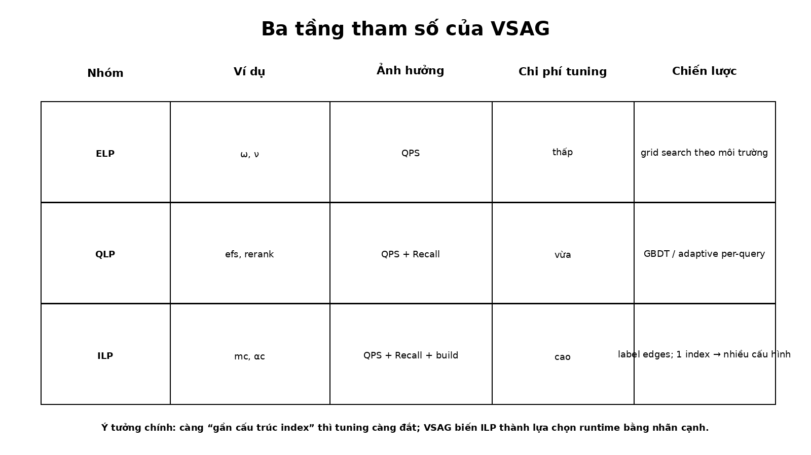

# Bài 05 - Automatic Parameter Tuning: ELP, QLP và ILP

## Mục tiêu

Phân loại tham số theo chi phí thay đổi và hiểu tại sao mỗi nhóm cần một chiến lược tuning khác nhau.



## 1. Environment-Level Parameters (ELP)

Ví dụ: prefetch stride `ω`, prefetch depth `ν`.

Đặc điểm:

- chủ yếu ảnh hưởng QPS;
- không trực tiếp thay đổi recall;
- phụ thuộc CPU, memory latency, instruction behavior và dimensionality;
- dễ thử nhiều tổ hợp vì không cần rebuild index.

VSAG dùng grid search trên sample base vectors, đo performance và chọn cấu hình đạt tốc độ cao, ổn định.

## 2. Query-Level Parameters (QLP)

Ví dụ: search candidate size `efs`, selective reranking configuration.

Đặc điểm:

- ảnh hưởng cả QPS lẫn recall;
- thay đổi tại search time;
- cùng một index nhưng query khó và query dễ không cần cùng mức effort.

Paper quan sát distribution rất lệch: phần lớn query có thể đạt target recall với tham số nhỏ, chỉ một phần nhỏ cần search rộng hơn. Nếu dùng một `efs` lớn cho mọi query, các query dễ bị over-search.

### Decision model

VSAG dùng một GBDT classifier với các feature liên quan tới search state, gồm:

- số điểm đã scan;
- distribution distance của top-5 hiện tại;
- diễn tiến distance theo thời gian ở top-5;
- relative distance differential giữa top-K candidate và optimal solution dùng trong training.

Search có thể bắt đầu với `efs` khá lớn, ví dụ 300, rồi giảm khi model nhận diện query dễ.

## 3. Index-Level Parameters (ILP)

Ví dụ: maximum graph degree `m_c`, pruning rate `α_c`.

Đặc điểm:

- quyết định topology của graph;
- ảnh hưởng recall, QPS và construction time;
- cách truyền thống phải rebuild index để thử cấu hình khác.

Đây là nhóm đắt nhất. Với million-scale dataset, paper mô tả một cấu hình có thể tốn hàng giờ xây index, nên grid search toàn bộ tổ hợp rất tốn.

## 4. “Hardness” tăng dần

Có thể nhớ bằng ba cấp:

```text
ELP: single-objective efficiency
QLP: efficiency + effectiveness trade-off
ILP: efficiency + effectiveness + rebuild cost
```

Tư duy này rất hữu ích ngoài VSAG: trước khi tune, cần hỏi “tham số này thay đổi cái gì trong lifecycle của hệ thống?”

## 5. Kết quả QLP tuner

Table 7 đánh giá GIST1M và SIFT1M ở các recall guarantees 94% và 97%. VSAG auto-tuner giữ recall quanh target và cho mức tăng QPS hơn 5% trong các trường hợp báo cáo.

Ví dụ GIST1M ở target 94%:

- FIX: Recall@10 94.64%, QPS 1469;
- VSAG: Recall@10 94.71%, QPS 1534.

Tăng không khổng lồ bằng các tối ưu memory/distance, nhưng overhead online của decision tree rất nhỏ, khoảng `~0.001s` cho 1000 queries trong bảng breakdown.

## 6. ELP tuning và cơ chế có quan hệ chặt

Một prefetch mechanism tốt vẫn có thể hoạt động kém nếu timing sai. Table 5 cho thấy Stride Prefetch chỉ tăng QPS nhẹ trước khi ELP auto-tuner chọn `ω` và `ν` phù hợp. Sau ELP tuning, QPS tăng rõ rệt.

## Tự kiểm tra

1. Vì sao `efs` là QLP thay vì ELP?
2. Vì sao `m_c` là ILP?
3. Nếu đổi server từ x86 sang ARM, nhóm tham số nào cần kiểm tra lại đầu tiên?
4. Vì sao một query-adaptive tuner có thể tốt hơn fixed parameter?

**Đối chiếu nguồn:** §4.1-§4.3, Table 6, Table 7.
