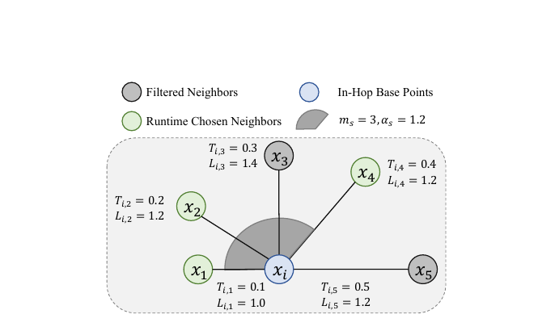
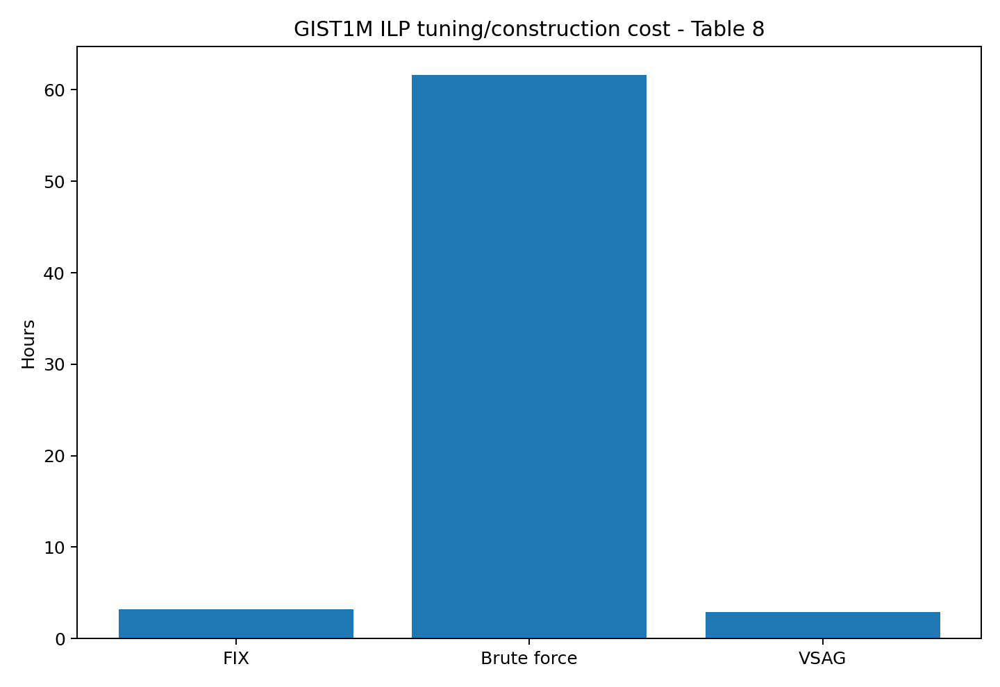

# Bài 06 - ILP Auto-Tuner: Edge Labeling và một index cho nhiều cấu hình

## Mục tiêu

Hiểu ý tưởng kỹ thuật quan trọng nhất của phần ILP: tận dụng overlap giữa nhiều graph để encode chúng trong một physical index, rồi chọn edge ở runtime.

## 1. Vấn đề của tuning ILP

Nếu mỗi cặp `(m_c, α_c)` cần một index riêng, tuning brute force phải:

1. build index;
2. benchmark;
3. đổi parameter;
4. build lại;
5. lặp lại.

Tổng cost tăng theo số tổ hợp. Đây là lý do paper báo cáo hơn 60 giờ cho brute-force tuning GIST1M trong cấu hình thử nghiệm.

## 2. Quan sát: các graph có overlap lớn

Với cùng dữ liệu và quá trình construction tương đương, graph có maximum degree nhỏ thường là subgraph của graph có maximum degree lớn hơn, dưới các điều kiện của Theorem 4.1.

Tương tự, với pruning rate, paper xây dựng tính chất inclusion có điều kiện trong Theorem 4.2.

Ý nghĩa kỹ thuật: thay vì giữ nhiều graph gần giống nhau, có thể giữ **union graph** và gắn metadata lên edge để biết edge tồn tại trong cấu hình nào.

## 3. Edge label là preservation threshold

Mỗi edge được gắn một label liên quan pruning rate. Có thể hiểu label như ngưỡng nhỏ nhất mà từ đó edge được giữ lại.

Khi runtime dùng `α_s`, chỉ edge có label thỏa điều kiện `L ≤ α_s` được xem là valid. Khi đồng thời giới hạn số neighbor bằng `m_s`, search có thể mô phỏng graph tương ứng với một cặp ILP khác.

## 4. Ví dụ Figure 5

Một node có 5 neighbors được sắp theo distance. Runtime chọn:

- `m_s = 3`;
- `α_s = 1.2`.

Một neighbor bị loại vì label `1.4 > 1.2`. Một neighbor khác bị bỏ vì đã lấy đủ 3 neighbor hợp lệ. Kết quả search dùng ba edge còn lại.

Paper lập luận rằng dưới các định lý inclusion, behavior này tương đương search trong graph được xây với cấu hình tương ứng `m_c = 3, α_c = 1.2`.

## 5. Prune-based Labeling

Algorithm 2 làm việc ở construction time:

- sắp ANN candidates theo distance;
- duyệt pruning rates tăng dần;
- thử điều kiện prune cho từng neighbor;
- edge nào tồn tại từ một ngưỡng `α_c` sẽ nhận label đó;
- loại edge không có label hợp lệ khi vượt max degree.

Điểm hiệu quả là distance `T_i,j` đã được cache từ search construction, giảm phép tính lặp.

## 6. Lifecycle mới: build → tune → search

Index truyền thống thường có:

`build → search`

VSAG thêm một phase rõ ràng:

`build relaxed labeled index → tune runtime edge-selection → search`

Vì edge selection được trì hoãn sang tuning/search, cấu trúc physical index không cần rebuild cho mỗi ILP candidate.

## 7. Tuning cost

Table 8 trên GIST1M:

| Phương pháp | Memory | Time |
|---|---:|---:|
| FIX | 3.83 GB | 3.20 h |
| Brute force | 89.87 GB | 61.64 h |
| VSAG | 4.07 GB | 2.92 h |

VSAG gần memory footprint của một index đơn nhưng tránh nhân chi phí theo số cấu hình. Paper báo cáo khoảng **19×** tiết kiệm tuning time so với brute force trên GIST1M.

## 8. Từ tuning đến Pareto frontier

Appendix D mô tả tuning ILP như multi-objective optimization. Mỗi cấu hình tạo ra một điểm performance (accuracy, latency/QPS). Các cấu hình không bị cấu hình khác đồng thời vượt trội tạo thành Pareto frontier. Khi user đưa target recall hoặc latency constraint, hệ thống chọn cấu hình phù hợp trên frontier.

## Tự kiểm tra

- Vì sao union/labeled graph tiết kiệm hơn nhiều index riêng?
- Edge label đóng vai trò gì khi `α_s` thay đổi?
- `m_s` và `α_s` là runtime knobs, nhưng chúng đang mô phỏng loại tham số nào?

**Đối chiếu nguồn:** §4.4, Figure 5, Algorithm 2, Appendix B-D, Table 8.
