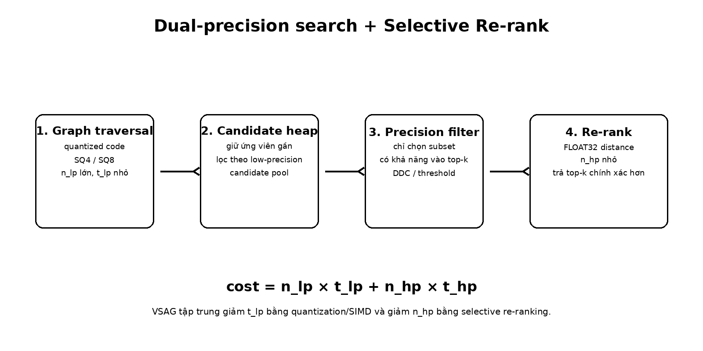
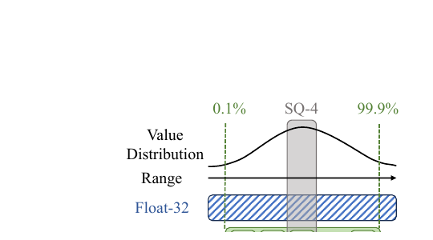

# Bài 07 - Distance Computation: Quantization, SIMD và Selective Re-rank

## Mục tiêu

Hiểu vì sao VSAG tách search thành low-precision traversal và high-precision verification, đồng thời biết các tối ưu cụ thể cho từng tầng.



## 1. Mô hình chi phí

VSAG biểu diễn chi phí distance:

```text
cost = n_lp × t_lp + n_hp × t_hp
```

Chiến lược:

- giảm `t_lp`: quantization + SIMD + layout;
- hạn chế `n_hp`: selective re-rank;
- tăng precision của low-precision distance để tránh candidate inflation.

## 2. Scalar Quantization phù hợp graph traversal

Product Quantization có thể rất mạnh khi batch access và lookup-table reuse thuận lợi. Nhưng graph traversal có random storage và visited filtering, làm SIMD batch khó dùng tối đa.

Scalar Quantization (SQ) nén trực tiếp từng dimension, ví dụ FLOAT32 → INT8/INT4. Với AVX512, low-bit representation cho phép xử lý nhiều phần tử hơn trên cùng bề rộng instruction.

Paper nhấn mạnh SQ đạt cân bằng tốt giữa compression, precision và khả năng dùng SIMD trong graph traversal.

## 3. Distance decomposition

Với Euclidean distance:

```text
||x_b - x_q||² = ||x_b||² + ||x_q||² - 2 x_b · x_q
```

Các thành phần có thể precompute:

- `||x_b||²` cho base vector lúc index build;
- `||x_q||²` một lần cho query.

Phần cần tính lặp với mỗi base candidate chủ yếu là dot product `x_b · x_q`.

Paper mô tả trade-off: thêm một FLOAT32 norm cho mỗi base vector để giảm instruction trong runtime distance.

## 4. Vì sao cần selective re-ranking?

Quantization có error. Nếu chỉ dùng low-precision distance để trả top-k, recall có thể giảm. Cách ngây thơ là re-rank mọi candidate bằng FLOAT32, nhưng điều đó làm mất phần lớn lợi ích tốc độ.

VSAG chỉ re-rank candidate có khả năng ảnh hưởng top-k. DDC-based scheme phân tích quan hệ giữa error và distance để xác định phạm vi re-ranking thích hợp.

Kết quả là:

- traversal rẻ;
- high-precision computation tập trung ở vùng decision boundary;
- final ranking được sửa sai nơi có giá trị nhất.

## 5. Truncated Scalar Quantization



Appendix G chỉ ra vấn đề của min/max quantization khi có outlier. Nếu 99% giá trị nằm dưới 0.3 nhưng max là 1.0, rất nhiều quantization bins bị dành cho vùng hiếm khi dùng.

Truncated SQ dùng thống kê percentile, ví dụ 99th percentile, thay vì absolute extremes. Mục tiêu là tăng resolution trên phần distribution chứa đa số dữ liệu.

Đây là một ví dụ quan trọng: quantization tốt không chỉ là “bit-width thấp hơn”, mà còn là **range estimation hợp lý**.

## 6. Tác động trong ablation

Table 5 cho thấy chỉ riêng Quantization làm GIST1M tăng QPS từ 510 lên 1272, dù recall thay đổi nhẹ từ 90.7% xuống 89.8% trong cấu hình ablation đó. Sau đó các kỹ thuật memory access đưa QPS lên cao hơn nữa.

Điều này giải thích vì sao Figure 8 xác định Quantization là một trong những đóng góp lớn nhất vào QPS.

## Tự kiểm tra

1. Vì sao `n_hp` nhỏ là quan trọng dù high-precision computation được SIMD tối ưu?
2. Min/max range có vấn đề gì khi dữ liệu có outlier?
3. Distance decomposition đổi memory footprint theo hướng nào?

**Đối chiếu nguồn:** §5.1-§5.3, Appendix G, Figure 10, Table 5.
