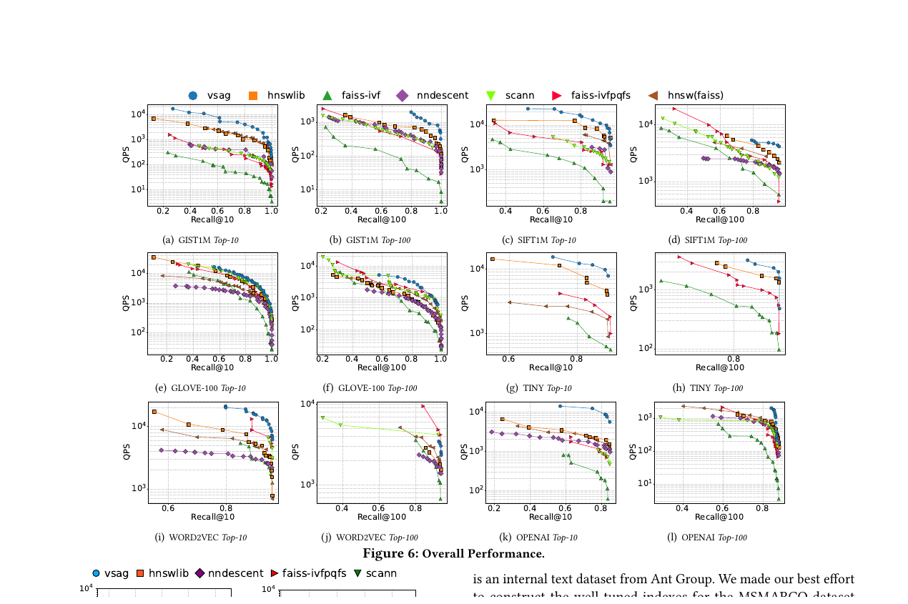
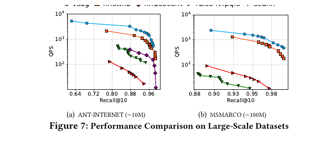
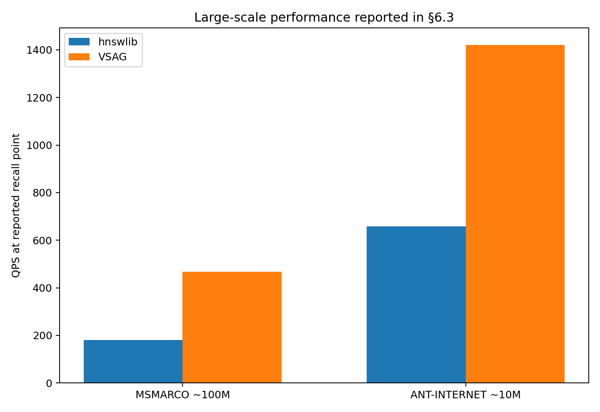
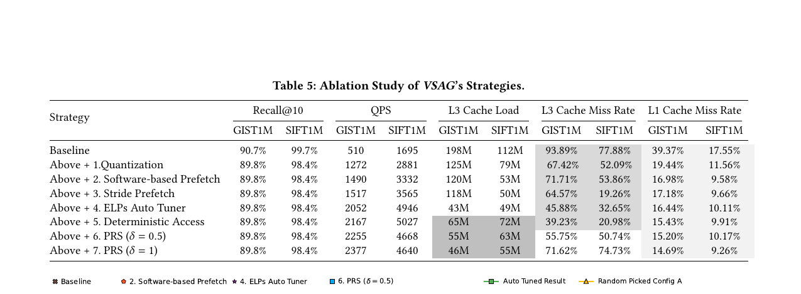
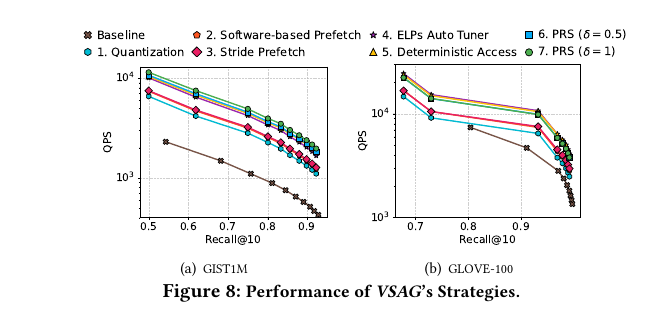
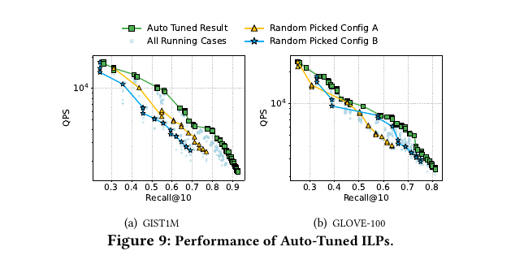

# Bài 08 - Đọc Experimental Study: Recall, QPS, Ablation và Scalability

## Mục tiêu

Biết cách đọc thiết kế thực nghiệm của VSAG mà không chỉ nhìn một con số speedup.

## 1. Dataset

Paper dùng cả image và text embeddings:

| Dataset | Dim | Base vectors | Query | Type |
|---|---:|---:|---:|---|
| GIST1M | 960 | 1,000,000 | 1,000 | Image |
| SIFT1M | 128 | 1,000,000 | 10,000 | Image |
| TINY | 384 | 5,000,000 | 1,000 | Image |
| GLOVE-100 | 100 | 1,183,514 | 10,000 | Text |
| WORD2VEC | 300 | 1,000,000 | 1,000 | Text |
| OPENAI | 1536 | 999,000 | 1,000 | Text |
| ANT-INTERNET | 768 | 9,991,307 | 1,000 | Text |
| MSMARCO | 1024 | 113,519,750 | 1,000 | Text |

Điểm đáng chú ý là dimension trải từ 100 đến 1536, và scale trải từ khoảng 1M đến hơn 113M vectors.

## 2. Baselines

Graph-based:

- hnswlib;
- HNSW implementation trong Faiss;
- NN-Descent.

Partition-based:

- Faiss IVF;
- Faiss IVF-PQ-FastScan;
- ScaNN.

Đánh giá dùng Recall và QPS, với các parameter grid cho từng hệ thống.

## 3. Overall performance

Cách đọc mỗi plot:

- trục ngang: recall;
- trục dọc: QPS;
- đường nằm càng cao tại cùng recall càng tốt;
- hoặc đường nằm càng phải tại cùng QPS càng tốt.

Paper báo cáo VSAG có QPS cao hơn tại cùng recall trên các dataset đánh giá, đặc biệt rõ trên high-dimensional GIST1M và OPENAI.

Ví dụ được nêu trong text:

- GIST1M, Recall@10 = 90%: QPS cao hơn hnswlib khoảng 226%;
- OPENAI, Recall@10 = 80%: khoảng 400% cao hơn hnswlib.

## 4. Large-scale scalability

Ở điểm recall được report:

- MSMARCO ~113.5M vectors: hnswlib 180 QPS → VSAG 467 QPS, khoảng 2.59×;
- ANT-INTERNET ~10M vectors: 659 QPS → 1421 QPS, khoảng 2.15×.

Trên MSMARCO, VSAG index build được report là 15.37 giờ và memory footprint 463 GB.

## 5. Ablation - tối ưu nào đóng góp gì?

Ablation thêm từng strategy theo thứ tự. Trên GIST1M, QPS:

`510 → 1272 → 1490 → 1517 → 2052 → 2167 → 2255 → 2377`

Các mốc tương ứng:

1. Quantization;
2. Software prefetch;
3. Stride prefetch;
4. ELP auto tuner;
5. Deterministic access;
6. PRS δ=0.5;
7. PRS δ=1.

Hai insight lớn:

- Quantization tạo bước tăng QPS lớn bằng cách giảm distance cost;
- ELP tuner làm Stride Prefetch thực sự hiệu quả vì chọn timing phù hợp.

## 6. Cache miss analysis

Trên GIST1M, chuỗi memory optimizations đưa L3 miss rate từ baseline 93.89% xuống 39.23% ở bước deterministic access. Đây là bằng chứng cơ chế, không chỉ là end-to-end speedup.

Một ablation tốt nên trả lời cả hai câu:

- metric cuối tăng bao nhiêu?
- intermediate bottleneck có thực sự giảm theo đúng giả thuyết không?

## 7. ILP tuning performance

Figure 9 so sánh random configurations với auto-tuned result. Trên GIST1M, paper nêu ví dụ:

- tại QPS 2500, worst-case running configuration có Recall@10 khoảng 62%, tuned index đạt 88%;
- tại Recall@10 70%, QPS tăng từ khoảng 2000 lên 4000.

## 8. QLP tuning

QLP auto-tuner cho tăng QPS nhỏ hơn các tối ưu nền tảng nhưng giữ recall target. Đây là dạng gain có giá trị production vì overhead online gần như không đáng kể.

## Tự kiểm tra

1. Tại sao không nên so QPS giữa hai hệ thống nếu recall khác nhau quá nhiều?
2. Vì sao ablation cần đo cả cache miss rate?
3. High-dimensional dataset làm quantization/SIMD quan trọng hơn theo logic nào?

**Đối chiếu nguồn:** §6.1-§6.6, Table 3-7, Figure 6-9.
