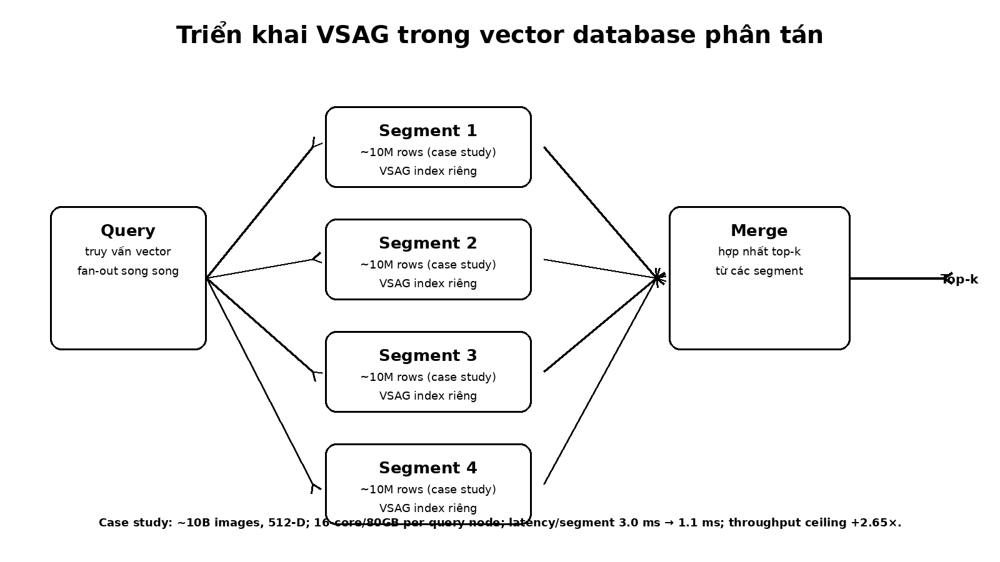

# Bài 09 - Production Case Study: VSAG trong vector database phân tán

## Mục tiêu

Hiểu cách một ANN library được đặt vào hệ thống phân tán và phân biệt performance của local index với scalability của database layer.

## 1. Segment-based vector storage

Hệ thống vector database tại Ant Group chia dataset quy mô rất lớn thành các subset gọi là **segments**, được quản lý trong kiến trúc storage lớn hơn.

VSAG không thay thế toàn bộ database. Nó phụ trách index và retrieval ở từng segment.

Luồng query:

1. query được fan-out đến nhiều segment;
2. mỗi segment search bằng VSAG index của riêng nó;
3. các kết quả local được merge;
4. hệ thống trả final top-k.

## 2. Horizontal scaling

Một query node quản lý một số segment. Khi data tăng, hệ thống thêm query node mới. Đây là separation of concerns:

- VSAG tối ưu local vector search;
- distributed database đảm nhiệm placement, parallelism, failover và result merge.

## 3. Case study khoảng 10 tỷ ảnh

Paper mô tả một image-search scenario:

- khoảng 10 billion images;
- mỗi image thành vector 512 chiều;
- mỗi segment khoảng 10 million rows;
- mỗi query node host tối đa 4 segments;
- mỗi query node: 16-core CPU, 80 GB RAM;
- khoảng 400 machine instances toàn cluster.

Khi dùng VSAG thay cho open-source hnswlib trong scenario này:

- average latency per segment giảm từ **3.0 ms xuống 1.1 ms**;
- upper limit của QPS throughput tăng **2.65×**.

## 4. Vì sao local speedup nhân giá trị ở distributed system?

Nếu mỗi query fan-out nhiều segment, latency của một segment nằm trên critical path. Giảm latency local không chỉ giúp một query; nó còn:

- giảm CPU occupancy;
- tăng concurrency;
- tăng capacity trước khi cần scale-out;
- giảm tail pressure khi nhiều segment xử lý cùng lúc.

Paper còn mô tả một product-search scenario 512-D nơi VSAG giảm resource usage khoảng 4.6× và giảm service latency khoảng 1.2× so với partition-based approach được so sánh trong appendix application section.

## 5. RAG và LLM retrieval

Paper liên hệ VSAG với RAG/agentic search vì các workflow này có thể thực hiện nhiều lượt retrieval liên tiếp. High-dimensional text embeddings như 1536-D hoặc hơn làm distance computation và memory traffic trở thành vấn đề rõ hơn.

Từ góc nhìn hệ thống, multi-step retrieval làm một query người dùng trở thành **nhiều vector queries**, nên throughput/headroom của index ảnh hưởng trực tiếp responsiveness của ứng dụng.

## 6. Bài học kiến trúc

Không nên đánh đồng “vector search engine nhanh” với “distributed vector database hoàn chỉnh”. Một library như VSAG tối ưu primitive tìm kiếm; production system còn cần sharding/segmentation, availability, recovery, scaling và aggregation.

## Tự kiểm tra

- Vì sao mỗi segment cần một index riêng?
- Nếu local latency giảm nhưng merge layer chậm, end-to-end latency sẽ bị giới hạn ở đâu?
- Vì sao agentic/RAG workload có thể khuếch đại yêu cầu QPS?

**Đối chiếu nguồn:** §7 Case Study, Appendix F Applications.
